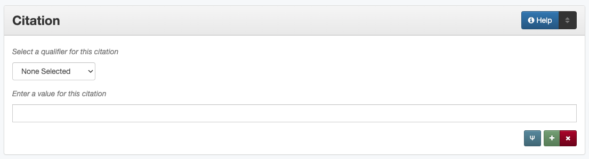

========
Citation
========

.. _citation-definition:

**********
Definition
**********

Information about a serial item, a resource from which the current resource is derived, or peer-reviewed status of items.

.. _citation-sources:

********************************************
Where Can the Citation Information be Found?
********************************************

Citation information can be found in several places including:

-   a title page
-   page headers or footers
-   in accompanying or supplementary information

.. _citation-form:

***************************************
How Citation Works in the Metadata Form
***************************************

Parts:
   1. Citation type -- drop-down menu
   2. Citation -- text field

    Note: Some citation information (Peer Reviewed) opens in a pop-up
    modal

Repeatable?:   
   -    Yes - to include different kinds of citation information (up to ten), click 'Add' to repeat all field parts; each individual
        information type (publication title, pages, volume, edition, etc.) cannot be repeated
   -    Page numbers can be expressed both as: (1) a total number of pages *and* (2) a range of page numbers (using start page/end page)

Required?
   No (:doc:`more information </minimally-viable-records>`)

.. _citation-fill:

*************************************
How Should the Citation be Filled in?
*************************************

General Citation Guidelines
===========================

-   Only include subfield parts that are relevant
-   For items expressed by numbers (pages, volume, issue, etc.), do not include additional text, for example *not* "Vol. 1"

Publication Title
-----------------

+-------------------------------------------------------------------------------+------------------------------------------------+
|**Guidelines**                                                                 |**Examples**                                    |
+===============================================================================+================================================+
|-      Use the title of the publication                                        |Chemical Information Bulletin                   |
|-      This will be the same as the serial title for full issues               +------------------------------------------------+
|                                                                               |Proceedings of the International Conference on  |
|                                                                               |Dublin Core and Metadata Applications           |
+-------------------------------------------------------------------------------+------------------------------------------------+

Pages
-----

+-------------------------------------------------------------------------------+------------------------------------------------+
|**Guidelines**                                                                 |**Examples**                                    |
+===============================================================================+================================================+
|List the total number of pages as a whole number                               |12                                              |
+-------------------------------------------------------------------------------+------------------------------------------------+
|For an item that does not start at page 1, include a range:                    |*Page Start:* 165                               |
|                                                                               +------------------------------------------------+
|-      Label the page number of the first page as "Page Start"                 |*Page End:* 176                                 |
|-      Label the page number of the last page as "Page End"                    |                                                |
+-------------------------------------------------------------------------------+------------------------------------------------+

Volume/Issue
------------

+-------------------------------------------------------------------------------+------------------------------------------------+
|**Guidelines**                                                                 |**Examples**                                    |
+===============================================================================+================================================+
|-      When relevant, include the volume and/or issue numbers                  |*Volume:* 27                                    |
|-      Use Arabic numerals                                                     +------------------------------------------------+
|-      If the volume or issue numbers are written in Roman numerals on the item|*Issue:* 2                                      |
|       add them in a [Display Note][]                                          +------------------------------------------------+
|                                                                               |*Note:* "Volume XXVII."                         |
+-------------------------------------------------------------------------------+------------------------------------------------+

Edition
-------

+-------------------------------------------------------------------------------+------------------------------------------------+
|**Guidelines**                                                                 |**Examples**                                    |
+===============================================================================+================================================+
|If the item has an edition number, include it as an Arabic number              |3                                               |
+-------------------------------------------------------------------------------+------------------------------------------------+
|If the item has a seasonal edition, include the season or month as it appears  |Fall                                            |
|on the item                                                                    |                                                |
+-------------------------------------------------------------------------------+------------------------------------------------+

Peer Reviewed
-------------

-   If the item has been peer-reviewed (or juried, or refereed), choose "True" from the drop-down menu
-   If the item has not been peer-reviewed, choose "False" from the drop-down menu
-   If it is unclear whether the item has been peer-reviewed, do not include this sub-element

Author String
-------------

-   This field should only be included if all of the authors (or creators) are not listed on the item or accompanying information
    
    -   If all of the authors (or creators) are named individually, include them in the [Creator][] field according to the guidelines
        
-   List the authors exactly as their names appear on the item, e.g.: Smith, Jones, et. al

Preferred Citation
------------------

-   This field should only be included if the item or accompanying information includes a preferred citation, e.g., "Cite this article as..."
-   List the citation exactly it as it appears on the item or accompanying information

.. _citation-examples:

Other Examples
==============

Paper Published in Conference Proceedings
   *Publication Title:* Proceedings of the International Conference on Dublin Core and Metadata Applications
   *Page Start:* 165
   *Page End:* 176
   *Pages:* 12
   *Peer Reviewed:* True

Photograph
   *Preferred Citation:* Please credit: USDA - Soil Conservation Service

Article Published in a Journal
   *Publication Title:* Journal of Vaishnava Studies
   *Volume:* 19
   *Issue:* 1

Full Serial Issue
   *Publication Title:* Chemical Information Bulletin
   *Volume:* 27
   *Issue:* 2

Revised Reference text
:   *Edition:* 3

.. _citation-comments:

Comments
========

-   This field may be used in conjunction with the :doc: `Source </source>` field
-   This field may repeat information from other fields including :doc: `Source </source>` and :doc: `Title </title>` (in order to parse the citation components for search engines)

**Glossary of Citation Qualifiers:**

+-------------------------------+-------------------------------+---------------------------------------------------------------+
|Code                           |Name                           |Definition                                                     |
+===============================+===============================+===============================================================+
|authorString                   |Author String                  |A list of creator names that cannot be broken into individual  |
|                               |                               |persons or organizations (often including "et al.")            |
+-------------------------------+-------------------------------+---------------------------------------------------------------+
|edition                        |Edition                        |Numeral or seasonal edition of the publication                 |
+-------------------------------+-------------------------------+---------------------------------------------------------------+
|issue                          |Issue                          |Issue number of the publication                                |
+-------------------------------+-------------------------------+---------------------------------------------------------------+
|pageEnd                        |Page End                       |The last page number on the item                               |
+-------------------------------+-------------------------------+---------------------------------------------------------------+
|pages                          |Pages                          |The total number of pages of content in the item               |
+-------------------------------+-------------------------------+---------------------------------------------------------------+
|pageStart                      |Page Start                     |The first page number on the item                              |
+-------------------------------+-------------------------------+---------------------------------------------------------------+
|peerReviewed                   |Peer Reviewed                  |Whether or not the item has been peer-reviewed, juried, or     |
|                               |                               |otherwise refereed                                             |
+-------------------------------+-------------------------------+---------------------------------------------------------------+
|preferredCitation              |Preferred Citation             |A full citation for an item in a preferred format or a         |
|                               |                               |crediting statement to be used in citations, not documented    |
|                               |                               |elsewhere in the record                                        |
+-------------------------------+-------------------------------+---------------------------------------------------------------+
|publicationTitle               |Publication Title              |Title of the serial publication                                |
+-------------------------------+-------------------------------+---------------------------------------------------------------+
|volume                         |Volume                         |Volume number of the publication                               |
+-------------------------------+-------------------------------+---------------------------------------------------------------+

.. _citation-resources:

Resources
=========

-   UNT Citation Qualifier `Controlled Vocabulary <https://digital2.library.unt.edu/vocabularies/citationQualifiers/>`_

**More Guidelines:**

-   :doc:`Quick-Start Metadata Guide </guides/quick-start-guide>`
-   `Metadata Home <https://library.unt.edu/metadata/>`_
