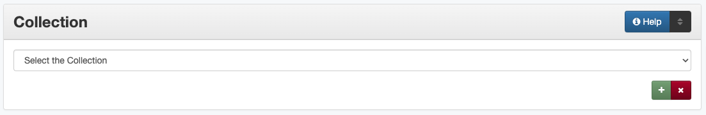

==========
Collection
==========

**********
Definition
**********

Collection refers to a larger group of resources with a unique
collective title to which the resource being described belongs.

**********************************************
Where Can the Collection Information be Found?
**********************************************

This information comes from the institution or from the project manager.

*****************************************
How Collection Works in the Metadata Form
*****************************************

Parts:
   1. Collection name -- drop-down menu

Repeatable?
:   Yes - to include multiple collections, click 'Add' to repeat the
    field

Required?
:   Yes ([more information][])

***************************************
How Should the Collection be Filled in?
***************************************

-   Select the correct collection name from the `controlled vocabulary
    <https://digital2.library.unt.edu/vocabularies/collections/>`_.
-   When relevant, include multiple collections

-   It is **important** that the correct collection name(s) be entered for
    the item

********
Examples
********

Photograph: Perini Well #1 Coming In
   *Collection:* ABPHC - Abilene Photograph Collection

Rare book: Rhymes, for infant minds
   *Collection:* UNTRB - Rare Book and Texana Collections

Pamphlet: Control of sugar-beet nematode by crop rotation.
   *Collection:* ATOZ - Government Documents A to Z Digitization Project
   *Collection:* USDAFB - USDA Farmers' Bulletins

1936 General Highway Map of Bosque County, Texas
   *Collection:* SG07 - Rescuing Texas History, 2007

Music USA Recording Schedule, 1962-1973
   *Collection:* MLCC - Music Library Conover Collection

Newspaper issue: The Caldwell News and the Burleson County Ledger (Caldwell, Tex.), Vol. 64, No. 45, Ed. 1 Friday, June 8, 1951
   *Collection:* TDNP - Texas Digital Newspaper Program
   *Collection:* CNBCL - Caldwell News and Burleson County Ledger:   *Collection:* TFG - Tocker Foundation Grant

********
Comments
********

-   Collections are determined based on a large group of related items,
    intended to facilitate browsing, such as:
    
    -   Topical groupings
    -   Historic events
    -   Serial sets -- especially full runs of a publication during
        which the title changes
    -   Projects sponsored by a grant or special funding
    
-   In some cases, all items from one institution may also belong to a
    single collection, however, large, distinctive groups may have their
    own collection
-   Although some archival collections may have a corresponding
    "collection," small collections or archival series may also be
    represented as [series titles][]

*********
Resources
*********

-   UNT Collections [Controlled Vocabulary][]

**More Guidelines:**

- [Quick-Start Metadata Guide][]
- [Input Guidelines for Descriptive Metadata][]
- [Metadata Home][]

[more information]: https://library.unt.edu/digital-projects-unit/metadata/minimally-viable-records/
[series titles]: https://library.unt.edu/digital-projects-unit/metadata/fields/serials-and-series/
[Controlled Vocabulary]: https://digital2.library.unt.edu/vocabularies/collections/
[Quick-Start Metadata Guide]: https://library.unt.edu/digital-projects-unit/metadata/quick-start-guide/
[Input Guidelines for Descriptive Metadata]: https://library.unt.edu/digital-projects-unit/metadata/input-guidelines-descriptive/
[Metadata Home]: https://library.unt.edu/digital-projects-unit/metadata/

