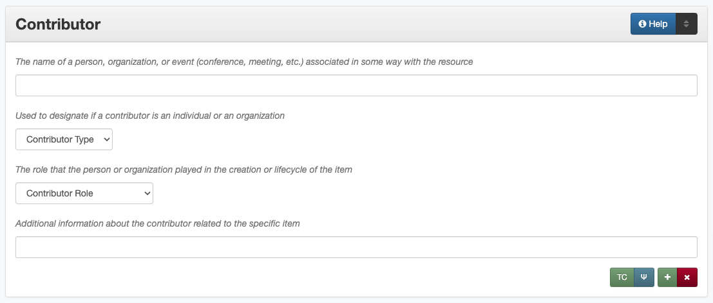

###########
Contributor
###########

.. _contributor-definition:

**********
Definition
**********

A person, agency, or organization that has played an important but secondary role in creating the content of the resource and is not specified in the creator element.

.. _contributor-sources:

***********************************************
Where Can the Contributor Information be Found?
***********************************************

In some cases, contributors may come from accompanying or supplementary information, but they may also be found on:

+---------------------------------------+-------------------------------------------------------+
|**Item Types**                         |**Information Sources**                                |
+=======================================+=======================================================+
|For text                               |- title page                                           |
|                                       |- cover                                                |
|                                       |- end of document                                      |
|                                       |- copyright statement                                  |
|                                       |- acknowledgments                                      |
+---------------------------------------+-------------------------------------------------------+
|For images                             |- notes on bottom or back of a photograph              |
|                                       |- envelope, slip cover, or case                        |
+---------------------------------------+-------------------------------------------------------+
|For maps                               |- statement in a caption                               |
|                                       |- notes around the outside of the map                  |
+---------------------------------------+-------------------------------------------------------+
|For music scores                       |- title page or header                                 |
|                                       |- top of page                                          |
|                                       |- table of contents                                    |
+---------------------------------------+-------------------------------------------------------+
|For videos                             |- label on disc                                        |
|                                       |- container cover                                      |
|                                       |- title screen(s) or credits                           |
+---------------------------------------+-------------------------------------------------------+
|For sound files                        |- information on disc/cassette                         |
|                                       |- container information                                |
+---------------------------------------+-------------------------------------------------------+
|For computer files                     |- title page/screen                                    |
|                                       |- statement in a header/footer                         |
+---------------------------------------+-------------------------------------------------------+

.. _contributor-form:

******************************************
How Contributor Works in the Metadata Form
******************************************

Parts:
    #.  Contributor name -- text field
    #.  Contributor type -- drop-down menu
    #.  Contributor role -- drop-down menu
    #.  Contributor information -- text field

Repeatable?
	Yes - to include multiple contributors, click 'Add' to repeat all field parts

Required?
	 No (:doc:`more information </minimally-viable-records>`)

.. _contributor-fill:

****************************************
How Should the Contributor be Filled in?
****************************************

General Contributor Rules
=========================

-   If no contributor information is readily available, leave the field blank
-   Only include individuals/organizations who had secondary
    responsibility for the item, or who were only responsible for a portion of the work
    
    -   Primary "contributors" should be entered as :doc:`creators </fields/creator>` instead
        
        -   A name should never be entered as both a creator and a
            contributor; if an agent acts in multiple capacities, see
            the :ref:`Role <contributor-role>` section for clarification
        -   For more information about when a person/organization is a
            creator or a contributor, see our :doc:`definition page </creator-contributor-definitions>`
            
    -   An entity **must** have a direct relationship to the item that
        can be explicated in order to be included as a contributor
        
        -   If there is information about a person/organization that
            cannot be expressed as a role, it may be appropriate to add
            it elsewhere, such as a :doc:`Note </fields/note>` or :ref:`Info <contributor-info>` in relation to
            an established contributor
            
-   Include as many contributors as are readily available

    -   A contributor name can only be entered once per record; if an agent acts in multiple capacities, see
        the :ref:`Role <contributor-role>` section for clarification
    -   Place them in order of importance
    -   If contributors are equally important, list them in the order that they appear
    -   If a document has an excessively large number of creators or
        authors (e.g., several hundred researchers) include the parent
        organizations as creators and the individual persons as
        contributors
        
-   For each contributor the name, type, and role are **required**
-   If possible, consult an authority file to find the correct form of
    the name, such as:
    
    -   The `UNT Name App <https://digital2.library.unt.edu/name/>`_
    -   The `Library of Congress Authorities <https://id.loc.gov>`__
    -   A locally-developed utility
    
-   Note that organizational names generally reflect the name of the agency at
    the time the item was created -- e.g., Texas (Republic) vs. Texas, or North
    Texas State University vs. University of North Texas -- however, if possible,
    personal names will generally reflect a single, most current version when
    multiple names (initials, maiden names, etc.) are known to be used by a
    specific person
    
    
Contributor Names
=================

.. _contributor-name-per:

Personal Names
--------------

+-----------------------------------------------------------+---------------------------------------+
| **Guideline**                                             | **Examples**                          |
+===========================================================+=======================================+
|If known, use the authorized form of the name from the     |Agapkin, Vasiliĭ Ivanovich, 1884-1964  |
|`Library of Congress Authorities <https://id.loc.gov>`__   |                                       |
+-----------------------------------------------------------+---------------------------------------+
|If no authorized version is available, enter the most      |                                       |
|complete version of the name that is known using proper    |                                       |
|formatting:                                                |                                       |
+-----------------------------------------------------------+---------------------------------------+
|   a.  Invert names (Last, First Middle)                   |McCaleb, Walter Flavius                |
+-----------------------------------------------------------+---------------------------------------+
|   b.  Use initials if the full name(s) are not known      |Henderson, Charles V.                  |
+-----------------------------------------------------------+---------------------------------------+
|   c.  Do not change the order of names                    |Mitchell, A. Cameron                   |
+-----------------------------------------------------------+---------------------------------------+
|   d.  Use spaces between initials                         |Blackburn, J. K. P.                    |
+-----------------------------------------------------------+---------------------------------------+
|   e.  Separate hyphenated first names with a hyphe        |Fang, H.-C.                            |
|       instead of a space if only initials are known       |                                       |
+-----------------------------------------------------------+---------------------------------------+
|   f.  Put additional middle names after the first name    |Sonneck, Oscar George Theodore         |
+-----------------------------------------------------------+---------------------------------------+
|   g.  Keep hyphenated "last names" and compound surnames  | | Ala'i-Rosales, Shahla S.            |
|       together                                            |                                       |
|                                                           | | Martinez Fischer, Ferdinand Frank   |
+-----------------------------------------------------------+---------------------------------------+
|   h.  Consider multiple parts (von, de la, etc.) as part  |de Almeida Lobo, Adriana               |
|       of the last name                                    |                                       |
+-----------------------------------------------------------+---------------------------------------+
|   i.  If a given name is unknown, the surname can be      |Huffman                                |
|       entered alone, but names cannot be a given name only|                                       |
|       e.g., "Miss Susie" or "Uncle Roger"                 |                                       |
+-----------------------------------------------------------+---------------------------------------+
|-  If it is unclear which part of the name is the surname, |                                       |
|   enter the name as it appears on the item                |                                       |
+-----------------------------------------------------------+---------------------------------------+
|Use appropriate abbreviations:                             |                                       |
+-----------------------------------------------------------+---------------------------------------+
|   a.  Only include known titles (Dr., Rev., Capt., etc.)  | | Hastings, Mrs. F. S.                |
|       before the first name if:                           |                                       |
|                                                           | | Jones, Dr.                          |
|       -   The title is necessary for clarification of the |                                       |
|           name (e.g., if the given name for a married     |                                       |
|           woman is unknown)                               |                                       |
|       -   The title is the only part of the name known    |                                       |
|           (aside from a surname)                          |                                       |
+-----------------------------------------------------------+---------------------------------------+
|   b.  Include suffixes that are a part of the name (Jr.,  |Williams, J. F. C., Jr.                |
|       Sr., etc.) at the end of the name after a second    |                                       |
|       comma                                               |                                       |
+-----------------------------------------------------------+---------------------------------------+
|-  Do not include:                                         | | *Name:* Alwin, Lawrence F.          |
|                                                           | | *Info:* CPA; State Auditor          |
|   -   nicknames                                           |                                       |
|   -   abbreviations                                       |                                       |
|   -   titles that do not fit the criteria above           |                                       |
|   -   job or educational qualifiers (C.E., D.D.S., Ph.D., |                                       |
|       etc.)                                               |                                       |
+-----------------------------------------------------------+---------------------------------------+
|-  Some common historical personal name abbreviations:     | | *Name:* Dunlap, George P.           |
|                                                           | | *Info:* Geo. P. Dunlap              |
|   -   Chas. = Charles                                     |                                       |
|   -   Geo. = George                                       |                                       |
|   -   Jas. = James                                        |                                       |
|   -   Jno. = John                                         |                                       |
|   -   Thos. = Thomas                                      |                                       |
|   -   Wm. = William                                       |                                       |
|                                                           |                                       |
|-  Alternate versions and omitted information may be added |                                       |
|   to the "info" section                                   |                                       |
+-----------------------------------------------------------+---------------------------------------+
|-  If the same person is responsible for multiple items:   |                                       |
|                                                           |                                       |
|   -   Enter the name as consistently as possible in every |                                       |
|       record                                              |                                       |
|   -   Use the fullest form of the name that is available  |                                       |
+-----------------------------------------------------------+---------------------------------------+
|-  If the name changes and it is *certainly* the same      | | *Name:* Gaines, Ann                 |
|   person:                                                 | | *Info:* Ann Sanders                 |
|                                                           |                                       |
|   -   Use the later/most current version and include the  |                                       |
|       former name in the info section if that version is  | | Davis, Catherine Dawe               |
|       used in the text                                    |                                       |
|   -   Alternately, for married names, use the maiden name | | Kempner, Mary Josephine Carroll     |
|       at the end of the full name                         |                                       |
|                                                           |                                       |
|-  When in doubt, enter the name as it appears on the item |                                       |
+-----------------------------------------------------------+---------------------------------------+
|-  Only include the names of specific persons (or          | | *Name:* Associated Press            |
|   organizations)                                          | | *Info:* Staff Photographer          |
|-  In cases where the name is not known (e.g., "Staff      |                                       |
|   Photographer"), either:                                 |                                       |
|                                                           |                                       |
|   -   Leave the contributor field blank                   |                                       |
|   -   Include the name of the parent organization and add |                                       |
|       details in the "info" section                       |                                       |
+-----------------------------------------------------------+---------------------------------------+

.. _contributor-name-org:

Organization Names
------------------

+-----------------------------------------------------------+---------------------------------------+
| **Guideline**                                             | **Examples**                          |
+===========================================================+=======================================+
|-  If known, use the authorized form of the name from the  |Geological Survey (U.S.)               |
|   `Library of Congress Authorities <https://id.loc.gov/>`_|                                       |
|-  Otherwise, use these formatting guidelines:             |                                       |
+-----------------------------------------------------------+---------------------------------------+
|For non-government or single-level bodies:                                                         |
+-----------------------------------------------------------+---------------------------------------+
|-  Use the name as it appears in the item                  |Camp Wolters Public Relations Branch   |
+-----------------------------------------------------------+---------------------------------------+
|-  Do not invert personal names that are parts of          |Julis Bien & Co.                       |
|   organizational names                                    |                                       |
+-----------------------------------------------------------+---------------------------------------+
|-  Write out names rather than using acronyms              | | *Name:* New York University         |
|                                                           | | *Info:* NYU                         |
+-----------------------------------------------------------+---------------------------------------+
|For hierarchical agencies or entities:                                                             |
+-----------------------------------------------------------+---------------------------------------+
|-  List agency or body parts in hierarchical order,        |University of Texas. Bureau of Research|
|   starting at the highest level and ending with the most  |in the Social Sciences.                |
|   specific                                                |                                       |
+-----------------------------------------------------------+---------------------------------------+
|-  Separate the elements of the hierarchy with periods     |Osk Ridge National Laboratory. Chemical|
|                                                           |Technology Division.                   |
+-----------------------------------------------------------+---------------------------------------+
|-  Preface the name of government agencies with the name of|Martin County (Fla.). Board of         |
|   the country or state                                    |Commissioners.                         |
+-----------------------------------------------------------+---------------------------------------+
|-  If a hierarchy is unclear, record the name as it appears|                                       |
|   on the item                                             |                                       |
+-----------------------------------------------------------+---------------------------------------+
|For United States agencies:                                                                        |
+-----------------------------------------------------------+---------------------------------------+
|-  Spell out "United States" unless there is an authorized | | United States. Navy. Training       |
|   version that abbreviates it                             |   Division. Bureau of Aeronautics.    |
|                                                           |                                       |
|                                                           | | U.S. Coast and Geodetic Survey      |
+-----------------------------------------------------------+---------------------------------------+
|-  In the case of a long (well-known) name, it may be      |United States. Central Intelligence    |
|   shortened by eliminating unnecessary parts              |Agency.                                |
|                                                           |                                       |
|   -   For example, the Library of Congress Authorities    |                                       |
|       often omit upper-level intermediary divisions, such |                                       |
|       as the secondary level in "United States. National  |                                       |
|       Security Council. Central Intelligence Agency."     |                                       |
+-----------------------------------------------------------+---------------------------------------+
|-  If an agency name has been translated for a non-English-| | *Name:* Texas. Department of State  |
|   language publication, the name should still be entered  |   Health Services.                    |
|   in it's original form                                   | | *Version on text:* Departamento     |
|                                                           |   Estatal de Servicios de Salud       |
+-----------------------------------------------------------+---------------------------------------+
|For non-U.S. organizations:                                                                        |
+-----------------------------------------------------------+---------------------------------------+
|-  When using an authorized form of the name, it may be    | | *Name:* Han'guk Kich'o Kwahak Chiwŏn|
|   appropriate to add notes to the "info" section:         |   Yŏn'guwŏn                           |
|                                                           | | *Info:* Korea Basic Science         |
|   -   If the name is written in a language other than     |   Institute; Taejon, Republic of Korea|
|       English, add the English translation (if relevant)  +---------------------------------------+
|   -   If the name is written in English, additional forms |Instituto de Investigaciones Geológicas|
|       from the item may be added                          |(Chile)                                |
+-----------------------------------------------------------+---------------------------------------+
|-  If there is no authorized form, follow general          |Mexico. Secretaría de la Economia      |
|   formatting rules                                        |Nacional Direccion General de Minas y  |
|                                                           |Petoleo.                               |
+-----------------------------------------------------------+---------------------------------------+

.. _contributor-type:

Contributor Type
================

-   Choose the appropriate contributor type:

+-----------------------------------------------------------+---------------------------------------+
| **Guideline**                                             | **Examples**                          |
+===========================================================+=======================================+
|If the contributor is an individual                        |Personal                               |
+-----------------------------------------------------------+---------------------------------------+
|If the contributor is a company, organization, association,|Organization                           |
|agency, or other institution                               |                                       |
+-----------------------------------------------------------+---------------------------------------+
|If it is unclear whether the contributor name belongs to an|                                       |
|individual or an organization, use "Personal" and format   |                                       |
|the name appropriately                                     |                                       |
|                                                           |                                       |
|   -   (If it is important to document or clarify this     |                                       |
|       choice, use a :ref:`Non-Display Note                |                                       |
|       <note-nondisplay>`)                                 |                                       |
+-----------------------------------------------------------+---------------------------------------+

-   In some rare and very specific cases, other options may apply:

+-----------------------------------------------------------+---------------------------------------+
| **Guideline**                                             | **Examples**                          |
+===========================================================+=======================================+
|If the contributor is a conference or other event that     |Event                                  |
|produces papers and materials (as an entity rather than    |                                       |
|named individual participants or a hosting organization)   |                                       |
|                                                           |                                       |
|   -   For example: a statement drafted by all members of a|                                       |
|       symposium or conference as part of the activities of|                                       |
|       the meeting                                         |                                       |
|   -   There are other ways to represent an event related  |                                       |
|       to the creation of an item, such as Source, when the|                                       |
|       event *itself* is not the contributor               |                                       |
+-----------------------------------------------------------+---------------------------------------+
|If the contributor is a computer program that generates    |Software                               |
|data or files independently                                |                                       |
|                                                           |                                       |
|   -   E.g.: an automatically-generated file created while |                                       |
|       a computer program was running                      |                                       |
+-----------------------------------------------------------+---------------------------------------+

.. _contributor-role:

Contributor Role
================

Entering Roles
--------------

-   Choose the appropriate contributor role from the `controlled vocabulary <https://digital2.library.unt.edu/vocabularies/agent-qualifiers/>`_

+-----------------------------------------------------------+---------------------------------------+
| **Guideline**                                             | **Examples**                          |
+===========================================================+=======================================+
|If the role is not listed:                                                                         |
+-----------------------------------------------------------+---------------------------------------+
|-  Choose "Other"                                          | | *Name:* Caffey, Wiley L.            |
|-  Include clarification in the "Info" section             | | *Role:* Other                       |
|                                                           | | *Info:* Business Manager            |
+-----------------------------------------------------------+---------------------------------------+
|If more than one role applies to the contributor:                                                  |
+-----------------------------------------------------------+---------------------------------------+
|-  Choose the primary or most encompassing role (or the one| | *Name:* Etter, Amanda Perez         |
|   listed first)                                           | | *Role:* Editor                      |
|-  Explain the details in the info section                 | | *Info:* Managing Editor; Sponsor    |
+-----------------------------------------------------------+---------------------------------------+

Assigning Roles
---------------

-   Although the same list of roles is available for both creators and
    contributors, some roles will generally only apply to contributors:
    
    -   Agents who only had responsibility for a part, e.g., author of
        introduction, etc.; witness; consultant; expert
    -   Agents who had an indirect relationship, e.g., funder, sponsor,
        former owner, donor
    -   Additional explanation is on our contributor and contributor :doc:`definition page </creator-contributor-definitions>`
    
-   The role should describe the action that the agent took in creating
    the item and it may not align with job titles or credentials, for
    example:

+---------------+-----------------------------------------------------------+-------------------+---------------+------------------------------------------+
|               |Agents                                                     |Role               |Field          |Example                                   |
+===============+===========================================================+===================+===============+==========================================+
|"Director"     |-  director of a performance (film, play, concert, etc.)   |Director           |Creator        | | *Name:* Homer, Paula                   |
|               |                                                           |                   |               | | *Type:* Personal                       |
|               |                                                           |                   |               | | *Role:* Director                       |
|               |                                                           |                   |               | | *Info:* UNT Opera Theater              |
|               +-----------------------------------------------------------+-------------------+---------------+------------------------------------------+
|               |-  executive director of an agency with no apparent        |n/a                |Creator        | | *Name:* Texas. Department of           |
|               |   personal contribution to the item                       |                   |               |   Transportation.                        |
|               |                                                           |                   |               | | *Type:* Organization                   |
|               |                                                           |                   |               | | *Role:* Author                         |
|               |                                                           |                   |               | | *Info:* Phil Wilson, Executive Director|
|               +-----------------------------------------------------------+-------------------+---------------+------------------------------------------+
|               |-  executive director of an agency with a described or     |Author of          |Contributor    | | *Name:* Camargo, Gene                  |
|               |   understandable role (e.g., author of transmittal letter)|introduction, etc. |               | | *Type:* Personal                       |
|               |                                                           |                   |               | | *Role:* Author of introduction, etc.   |
|               |                                                           |(or another        |               | | *Info:* Director of Building           |
|               |                                                           |appropriate role)  |               |   Inspections                            |
+---------------+-----------------------------------------------------------+-------------------+---------------+------------------------------------------+
|"Performer"    |-  musician in a recital or concert                        |Performer          |Creator        | | *Name:* North Texas Wind Symphony      |
|               |-  actor in a play or movie                                |                   |               | | *Type:* Organization                   |
|               |                                                           |                   |               | | *Role:* Performer                      |
|               +-----------------------------------------------------------+-------------------+---------------+------------------------------------------+
|               |-  a person/organization that "performed" work or research |Originator,        |Creator        | | *Name:* Quigg, Antonietta Salvatrice   |
|               |   (aside from, or in addition to, specific person/s who   |Researcher, or     |               | | *Type:* Personal                       |
|               |   authored a report or created some product of the work)  |another appropriate|               | | *Role:* Author                         |
|               |                                                           |role               +---------------+------------------------------------------+
|               |                                                           |                   |Contributor    | | *Name:* Texas Water Development Board  |
|               |                                                           |                   |               | | *Type:* Organization                   |
|               |                                                           |                   |               | | *Role:* Originator                     |
+---------------+-----------------------------------------------------------+-------------------+---------------+------------------------------------------+
|"Consultant"   |-  a consulting company or person that authors a report    |Author             |Creator        | | *Name:* Kerley, Gerald Irwin           |
|               |                                                           |                   |               | | *Type:* Personal                       |
|               |                                                           |                   |               | | *Role:* Author                         |
|               |                                                           |                   |               | | *Info:* Kerley Technical Consultant,   |
|               |                                                           |                   |               |   Appomattox, VA                         |
|               +-----------------------------------------------------------+-------------------+---------------+------------------------------------------+
|               |-  a consultant who provide information as a contribution  |Consultant         |Contributor    | | *Name:* Kanto, Leonard E.              |
|               |   to a report                                             |                   |               | | *Type:* Personal                       |
|               |-  a consultant who spoke during recorded/transcribed      |                   |               | | *Role:* Consultant                     |
|               |   proceedings (could also be an "expert" or "witness"     |                   |               | | *Info:* State of Texas Professional    |
|               |   depending on the context)                               |                   |               |   Engineer; Consultant Engineer          |
+---------------+-----------------------------------------------------------+-------------------+---------------+------------------------------------------+

.. _contributor-info:

Contributor Info
================

-   Info is not required as part of the contributor entry
-   This field is only for information about the contributor listed in or
    directly related to the object
-   The info field is not intended for biographies or lengthy descriptions of the agent
-   It is not necessary to do research to find information; this field
    is only used for readily-available notes

+-----------------------------------------------------------+---------------------------------------+
| **Guideline**                                             | **Examples**                          |
+===========================================================+=======================================+
|-  Include information that clarifies the role of the      | | Consulting Engineer                 |
|   contributor, e.g.:                                      |                                       |
|                                                           | | Trio for Piano, Violin and Cello in |
|   -   For composers, the name of the piece(s)             |   C Major, K. 548 (1788)              |
|   -   For journals or compiled documents, the title(s) of |                                       |
|       pieces authored by the contributor                  | | Baby Lore: The Why and Wherefore of |
|                                                           |   It                                  |
+-----------------------------------------------------------+---------------------------------------+
|-  Include other relevant information known about the      | | Judge Sam'l A. Roberts              |
|   contributor that relates to the object, such as:        |                                       |
|                                                           | | LMSW; Manager, Purchased Health     |
|   -   Additional forms of the contributor's name          |   Services Unit                       |
|   -   Addresses                                           |                                       |
|   -   Birth and death dates (not part of an authorized    | | Houston, Texas                      |
|       name)                                               |                                       |
|   -   Organizational affiliations                         |                                       |
|   -   Other information associated with the name          |                                       |
+-----------------------------------------------------------+---------------------------------------+
|-  For an agency, the info may include:                    | | CEA                                 |
|                                                           |                                       |
|   -   Persons associated with the organization who did not| | U.S. Department of the Interior,    |
|       have another role (e.g., directors)                 |   Bureau of Mines                     |
|   -   Acronyms, abbreviations, or alternative name forms  |                                       |
|   -   Additional omitted hierarchical components (e.g.,   |                                       |
|       for some federal agencies)                          |                                       |
+-----------------------------------------------------------+---------------------------------------+
|-  There are no strict formatting requirements for info,   | | Rev. R. G. Mood, M.A., D.D. ;       |
|   but here are some suggestions:                          |   Secretary and Editor of the North   |
|                                                           |   Texas Conference                    |
|   -   List each name, fact, or statement individually and |                                       |
|       separate them with semicolons or periods            | | "Under Four Flags on Texas Soil, By |
|   -   Use sentence form when relevant, or when taken      |   A. Garland Adair, Editor, The Mexia |
|       directly from the item                              |   Daily News"                         |
|   -   Quotation marks may be used when quoting information|                                       |
|       directly from the item                              |                                       |
+-----------------------------------------------------------+---------------------------------------+

.. _contributor-examples:

***************
Other Examples:
***************

**Book**

    -   *Name:* Ben C. Jones & Co.
    -   *Type:* Organization
    -   *Role:* Printer
    -   *Information:* "Printers, Electrotypers and Binders, Austin."

**Yearbook**

    -   *Name:* Richards, Olan
    -   *Type:* Personal
    -   *Role:* Editor
    -   *Information:* Art Editor

|

    -   *Name:* American Beauty Cover Company
    -   *Type:* Organization
    -   *Role:* Artist

|

    -   *Name:* Abilene Printing and Stationery Company
    -   *Type:* Organization
    -   *Role:* Printer

|

    -   *Name:* Thurman's Studio
    -   *Type:* Organization
    -   *Role:* Photographer

|

    -   *Name:* Southwest Engraving Company
    -   *Type:* Organization
    -   *Role:* Engraver

**Journal issue**

    -   *Name:* Baldwin, Dan
    -   *Type:* Personal
    -   *Role:* Editor
    -   *Information:* Assistant Editor

|

    -   *Name:* Riddle, Peggy
    -   *Type:* Personal
    -   *Role:* Editor
    -   *Information:* Assistant Editor

**Research report**

    -   *Name:* Texas Water Development Board
    -   *Type:* Organization
    -   *Role:* Sponsor

|

    -   *Name:* Guadalupe-Blanco River Authority (Tex.)
    -   *Type:* Organization
    -   *Role:* Funder

|

    -   *Name:* Upper Guadalupe River Authority
    -   *Type:* Organization
    -   *Role:* Funder

|

    -   *Name:* Headwaters Groundswater Conservation District
    -   *Type:* Organization
    -   *Role:* Consultant

|

    -   *Name:* Cow Creek Groundwater Conservation District
    -   *Type:* Organization
    -   *Role:* Consultant

|

    -   *Name:* Kendall County Water Control and Improvement District \#1
    -   *Type:* Organization
    -   *Role:* Consultant

|

    -   *Name:* Kerr County (Tex.)
    -   *Type:* Organization
    -   *Role:* Consultant

|

    -   *Name:* Kendall County (Tex.)
    -   *Type:* Organization
    -   *Role:* Consultant

**Map**

    -   *Name:* United States. Bureau of Naval Personalnel. Educational Services Section.
    -   *Type:* Organization
    -   *Role:* Distributor
    -   *Information:* [United States.] Navy Dept. BuPers. Educational Services Section.; Navy distribution. Washington, D. C.

|

    -   *Name:* Harrison, Richard Edes
    -   *Type:* Personal
    -   *Role:* Cartographer
    -   *Information:* Base map for "Pacific War in the Air" drawn by Richard Edes Harrison. Copyright, Fortune.

|

    -   *Name:* United States. Office of Strategic Services.
    -   *Type:* Organization
    -   *Role:* Cartographer
    -   *Information:* Map of South Burma and Thailand "prepared in the R and A Branch, O.S.S."

**Legal estate transfer**

    -   *Name:* Sayles, Mary E.
    -   *Type:* Personal
    -   *Role:* Other
    -   *Information:* Transferee

|

    -   *Name:* Turnee, Sam
    -   *Type:* Personal
    -   *Role:* Author
    -   *Information:* Notary Public

|

    -   *Name:* Collins, E. H.
    -   *Type:* Personal
    -   *Role:* Witness

**Dissertation**

    -   *Name:* Wilhelm, Ronald
    -   *Type:* Personal
    -   *Role:* Chair or Major Professor
    -   *Information:* Major Professor

|

    -   *Name:* Ausbrooks, Carrie Y.
    -   *Type:* Personal
    -   *Role:* Committee member
    -   *Information:* Minor Professor

|

    -   *Name:* Cowart, Melinda
    -   *Type:* Personal
    -   *Role:* Committee member

**Opera score**

    -   *Name:* Harding, Bertita
    -   *Type:* Personal
    -   *Role:* Librettist

|

    -   *Name:* Ballenger, Kenneth L.
    -   *Type:* Personal
    -   *Role:* Author of introduction, etc.
    -   *Information:* Prof. Kenneth L. Ballenger; Author of synopsis (page ii).

.. _contributor-comments:

********
Comments
********

-   Name fields are connected to the `UNT Name App`_, which will try to
    match text against local authority files. Editors should always
    choose an authorized form from the list if it is available.
-   The contributor field is not constrained by the AACR2 practice of
    limiting contributors to three or fewer names. Include as many contributors
    as are readily available.
-   If the contributor and the publisher are the same, repeat the name in
    the :doc:`Publisher </fields/publisher>` element.
-   Individuals or organizations with greater or complete responsibility for creation
    of the intellectual content of the resource should be recorded in
    the :doc:`Creator </fields/creator>` element instead of the contributor
    element. Some examples of creators are author, editor, compiler, etc. (when applicable to the whole item)
-   The contributor roles come primarily from MARC `relator codes <http://www.loc.gov/marc/relators/relators.html>`_; not
    all of the Library of Congress roles are included in the UNT system
    and several local codes have been added to the UNT list.

.. _contributor-resources:

*********
Resources
*********

-   UNT Contributor Role `controlled vocabulary <https://digital2.library.unt.edu/vocabularies/agent-qualifiers/>`_
-   Contributor and Contributor Definitions :doc:`definition page </creator-contributor-definitions>` (how to choose which one to use)
-   `UNT Name App`_
-   Library of Congress

    - `Authorities <http://authorities.loc.gov>`__
    - `Linked Data Service <http://id.loc.gov/>`__

-   `OCLC Worldcat <http://www.worldcat.org/>`_
-   `Worldcat via FirstSearch <https://discover.library.unt.edu/catalog/b2247936>`_ (Accessible to UNT staff/students)

**More Guidelines:**

-   :doc:`Quick-Start Metadata Guide </guides/quick-start-guide>`
-   `Metadata Home <https://library.unt.edu/metadata/>`_