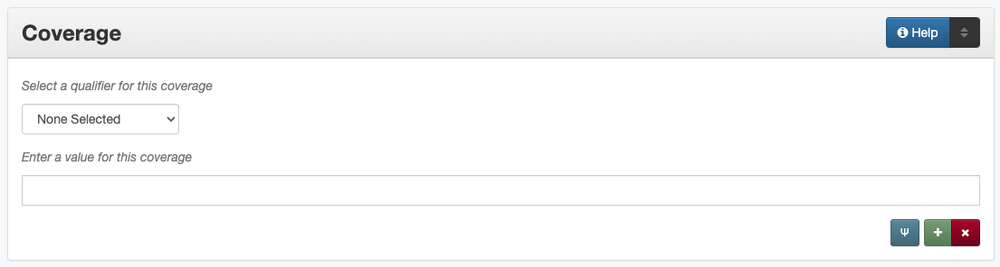

########
Coverage
########

**********
Definition
**********

Geographic and temporal information related to the content of the resource.

********************************************
Where Can the Coverage Information be Found?
********************************************

In some cases, coverage information may come from accompanying or supplementary information; generally the item must be read/examined to find coverage information, such as:

+---------------------------------------+-------------------------------------------------------+
|**Item Types**                         |**Information Sources**                                |
+=======================================+=======================================================+
|For text                               |- titles                                               |
|                                       |- abstracts                                            |
|                                       |- tables of contents                                   |
|                                       |- section/chapter headings                             |
|                                       |- introduction/scope statements/text content           |
+---------------------------------------+-------------------------------------------------------+
|For images                             |- notes on bottom or back of a photograph              |
|                                       |- visible items (people, surroundings, objects, etc.)  |
|                                       |- illustrations                                        |
+---------------------------------------+-------------------------------------------------------+
|For maps                               |- statement in a caption                               |
|                                       |- notes around the outside of the map                  |
|                                       |- geographic area and time period of the map (content) |
+---------------------------------------+-------------------------------------------------------+
|For music scores                       |- title page                                           |
|                                       |- table of contents                                    |
+---------------------------------------+-------------------------------------------------------+
|For videos                             |- label on disc                                        |
|                                       |- container cover                                      |
|                                       |- title screens or content                             |
+---------------------------------------+-------------------------------------------------------+
|For sound files                        |- information on disc/cassette                         |
|                                       |- container information                                |
|                                       |- content of audio                                     |
+---------------------------------------+-------------------------------------------------------+
|For computer files                     |- title page/screen                                    |
|                                       |- text of document (content)                           |
+---------------------------------------+-------------------------------------------------------+

***************************************
How Coverage Works in the Metadata Form
***************************************

   
   
**Parts:**
	1. Coverage type -- drop-down menu
	2. Coverage -- text field

Note: Some coverage information opens in a pop-up modal

Repeatable?
	Yes - to include different kinds of coverage information, click 'Add' to repeat all field parts
	
	
-   Coverage location ([Place Name][], [Place Box or Point][]) can be repeated to include
    multiple places
-   Coverage eras ([Time Period][]) can be repeated to include multiple
    eras
-   Coverage [dates][] should be expressed in a *single entry* as an
    individual date or date range(s)

Required?
   No ([more information][])

*************************************
How Should the Coverage be Filled in?
*************************************

General Coverage Guidelines
===========================

-   Multiple places and time periods may be included when relevant
-   Coverage is about the content of the item

    -   For some items (e.g., original photographs) the coverage date
        will be the same as the [creation][] date
    -   For text items dates and locations may overlap with [creation][]
        dates and [publisher][] locations but are often different
    -   For reproductions, consider that the content and creation may
        not match regardless of type (e.g., a copy negative would have a
        different creation date than the coverage date, which will match
        the original photo)

Place Name(s)
-------------

-   Place names include sovereign political entities (such as countries)
    and continent-level regions

+-------------------------------------------------------------------------------+------------------------------------------------+
|**Guidelines**                                                                 |**Examples**                                    |
+===============================================================================+================================================+
|Include any places relevant to the content of the item                         |United States                                   |
|                                                                               |                                                |
|                                                                               |France                                          |
+-------------------------------------------------------------------------------+------------------------------------------------+
|Note that most locations will already have an established form that should be  |                                                |
|chosen from the searchable modal.  If the location name is not in the system,  |                                                |
|follow the instructions below.                                                 |                                                |
|                                                                               |                                                |
|Use a hierarchical format of the current place name in the                     |                                                |
|`Geonames Database <http://www.geonames.org/>`_:                               |                                                |
+-------------------------------------------------------------------------------+------------------------------------------------+
|*General Format*                                                                                                                |
+-------------------------------------------------------------------------------+------------------------------------------------+
|Separate elements of the hierarchy with a space followed by a hyphen and then  |Canada - Ontario Province                       |
|another space ([text] - [text])                                                |                                                |
|                                                                               |England - Brighton and Hove Unitary Authority - |
|Begin with the largest ("country" level) and proceed to the smallest relevant  |Brighton                                        |
|geographical unit                                                              |                                                |
|                                                                               |Poland - Lower Silesia Province -               |
|                                                                               |Lubin County - Lubin Gmina - Lubin              |
+-------------------------------------------------------------------------------+------------------------------------------------+
|Write out "County", "Parish", "Province", and other relevant descriptors (*not*|Italy - Latium Region - Rome Province - Rome    |
|"State")                                                                       |                                                |
|                                                                               |United States - Louisiana - Caddo Parish -      |
|For most places in the United States, this form should be used:                |Shreveport                                      |
|                                                                               |                                                |
|United States - [state] - [county] County - [city]                             |United States - Illinois - Cook County -        |
|                                                                               |Chicago                                         |
+-------------------------------------------------------------------------------+------------------------------------------------+
|*Levels of Specificity*                                                                                                         |
+-------------------------------------------------------------------------------+------------------------------------------------+
|If the place is a territory or "dependent state," treat it as a country and do |Guam                                            |
|not include the parent nation in the hierarchy                                 |                                                |
+-------------------------------------------------------------------------------+------------------------------------------------+
|When item content covers continents rather than countries (e.g., maps), use    |North America                                   |
|continent names based on the `CIA World Factbook                               |                                                |
|<https://www.cia.gov/the-world-factbook/countries/world>`_ (also listed in the)|Central America and Caribbean                   |
|[Comments][] section                                                           |                                                |
+-------------------------------------------------------------------------------+------------------------------------------------+
|For content about the entire United Kingdom rather than the individual         |United Kingdom                                  |
|countries, use the "nation" name                                               |                                                |
+-------------------------------------------------------------------------------+------------------------------------------------+
|Do not include political groups (e.g., the European Union, United Nations,     |France                                          |
|etc.); instead list the relevant member countries based on the content/time of |                                                |
|publication                                                                    |England                                         |
|                                                                               |                                                |
|                                                                               |Germany                                         |
|                                                                               |                                                |
|                                                                               |etc.                                            |
+-------------------------------------------------------------------------------+------------------------------------------------+
|For bodies of water (lakes, rivers, oceans, etc.) and geographic landmarks     |*Coverage Place:* United States - Texas         |
|(e.g., mountains):                                                             |                                                |
|                                                                               |*Keyword:* Neches River                         |
|- Include the most specific location that is relevant (e.g., country, region,  |                                                |
|  county, state, etc.) *or*                                                    +------------------------------------------------+
|- Leave the coverage place blank for oceans or landmarks that are not          |*Keyword:* Atlantic Ocean                       |
|  contained in a specific region                                               |                                                |
+-------------------------------------------------------------------------------+------------------------------------------------+
|Do not include:                                                                |*Coverage Place:* United States - Texas -       |
|                                                                               |Palo Pinto County - Mineral Wells               |
|- Any levels smaller than the "city" or populated place levels (parks,         |                                                |
|  neighborhoods, etc.)                                                         |*Keyword:* Crazy Park                           |
|- Names of military installations that are not also designated as "populated   |                                                |
|  places"                                                                      +------------------------------------------------+
|- Geographic regions other than continents (e.g., Midwest)                     |*Keyword:* New England                          |
|                                                                               |                                                |
|Proper names can be included as [keywords][]                                   |                                                |
+-------------------------------------------------------------------------------+------------------------------------------------+
|For a neighborhood, subdivision, or other non-populated place:                 |*Coverage Place:* United States - Texas -       |
|                                                                               |Taylor County - Abilene                         |
|- Use the smallest appropriate level (usually a county or city)                |                                                |
|- Add the name of the area as a keyword, using the full name/designation       |*Keyword:* Brook Hollow Subdivision             |
|                                                                               +------------------------------------------------+
|                                                                               |*Coverage Place:* United States - Texas -       |
|                                                                               |Taylor County                                   |
|                                                                               |                                                |
|                                                                               |*Keyword:* Camp Barkeley                        |
+-------------------------------------------------------------------------------+------------------------------------------------+
|A colonia or "Census Designated Place" (CDP) is treated the same as a city     |*Coverage Place:* United States - Webb County - |
|                                                                               |Ranchitos Las Lomas                             |
|Other forms of the name (e.g., with the CDP note) can be added as keywords     |                                                |
|                                                                               |*Coverage Place:* United States - Webb County - |
|                                                                               |Village East Colonia                            |
|*Note: A CDP is defined according the `U.S. Census Bureau                      |                                                |
|<https://data.census.gov>`_ and is noted in their database*                    |*Keyword:* Ranchitos Las Lomas CDP, Texas       |
+-------------------------------------------------------------------------------+------------------------------------------------+
|*Name Changes*                                                                                                                  |
+-------------------------------------------------------------------------------+------------------------------------------------+
|If the region being described has changed names or restructured, use the       |*Coverage Place:* Puerto Rico                   |
|current name                                                                   |                                                |
|                                                                               |*Keyword:* Porto Rico                           |
|Variant names may be included as [keywords][] and may be used in other text    +------------------------------------------------+
|fields when describing the item/content                                        |*Coverage Place:* Vietnam - Ho Chi Minh         |
|                                                                               |Municipality - Ho Chi Mihn City                 |
|If the previous hierarchy or version of a place name is important, it may also |                                                |
|be added as a [historic place name][]                                          |*Historic Place Name:* Vietnam - Saigon         |
+-------------------------------------------------------------------------------+------------------------------------------------+

Exceptions
^^^^^^^^^^
+-------------------------------------------------------------------------------+---------------------------------------------+
|**Guidelines**                                                                 |**Examples**                                 |
+===============================================================================+=============================================+
|1. New York City encompasses five different counties, so the "county" part of  |United States - New York - New York City     |
|the hierarchy should be omitted                                                |                                             |
|                                                                               |United States - New York - Kings County - New|
|2. New York boroughs can be included at the level below "city" (with the       |York City - Brooklyn Borough                 |
|relevant county)                                                               |                                             |
+-------------------------------------------------------------------------------+---------------------------------------------+
|3. For "Hollywood" do not include "Los Angeles" as the city                    |United States - California - Los Angeles     |
|                                                                               |County - Hollywood                           |
+-------------------------------------------------------------------------------+---------------------------------------------+
|4. The District of Columbia should be written as "Washington D.C."             |United States - Washington D.C.              |
+-------------------------------------------------------------------------------+---------------------------------------------+
|5. Within the United States, do not include places in the hierarchy between    |United States - Texas - Galveston County -   |
|"county" and "city" e.g.:                                                      |Galveston                                    |
|                                                                               |                                             |
|United States - Texas - Galveston County - Galveston Island - Galveston        |United States - Indiana - Hancock County -   |
|                                                                               |McCordsville                                 |
|United States - Indiana - Hancock County - Vernon Township - McCordsville      |                                             |
+-------------------------------------------------------------------------------+---------------------------------------------+
|6. Places classified as "Independent Cities" will not have counties            |United States - Missouri - St. Louis         |
|                                                                               |Independent City - St. Louis                 |
+-------------------------------------------------------------------------------+---------------------------------------------+
|7. There is no need to include a descriptor such as "Department" or "National  |France - &Icirc;le-de-France Region -        |
|District" if it already appears in the name (Distrito Federal, etc.)           |D&eacute;partement de Ville de Paris - Paris |
|                                                                               |                                             |
|                                                                               |Portugal - Distrito de Lisboa - Lisbon       |
+-------------------------------------------------------------------------------+---------------------------------------------+

Historic Place Name
-------------------

-   For places that have changed names, it may be appropriate to include a historic place name,
    so that users can still search the location in the coverage field
-   Generally, historic place name(s) will be added in addition to coverage place value(s) that use
    the current version of the location's name
-   In some cases, it may be more appropriate to put the name in a keyword instead, such as the name for a body
    of water (which is excluded from place names), even if it is a historic usage

+-------------------------------------------------------------------------------+------------------------------------------------+
|**Guidelines**                                                                 |**Examples**                                    |
+===============================================================================+================================================+
|Add the historic name of the location                                          |Yugoslavia - Brod                               |
|                                                                               |                                                |
|If known, use a hierarchical format to provide context                         |United States - Indian Territory - Canadian     |
|                                                                               |County - El Reno                                |
|                                                                               |                                                |
|                                                                               |U.S.S.R.                                        |
|                                                                               |                                                |
|                                                                               |France - Alsace Region - Bas-Rhin Department -  |
|                                                                               |Herrlisheim                                     |
|                                                                               |                                                |
|                                                                               |New Spain                                       |
+-------------------------------------------------------------------------------+------------------------------------------------+

Geocoordinates
---------------

-   Place point and place box are used to represent specific coordinates
    when available information is more specific than a place name (e.g.,
    place points should not be dropped in a city center unless that is
    the actual location of the content)
-   Values may be approximate, but should be as accurate as possible 
-   After choosing place point or place box in the drop-down menu,
    clicking in the text area will pop up with a Google Maps interface
    
    -   Follow the instructions in the modal to place a precise point or
        to draw a box representing the area
    -   Click "Insert" to save the information (the coordinates will
        automatically be saved in the record)
        
-   Geocoordinate options are repeatable, but multiple point(s) or box(es)
    should be used sparingly, and only when this level of specificity
    is appropriate

Place Point
^^^^^^^^^^^
-   Place points are appropriate to denote a specific location such as:

    -   The vantage point of an image (generally from ground level)
    -   Marking the center of a building for an interior photo (or
        unknown vantage point of a known building)
    -   Textual content about a building or specific location
    -   Audio/video recorded at a known location (e.g., a building or
        vantage point)

Place Box
^^^^^^^^^

-   Place boxes are appropriate when content encompasses an entire area,
    such as:
    
    -   A map
    -   An aerial photograph
    -   An architectural drawing
    -   A technical report about the survey of a specific area
    -   A pamphlet/guide for a park, historic estate, etc.

Multiple Geocodes
^^^^^^^^^^^^^^^^^

-   In specific cases where the content encompasses multiple points/areas
    place points and place boxes are repeatable, such as:
    
    -   A photo/image collage of multiple buildings or locations-
    -   A technical report of study about multiple discreet areas
    -   A map (box) with an inset photo (point)
    -   Different maps printed on two sides of the same sheet

Time Period
-----------

-   Time period refers specifically to the browse structure used for
    Portal records
-   Time period(s) should be chosen from the [controlled vocabulary][]
    to reflect the era(s) of the content
-   In cases where the years of the time periods overlap, always use the
    most generic era unless a more specific one applies
-   It is important to include the time period whenever possible in
    Portal records for browsing

Dates
-----

-   Use the 'Coverage Date' qualifier for date(s) represented or
    discussed in the content
-   Note that coverage dates will often be broader than the creation
    date for textual materials (do not copy the creation date as the coverage date
    unless it matches the content)
-   Include exact dates when applicable
-   Only use a *single coverage date entry*, even when documenting multiple dates or ranges
-   Use proper formatting:

+-------------------------------------------------------------------------------+------------------------------------------------+------------------+
|**Guidelines**                                                                 |**Examples**                                                       |
+===============================================================================+================================================+==================+
|Write dates using the format YYYY-MM-DD, separating sections with a single     |A photograph taken February 16, 1958            |1958-02-16        |
|hyphen                                                                         |                                                |                  |
+-------------------------------------------------------------------------------+------------------------------------------------+------------------+
|Include partial dates if content discusses a whole year (YYYY) or month (YYYY- |A calendar of events for August 2001            |2001-08           |
|MM), or if that is the most specific date that can be determined               |                                                |                  |
|                                                                               |An annual report for calendar year 1972         |1972              |
|                                                                               |                                                |                  |
|                                                                               |A letter written sometime in 1852               |1852              |
+-------------------------------------------------------------------------------+------------------------------------------------+------------------+
|*Uncertain Dates**                                                                                                                                 |
+-------------------------------------------------------------------------------+------------------------------------------------+------------------+
|If a date is uncertain, use a question mark at the end                         |A map documenting a survey, believed to have    |1720?             |
|                                                                               |occurred in 1720                                |                  |
|It the specific year is unknown (e.g., a decade), the last digit can be        |                                                |                  |
|replaced by "X"                                                                |A book discussing trends of the 1970s           |197X              |
+-------------------------------------------------------------------------------+------------------------------------------------+------------------+
|Approximate ("circa") dates are represented with a tilde at the end            |A letter written mid-May 1862, discussing       |1862-05~          |
|                                                                               |general news without specific dates             |                  |
+-------------------------------------------------------------------------------+------------------------------------------------+------------------+
|For B. C. dates, include a hyphen at the front of the date                     |A report on archeological findings from 601 BC  |-0601             |
|                                                                               |                                                |                  |
|The year must have at least 4 digits                                           |                                                |                  |
+-------------------------------------------------------------------------------+------------------------------------------------+------------------+
|*Date Ranges*                                                                                                                                      |
+-------------------------------------------------------------------------------+------------------------------------------------+------------------+
|For a single, inclusive date range, use the interval notation                  |A journal with article content ranging 1908-1928|1908/1928         |
|                                                                               |                                                |                  |
|                                                                               |An interview discussing events from roughly 2013|2013~/2018        |
|                                                                               |until 2018, when it was recorded                |                  |
|                                                                               |                                                |                  |
|                                                                               |Annual financial report for fiscal year 2003    |2002-09-01/2003-  |
|                                                                               |                                                |08-31             |
+-------------------------------------------------------------------------------+------------------------------------------------+------------------+
|To represent a particular date within a known range, use one-of-a-set notation |A photograph taken at an event held September   |[1974-09-12..1974-|
|                                                                               |12-15, 1974                                     |09-15]            |
|(This generally applies to photos, where the content matches the creation date)|                                                |                  |
+-------------------------------------------------------------------------------+------------------------------------------------+------------------+
|For multiple (inclusive) dates or date ranges that are *not consecutive*, use  |Report documenting data collected in  1900,     |{1900,1950,2000}  |
|multiple date notation with {curly brackets}                                   |1950, and 2000                                  |                  |
|                                                                               |                                                |                  |
|                                                                               |Thesis comparing various aspects of WWI and WWII|{1914-07..1918-11,|
|                                                                               |                                                |1939-09..1945-09} |
+-------------------------------------------------------------------------------+------------------------------------------------+------------------+

For additional date formats and examples, see [General Date Rules][].

Other Examples
==============

Drawing: Bird's eye view of Denton, Denton County, Texas: 1883
   *Place Name:* United States - Texas - Denton County - Denton
   
   *Time Period:* new-sou: New South, Populism, Progressivism, and the
   Great Depression, 1876-1939
    
   *Coverage Date:* 1883

Map: Hispania nova
   *Place Name:* Spain
   
   *Place Name:* Mexico
   
   *Time Period:* eur-tex: European Explorers in Texas, 1519-1689

Letter to Cromwell Anson Jones, May 19, 1869
   *Place Name:* United States - Texas - Galveston County - Galveston
   
   *Time Period:* civ-war: Civil War and Reconstruction, 1861-1876
   
   *Coverage Date:* 1869-05

Photograph: 1918 Morning After
   *Place Name:* United States - Texas - Denton County - Aubrey  
   
   *Time Period:* new-sou: New South, Populism, Progressivism, and the
   Great Depression, 1876-1939:   *Coverage Date:* 1918-04-15

[Bell County Ex-Confederate Association Ledger]
   *Place Name:* United States - Texas - Bell County - Belton
   
   *Time Period:* new-sou: New South, Populism, Progressivism, and the
   Great Depression, 1876-1939
   
   *Coverage Date:* 1888~/1920

Map: Bachman Lake Park: Hike and Bike Trail Plan
   *Place Name:* United States - Texas - Dallas County - Dallas
   
   *Place Box:* N:32.8683058054, E:-96.8294005002, S: 32.8437915023,
   W:-96.8905119504
   
   *Time Period:* mod-tim: Into Modern Times, 1939-Present
   
   *Coverage Date:* 1983-03

[Letter to Johnson Moorhead from H. T. Hathaway]
   *Place Name:* United States - Kansas - Reno County - Turon
   
   *Time Period:* new-sou: New South, Populism, Progressivism, and the
   Great Depression, 1876-1939
   
   *Coverage Date:* 1888

French World War I poster
   *Place Name:* France
   
   *Coverage Date:* 1914/1917

[House at 911 N. Sycamore]
   *Place Name:* United States - Texas - Anderson County - Palestine
   
   *Place Point:* 31.7671795871, -95.6326822933
   
   *Time Period:* mod-tim: Into Modern Times, 1939-Present
   
   *Coverage Date:* 1991-06

Map: Abernathy Quadrangle
   *Place Name:* United States - Texas - Lubbock County - Abernathy
   
   *Place Name:* United States - Texas - Hale County
   
   *Place Box (map boundaries):* N:33.88, E:-101.75, S: 33.75,
   W:-101.88
   
   *Place Point (center of quadrangle):* 33.81, -101.81
   
   *Time Period:* tex-land: The Texas Landscape

Map: Encinal County
   *Place Name:* United States - Texas - Webb County
   
   *Historic Place Name:* United States - Texas - Encinal County
   
   *Time Period:* tex-fron: The Texas Frontier, 1846-1861
   
   *Time Period:* tex-land: The Texas Landscape

Photograph: The Arsenal - Kremlin offices 
   *Place Name:* Russia - Moscow Federal City - Moscow
   
   *Historic Place Name:* U.S.S.R.
   
   *Coverage Date:* 1985
   
   *Place Point:* 55.752042, 37.617935 
   
   *Time Period:* mod-tim: Into Moder Times, 1939-Present

Comments
========

-   Note: As of February 2014, we are using the [GeoNames Database][] as
    the authority for place names rather than the Getty Thesaurus of
    Geographic Names.
-   Although the coverage element appears to repeat information that
    could also be placed in other elements, such as subject/keywords and
    date, it is needed to provide the best interoperability with other
    metadata and resource-sharing systems.  To reduce duplication, we 
    recommend only entering location/date information the the coverage
    element unless it represents both *creation* and *content* (e.g., the
    creation date/coverage date for original photographs).
-   It is strongly recommended that both coverage place(s) and coverage
    time period(s) be included in order to facilitate the browse
    structure for Portal records, and to provide the best
    interoperability with other metadata and resource-sharing systems.
-   Recommended best practice for encoding the date value is defined in
    the proposed standards from the Library of Congress: [Extended Date
    Time Format][]
    
    -   For more information about date implementation and local
        practices, see the [Date][creation] guidelines and the notes in
        the [Comments][] section.

-   For coverage place names, the following continent names can be used
    in place of countries (derived from the `CIA World Factbook <https://www.cia.gov/the-world-factbook/countries/world>`_:
    
    -  Africa
    -  Antarctica
    -  Arctic*
    -  Australia/Oceania
    -  Central America and Caribbean
    -  Central Asia
    -  East & Southeast Asia
    -  Europe
    -  Middle East
    -  North America
    -  South America
    -  South Asia

*Note:* Although the "Arctic" is not on the list of continents, it is used as
a regional term for maps in the Factbook; it can be used when the item
is related to the whole Arctic region rather than specific
continents/countries

Based on the browse features in the `CIA World Factbook <https://www.cia.gov/the-world-factbook/countries/world>`_ the following countries are in the three Asian regions:

+-------------------------+-------------------------------+---------------------------------------+
|Central Asia             |East & Southeast Asia          |South Asia                             |
+=========================+===============================+=======================================+
| - Kazakhstan            |- Brunei                       |- Afghanistan                          |
| - Kyrgyzstan            |- Burma                        |- Bangladesh                           |
| - Russia                |- Cambodia                     |- Bhutan                               |
| - Tajikistan            |- China                        |- British Indian Ocean Territory       |
| - Turkmenistan          |- Hong Kong                    |- India                                |
| - Uzbekistan            |- Indonesia                    |- Maldives                             |
|                         |- Japan                        |- Nepal                                |
|                         |- Laos                         |- Pakistan                             |
|                         |- Macau                        |- Sri Lanka                            |
|                         |- Malaysia                     |                                       |
|                         |- Mongolia                     |                                       |
|                         |- North Korea                  |                                       |
|                         |- Papua New Guinea             |                                       |
|                         |- Paracel Islands              |                                       |
|                         |- Philippines                  |                                       |
|                         |- Singapore                    |                                       |
|                         |- South Korea                  |                                       |
|                         |- Spratly Islands              |                                       |
|                         |- Taiwan                       |                                       |
|                         |- Thailand                     |                                       |
|                         |- Timor-Leste                  |                                       |
|                         |- Vietnam                      |                                       |
+-------------------------+-------------------------------+---------------------------------------+

[Back][Place Name] to Coverage Place Names

Resources
=========

-   UNT Coverage Qualifier `Controlled Vocabulary <https://digital2.library.unt.edu/vocabularies/coverage-qualifiers/>`_

**Dates**

-   UNT Coverage Time Period `Controlled Vocabulary <https://digital2.library.unt.edu/vocabularies/coverage-eras>`_
-   Library of Congress `Extended Date Time Format < https://www.loc.gov/standards/datetime/>`_

**Places**

- `GeoNames Database <http://www.geonames.org/>`_
- `Getty Thesaurus of Geographic Names <http://www.getty.edu/research/tools/vocabularies/tgn/>`_
- `CIA World Factbook <https://www.cia.gov/the-world-factbook/countries/world>`_
- `Member Countries of the European Union <http://europa.eu/about-eu/countries/member-countries/index_en.htm>`_
- `U.S. Census Bureau <https://data.census.gov/cedsci/>`_

**More Guidelines:**

- [Quick-Start Metadata Guide][]
- [Input Guidelines for Descriptive Metadata][]
- [Metadata Home][]

