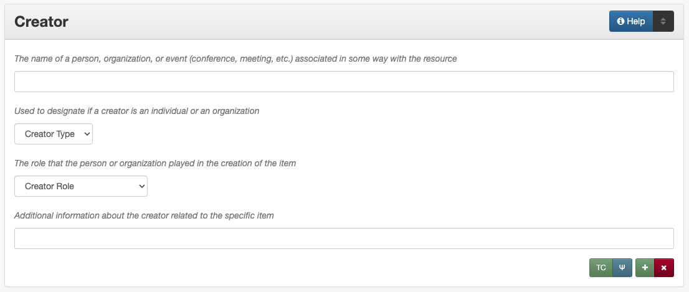

#######
Creator
#######

.. _creator-definition:

**********
Definition
**********

A person, agency, or organization primarily responsible for creating the intellectual content of the resource.

.. _creator-sources:

*******************************************
Where Can the Creator Information be Found?
*******************************************

In some cases, creators may come from accompanying or supplementary information, but they may also be found on:

+---------------------------------------+-------------------------------------------------------+
|**Item Types**                         |**Information Sources**                                |
+=======================================+=======================================================+
|For text                               |- title page                                           |
|                                       |- cover                                                |
|                                       |- end of document                                      |
|                                       |- copyright statement                                  |
|                                       |- acknowledgments                                      |
+---------------------------------------+-------------------------------------------------------+
|For images                             |- notes on bottom or back of a photograph              |
|                                       |- envelope, slip cover, or case                        |
+---------------------------------------+-------------------------------------------------------+
|For maps                               |- statement in a caption                               |
|                                       |- notes around the outside of the map                  |
+---------------------------------------+-------------------------------------------------------+
|For music scores                       |- title page or header                                 |
|                                       |- top of page                                          |
|                                       |- table of contents                                    |
+---------------------------------------+-------------------------------------------------------+
|For videos                             |- label on disc                                        |
|                                       |- container cover                                      |
|                                       |- title screen(s) or credits                           |
+---------------------------------------+-------------------------------------------------------+
|For sound files                        |- information on disc/cassette                         |
|                                       |- container information                                |
+---------------------------------------+-------------------------------------------------------+
|For computer files                     |- title page/screen                                    |
|                                       |- statement in a header/footer                         |
+---------------------------------------+-------------------------------------------------------+

.. _creator-form:

**************************************
How Creator Works in the Metadata Form
**************************************

Parts:
    #. Creator name -- text field
    #. Creator type -- drop-down menu
    #. Creator role -- drop-down menu
    #. Creator information -- text field

Repeatable?
	Yes - to include multiple creators, click 'Add' to repeat all field parts

Required?
	 No (:doc:`more information </minimally-viable-records>`)

.. _creator-fill:

************************************
How Should the Creator be Filled in?
************************************

General Creator Rules
=====================

-   If no creator information is readily available, leave the field blank
-   Only include individuals/organizations who were primarily responsible for the creation of the item

    -   Secondary "creators" (e.g., agents responsible for only a portion of the work) should be entered as :doc:`contributors </fields/contributor>` instead

        -   A name should never be entered as both a creator and a
            contributor; if an agent acts in multiple capacities, see
            the :ref:`Role <creator-role>` section for clarification
        -   For more information about when a person/organization is a
            creator or a contributor, see our :doc:`definition page </creator-contributor-definitions>`

    -   An entity **must** have a direct relationship to the item that
        can be explicated in order to be included as a creator (or contributor)

        -   If there is information about a person/organization that
            cannot be expressed as a role, it may be appropriate to add
            it elsewhere, such as a :doc:`Note </fields/note>` or :ref:`Info <creator-info>` in relation to
            an established creator

-   Include as many creators as are readily available

    -   A creator name can only entered once per record; if an agent acts in multiple capacities, see
        the :ref:`Role <creator-role>` section for clarification
    -   Place them in order of importance
    -   If creators are equally important, list them in the order that they appear
    -   If a document lists individuals as "et al." include names of
        every individual author that is known for the item
    -   If a document has an excessively large number of creators or
        authors (e.g., several hundred researchers) include the parent
        organizations as creators and the individual persons as
        contributors
        
-   For each creator the name, type, and role are **required**
-   If possible, consult an authority file to find the correct form of
    the name, such as:
    
    -   The `UNT Name App <https://digital2.library.unt.edu/name/>`_
    -   The `Library of Congress Authorities <https://id.loc.gov>`_
    -   A locally-developed utility
    
-   Note that organizational names generally reflect the name of the agency at
    the time the item was created -- e.g., Texas (Republic) vs. Texas, or North
    Texas State University vs. University of North Texas -- however, if possible,
    personal names will generally reflect a single, most current version when
    multiple names (initials, maiden names, etc.) are known to be used by a
    specific person
    

Creator Names
=============

.. _creator-name-per:

Personal Names
--------------

+-----------------------------------------------------------+---------------------------------------+
| **Guideline**                                             | **Examples**                          |
+===========================================================+=======================================+
|If known, use the authorized form of the name from the     |Kittrell, Norman G. (Norman Goree),    |
|`Library of Congress Authorities`_                         |1849-1927                              |
+-----------------------------------------------------------+---------------------------------------+
|If no authorized version is available, enter the most      |                                       |
|complete version of the name that is known using proper    |                                       |
|formatting:                                                |                                       |
+-----------------------------------------------------------+---------------------------------------+
|   a.  Invert names (Last, First Middle)                   |Hébert, Rachel Bluntzer                |
+-----------------------------------------------------------+---------------------------------------+
|   b.  Use initials if the full name(s) are not known      |Reid, Samuel C.                        |
+-----------------------------------------------------------+---------------------------------------+
|   c.  Do not change the order of names                    |Davis, J. Mark                         |
+-----------------------------------------------------------+---------------------------------------+
|   d.  Use spaces between initials                         |Blackburn, J. K. P.                    |
+-----------------------------------------------------------+---------------------------------------+
|   e.  Separate hyphenated first names with a hyphen       |Hsieh, P.-C.                           |
|       instead of a space if only initials are known       |                                       |
+-----------------------------------------------------------+---------------------------------------+
|   f.  Put additional middle names after the first name    |Briscoe, Mary Jane Harris              |
+-----------------------------------------------------------+---------------------------------------+
|   g.  Keep hyphenated "last names" and compound surnames  |-  Donahue-Smith, James A.             |
|       together                                            |-  Hasanul Basher, A. M.               |
+-----------------------------------------------------------+---------------------------------------+
|   h.  Consider multiple parts (von, de la, etc.) as part  |de la Peña, L. R.                      |
|       of the last name                                    |                                       |
+-----------------------------------------------------------+---------------------------------------+
|   i.  If a given name is unknown, the surname can be      |Goldstein                              |
|       entered alone, but names cannot be a given name only|                                       |
|       e.g., "Miss Susie" or "Uncle Roger"                 |                                       |
+-----------------------------------------------------------+---------------------------------------+
|-  If it is unclear which part of the name is the surname, |                                       |
|   enter the name as it appears on the item                |                                       |
+-----------------------------------------------------------+---------------------------------------+
|Use appropriate abbreviations:                             |                                       |
+-----------------------------------------------------------+---------------------------------------+
|a.   Only include known titles (Dr., Rev., Capt., etc.)    |-  Morris, Mrs. Harry Joseph           |
|     before the first name if:                             |-  Ross, Lieutenant                    |
|                                                           |                                       |
|     -   The title is necessary for clarification of the   |                                       |
|         name (e.g., if the given name for a married       |                                       |
|         woman is unknown)                                 |                                       |
|     -   The title is the only part of the name known      |                                       |
|         (aside from a surname)                            |                                       |
+-----------------------------------------------------------+---------------------------------------+
|b.   Include suffixes that are a part of the name (Jr.,    |Roberts, Frank H. H., Jr.              |
|     Sr., etc.) at the end of the name after a second      |                                       |
|     comma                                                 |                                       |
+-----------------------------------------------------------+---------------------------------------+
|-  Do not include:                                         | | *Name:* Parera, Mahendra            |
|                                                           | | *Info:* M.B.B.S., Ph.D., M.D.,      |
|   -   nicknames                                           |   MRCPsych, FRANZCP; Albert Road      |
|   -   abbreviations                                       |   Clinic, Melbourne, Australia        |
|   -   titles that do not fit the criteria above           |                                       |
|   -   job or educational qualifiers (C.E., D.D.S., Ph.D., |                                       |
|       etc.)                                               |                                       |
+-----------------------------------------------------------+---------------------------------------+
|-  Some common historical personal name abbreviations:     | | *Name:* James, Thomas Leroy         |
|                                                           | | *Info:* Thos. L. James              |
|   -   Chas. = Charles                                     |                                       |
|   -   Geo. = George                                       |                                       |
|   -   Jas. = James                                        |                                       |
|   -   Jno. = John                                         |                                       |
|   -   Thos. = Thomas                                      |                                       |
|   -   Wm. = William                                       |                                       |
|                                                           |                                       |
|-  Alternate versions and omitted information may be added |                                       |
|   to the "info" section                                   |                                       |
+-----------------------------------------------------------+---------------------------------------+
|-  If the same person is responsible for multiple items:   |                                       |
|                                                           |                                       |
|   -   Enter the name as consistently as possible in every |                                       |
|       record                                              |                                       |
|   -   Use the fullest form of the name that is available  |                                       |
+-----------------------------------------------------------+---------------------------------------+
|-  If the name changes and it is *certainly* the same      | | *Name:* Gaines, Ann                 |
|   person:                                                 | | *Info:* Ann Sanders                 |
|                                                           |                                       |
|   -   Use the later/most current version                  |                                       |
|   -   Include the former name in the info section if that |                                       |
|       version is used in the text                         |                                       |
|                                                           |                                       |
|-  When in doubt, enter the name as it appears on the item |                                       |
+-----------------------------------------------------------+---------------------------------------+
|-  Only include the names of specific persons (or          | | *Name:* Texas. Department of        |
|   organizations)                                          |   Transportation.                     |
|-  In cases where the name is not known (e.g., "Staff      | | *Info:* Staff Photographer          |
|   Photographer"), either:                                 |                                       |
|                                                           |                                       |
|   -   Leave the creator field blank                       |                                       |
|   -   Include the name of the parent organization and add |                                       |
|       details in the "info" section                       |                                       |
+-----------------------------------------------------------+---------------------------------------+

.. _creator-name-org:

Organization Names
------------------

+-----------------------------------------------------------+---------------------------------------+
| **Guideline**                                             | **Examples**                          |
+===========================================================+=======================================+
|-  If known, use the authorized form of the name from the  |Geological Survey (U.S.)               |
|   `Library of Congress Authorities`_                      |                                       |
|-  Otherwise, use these formatting guidelines:             |                                       |
+-----------------------------------------------------------+---------------------------------------+
|For non-government or single-level bodies:                                                         |
+-----------------------------------------------------------+---------------------------------------+
|-  Use the name as it appears in the item                  |Dallas Heritage Village                |
+-----------------------------------------------------------+---------------------------------------+
|-  Do not invert personal names that are parts of          |R. L. Polk & Co.                       |
|   organizational names                                    |                                       |
+-----------------------------------------------------------+---------------------------------------+
|-  Write out names rather than using acronyms              |Monsoon Asia Integrated Regional Study |
+-----------------------------------------------------------+---------------------------------------+
|For hierarchical agencies or entities:                                                             |
+-----------------------------------------------------------+---------------------------------------+
|-  List agency or body parts in hierarchical order,        |Texas State College for Women. College |
|   starting at the highest level and ending with the most  |of Industrial Arts.                    |
|   specific                                                |                                       |
+-----------------------------------------------------------+---------------------------------------+
|-  Separate the elements of the hierarchy with periods     |Dallas (Tex.). Police Department.      |
+-----------------------------------------------------------+---------------------------------------+
|-  Preface the name of government agencies with the name of|Washington (State). State Building Code|
|   the country or state                                    |Advisory Council. Energy Code          |
|                                                           |Committee.                             |
+-----------------------------------------------------------+---------------------------------------+
|-  If a hierarchy is unclear, record the name as it appears|                                       |
|   on the item                                             |                                       |
+-----------------------------------------------------------+---------------------------------------+
|For United States agencies:                                                                        |
+-----------------------------------------------------------+---------------------------------------+
|-  Spell out "United States" unless there is an authorized |United States. Bureau of Mines.        |
|   version that abbreviates it                             |                                       |
+-----------------------------------------------------------+---------------------------------------+
|-  In the case of a long (well-known) name, it may be      |United States. Central Intelligence    |
|   shortened by eliminating unnecessary parts              |Agency.                                |
|                                                           |                                       |
|   -   For example, the Library of Congress Authorities    |                                       |
|       often omit upper-level intermediary divisions, such |                                       |
|       as the secondary level in "United States. National  |                                       |
|       Security Council. Central Intelligence Agency."     |                                       |
+-----------------------------------------------------------+---------------------------------------+
|-  If an agency name has been translated for a non-English-| | *Name:* Texas. Parks and Wildlife   |
|   language publication, the name should still be entered  |   Department.                         |
|   in it's original form                                   | | *Version on text:* Departamento     |
|                                                           |   de Parques y Vida Silvestre de Texas|
+-----------------------------------------------------------+---------------------------------------+
|For non-U.S. organization:                                                                         |
+-----------------------------------------------------------+---------------------------------------+
|-  When using an authorized form of the name, it may be    | | *Name:* Han'guk Kwahak Kisurwŏn     |
|   appropriate to add notes to the "info" section:         | | *Info:* Korea Advanced Institute of |
|                                                           |   Science and Technology              |
|   -   If the name is written in a language other than     |                                       |
|       English, add the English translation (if relevant)  +---------------------------------------+
|   -   If the name is written in English, additional forms |China (Republic : 1949- ). Huan jing   |
|       from the item may be added                          |bao hu shu.                            |
+-----------------------------------------------------------+---------------------------------------+
|-  If there is no authorized form, follow general          |                                       |
|   formatting rules                                        |                                       |
+-----------------------------------------------------------+---------------------------------------+

.. _creator-type:

Creator Type
============

-   Choose the appropriate creator type:

+-----------------------------------------------------------+---------------------------------------+
| **Guideline**                                             | **Examples**                          |
+===========================================================+=======================================+
|If the creator is an individual                            |Personal                               |
+-----------------------------------------------------------+---------------------------------------+
|If the creator is a company, organization, association,    |Organization                           |
|agency, or other institution                               |                                       |
+-----------------------------------------------------------+---------------------------------------+
|If it is unclear whether the creator name belongs to an    |                                       |
|individual or an organization, use "Personal" and format   |                                       |
|the name appropriately                                     |                                       |
|                                                           |                                       |
|   -   (If it is important to document or clarify this     |                                       |
|       choice, use a                                       |                                       |
|       :ref:`Non-Display Note <note-nondisplay>`)          |                                       |
+-----------------------------------------------------------+---------------------------------------+

-   In some rare and very specific cases, other options may apply:

+-----------------------------------------------------------+---------------------------------------+
| **Guideline**                                             | **Examples**                          |
+===========================================================+=======================================+
|If the creator is a conference or other event that produces|Event                                  |
|papers and materials (as an entity rather than named       |                                       |
|individual participants or a hosting organization)         |                                       |
|                                                           |                                       |
|   -   For example: a statement drafted by all members of a|                                       |
|       symposium or conference as part of the activities of|                                       |
|       the meeting                                         |                                       |
|   -   There are other ways to represent an event related  |                                       |
|       to the creation of an item, such as Source, when the|                                       |
|       event *itself* is not the creator                   |                                       |
+-----------------------------------------------------------+---------------------------------------+
|If the creator is a computer program that generates data or|Software                               |
|files independently                                        |                                       |
|                                                           |                                       |
|   -   E.g.: an automatically-generated file created while |                                       |
|       a computer program was running                      |                                       |
+-----------------------------------------------------------+---------------------------------------+

.. _creator-role:

Creator Role
============

Entering Roles
--------------

-   Choose the appropriate creator role from the `controlled vocabulary <https://digital2.library.unt.edu/vocabularies/agent-qualifiers/>`_

+-----------------------------------------------------------+---------------------------------------+
| **Guideline**                                             | **Examples**                          |
+===========================================================+=======================================+
|If the role is not listed:                                                                         |
+-----------------------------------------------------------+---------------------------------------+
|-  Choose "Other"                                          | | *Name:* Phillips, Nelson            |
|-  Include clarification in the "Info" section             | | *Role:* Other                       |
|                                                           | | *Info:* Speaker; Associate Justice  |
|                                                           |   or the Supreme Court                |
+-----------------------------------------------------------+---------------------------------------+
|If more than one role applies to the creator:                                                      |
+-----------------------------------------------------------+---------------------------------------+
|-  Choose the primary or most encompassing role (or the one| | *Name:* Harden, Leland              |
|   listed first                                            | | *Role:* Editor                      |
|-  Explain the details in the info section                 | | *Info:* Executive Editor; Sponsor   |
+-----------------------------------------------------------+---------------------------------------+

Assigning Roles
---------------

-   Although the same list of roles is available for both creators and
    contributors, some roles will generally only apply to contributors:
    
    -   Agents who only had responsibility for a part, e.g., author of
        introduction, etc.; witness; consultant; expert
    -   Agents who had an indirect relationship, e.g., funder, sponsor,
        former owner, donor
    -   Additional explanation is on our creator and contributor :doc:`definition page </creator-contributor-definitions>`
    
-   The role should describe the action that the agent took in creating
    the item and it may not align with job titles or credentials, for
    example:

+---------------+-----------------------------------------------------------+-------------------+---------------+------------------------------------------+
|               |Agents                                                     |Role               |Field          |Example                                   |
+===============+===========================================================+===================+===============+==========================================+
|"Director"     |director of a performance (film, play, concert, etc.)      |Director           |Creator        | | *Name:* Homer, Paula                   |
|               |                                                           |                   |               | | *Type:* Personal                       |
|               |                                                           |                   |               | | *Role:* Director                       |
|               |                                                           |                   |               | | *Info:* UNT Opera Theater              |
|               +-----------------------------------------------------------+-------------------+---------------+------------------------------------------+
|               |executive director of an agency with no apparent personal  |n/a                |Creator        | | *Name:* Texas. Department of           |
|               |contribution to the item                                   |                   |               |   Transportation.                        |
|               |                                                           |                   |               | | *Type:* Organization                   |
|               |                                                           |                   |               | | *Role:* Author                         |
|               |                                                           |                   |               | | *Info:* Phil Wilson, Executive Director|
|               +-----------------------------------------------------------+-------------------+---------------+------------------------------------------+
|               |executive director of an agency with a described or        |Author of          |Contributor    | | *Name:* Camargo, Gene                  |
|               |understandable role (e.g., author of transmittal letter)   |introduction, etc. |               | | *Type:* Personal                       |
|               |                                                           |                   |               | | *Role:* Author of introduction, etc.   |
|               |                                                           |(or another        |               | | *Info:* Director of Building           |
|               |                                                           |appropriate role)  |               |   Inspections                            |
+---------------+-----------------------------------------------------------+-------------------+---------------+------------------------------------------+
|"Performer"    |-  musician in a recital or concert                        |Performer          |Creator        | | *Name:* North Texas Wind Symphony      |
|               |-  actor in a play or movie                                |                   |               | | *Type:* Organization                   |
|               |                                                           |                   |               | | *Role:* Performer                      |
|               +-----------------------------------------------------------+-------------------+---------------+------------------------------------------+
|               |a person/organization that "performed" work or research    |Originator,        |Creator        | | *Name:* Quigg, Antonietta Salvatrice   |
|               |(aside from, or in addition to, specific person/s who      |Researcher, or     |               | | *Type:* Personal                       |
|               |authored a report or created some product of the work)     |another appropriate|               | | *Role:* Author                         |
|               |                                                           |role               +---------------+------------------------------------------+
|               |                                                           |                   |Contributor    | | *Name:* Texas Water Development Board  |
|               |                                                           |                   |               | | *Type:* Organization                   |
|               |                                                           |                   |               | | *Role:* Originator                     |
+---------------+-----------------------------------------------------------+-------------------+---------------+------------------------------------------+
|"Consultant"   |a consulting company or person that authors a report       |Author             |Creator        | | *Name:* Kerley, Gerald Irwin           |
|               |                                                           |                   |               | | *Type:* Personal                       |
|               |                                                           |                   |               | | *Role:* Author                         |
|               |                                                           |                   |               | | *Info:* Kerley Technical Consultant,   |
|               |                                                           |                   |               |   Appomattox, VA)                        |
|               +-----------------------------------------------------------+-------------------+---------------+------------------------------------------+
|               |-  a consultant who provided information as a contribution |Consultant         |Contributor    | | *Name:* Kanto, Leonard E.              |
|               |   to a report                                             |                   |               | | *Type:* Personal                       |
|               |-  a consultant who spoke during recorded/transcribed      |                   |               | | *Role:* Consultant                     |
|               |   proceedings (could also be an "expert" or "witness"     |                   |               | | *Info:* State of Texas Professional    |
|               |   depending on the context)                               |                   |               |   Engineer; Consultant Engineer          |
+---------------+-----------------------------------------------------------+-------------------+---------------+------------------------------------------+

.. _creator-info:

Creator Info
============

-   Info is not required as part of the creator entry
-   This field is only for information about the creator listed in or
    directly related to the object
-   The info field is not intended for biographies or lengthy descriptions of the agent
-   It is not necessary to do research to find information; this field
    is only used for readily-available notes

+-----------------------------------------------------------+---------------------------------------+
| **Guideline**                                             | **Examples**                          |
+===========================================================+=======================================+
|-  Include information that clarifies the role of the      |Co-Editor                              |
|   creator                                                 |                                       |
+-----------------------------------------------------------+---------------------------------------+
|-  Include other relevant information known about the      |-  Geo. S. Anderson                    |
|   creator that relates to the object, such as:            |-  1906-2005                           |
|                                                           |-  Ph.D.; Texas A &amp; M University   |
|   -   Additional forms of the creator's name              |   Real Estate Center                  |
|   -   Addresses                                           |-  "By his son, the late Wilson Gregg" |
|   -   Birth and death dates (not part of an authorized    |   (d. 1899)                           |
|       name)                                               |                                       |
|   -   Organizational affiliations                         |                                       |
|   -   Other information associated with the name          |                                       |
+-----------------------------------------------------------+---------------------------------------+
|-  For an agency, the info may include:                    |-  LLNL                                |
|                                                           |-  U.S. Department of Agriculture,     |
|   -   Persons associated with the organization who did not|   Office of Experiment Stations; W. O.|
|       have another role (e.g., directors)                 |   Atwater, Director                   |
|   -   Acronyms, abbreviations, or alternative name forms  |                                       |
|   -   Additional omitted hierarchical components (e.g.,   |                                       |
|       for some federal agencies)                          |                                       |
+-----------------------------------------------------------+---------------------------------------+
|-  There are no strict formatting requirements for info,   |-  California Univ., Berkeley, CA      |
|   but here are some suggestions:                          |   (United States). Dept. of Geology   |
|                                                           |   and Geophysics Lawrence Berkeley    |
|   -   List each name, fact, or statement individually and |   Lab., CA (United States)            |
|       separate them with semicolons or periods            |-  Freegift Vandervoort, of Carrizo    |
|   -   Use sentence form when relevant, or when taken      |   Springs, Texas ; F. Vandervoort     |
|       directly from the item                              |-  Member of the Association of        |
|   -   Quotation marks may be used when quoting information|   American Directory Publishers"      |
|       directly from the item                              |                                       |
+-----------------------------------------------------------+---------------------------------------+

.. _creator-examples:

***************
Other Examples:
***************

**Book**

    -   *Name:* Farrar, R. M.
    -   *Type:* Personal
    -   *Role:* Author

**Yearbook**

    -   *Name:* North Texas Laboratory School
    -   *Type:* Organization
    -   *Role:* Author

|
    
    -   *Name:* Mays, Sharon
    -   *Type:* Personal
    -   *Role:* Editor
    -   *Information:* Co-Editor

|

    -   *Name:* Wyss, Margaret
    -   *Type:* Personal
    -   *Role:* Editor
    -   *Information:* Co-Editor

**Genealogical newsletter**

    -   *Name:* Texas State Genealogical Society
    -   *Type:* Organization
    -   *Role:* Author

|

    -   *Name:* Pryor, Frances
    -   *Type:* Personal
    -   *Role:* Editor

**Atlas**

    -   *Name:* Geological Survey (U.S.)
    -   *Type:* Organization
    -   *Role:* Author
    -   *Information:* U.S. Department of the Interior, Geological Survey; J. W. Powell, Director

|

    -   *Name:* Dutton, Clarence E.
    -   *Type:* Personal
    -   *Role:* Author
    -   *Information:* Capt. Clarence E. Dutton U.S.A. - Author of "Tertiary History of the Grand Canon District"

**Collection of legal papers**

    -   *Name:* Blades, J. R.
    -   *Type:* Personal
    -   *Role:* Compiler
    -   *Information:* Clerk, District Court, Henderson County

**Painting**

    -   *Name:* Seurat, Georges, 1859-1891
    -   *Type:* Personal
    -   *Role:* Artist
    -   *Information:* French

**Research report**

    -   *Name:* Moris, Marlene C.
    -   *Type:* Personal
    -   *Role:* Author
    -   *Information:* International Centre for Diffraction Data

|

    -   *Name:* McMurdie, Howard F.
    -   *Type:* Personal
    -   *Role:* Author
    -   *Information:* International Centre for Diffraction Data

|

    -   *Name:* Evans, Eloise H.
    -   *Type:* Personal
    -   *Role:* Author
    -   *Information:* International Centre for Diffraction Data

|

    -   *Name:* Paretzkin, Boris
    -   *Type:* Personal
    -   *Role:* Author
    -   *Information:* International Centre for Diffraction Data

|

    -   *Name:* Parker, Harry S.
    -   *Type:* Personal
    -   *Role:* Author
    -   *Information:* International Centre for Diffraction Data

|

    -   *Name:* Panagiotopoulos, Nicholas C.
    -   *Type:* Personal
    -   *Role:* Author
    -   *Information:* International Centre for Diffraction Data

|

    -   *Name:* Hubbard, Camden R.
    -   *Type:* Personal
    -   *Role:* Author
    -   *Information:* National Measurement Laboratory, National Bureau of Standards, Washington D.C.

**Map**

    -   *Name:* Hill, Robert Thomas, 1858-1941
    -   *Type:* Personal
    -   *Role:* Cartographer
    -   *Information:* "By Robert T. Hill"

**Opera score**

    -   *Name:* Smith, Julia, 1905-1989
    -   *Type:* Personal
    -   *Role:* Composer
    -   *Information:* Music by Julia Smith

**Laws of Texas**

    -    *Name:* Texas (Republic). Secretary of State.
    -    *Type:* Organization
    -    *Role:* Compiler

**City directory**

    -   *Name:* Morrison & Fourmy Directory Co.
    -   *Type:* Organization
    -   *Role:* Compiler
    -   *Information:* Compilers, Publishers and Proprietors

**Committee report**

    -   *Name:* Texas. Legislature. House of Representatives. Committee on Business and Industry.
    -   *Type:* Organization
    -   *Role:* Author

**Photograph**

    -   *Name:* Dallas (Tex.). Police Department.
    -   *Type:* Organization
    -   *Role:* Photographer
    -   *Information:* Staff photographer

.. _creator-comments:

********
Comments
********

-   Name fields are connected to the `UNT Name App`_, which will try to
    match text against local authority files. Editors should always
    choose an authorized form from the list if it is available.
-   The creator field is not constrained by the AACR2 practice of
    limiting creators to three or fewer names. Include as many creators
    as are readily available.
-   If the creator and the publisher are the same, repeat the name in
    the :doc: `Publisher </fields/publisher>` element.
-   Individuals or organizations with lesser responsibility for creation
    of the intellectual content of the resource should be recorded in
    the :doc: `Contributor </fields/contributor>` element instead of the creator
    element. Some examples of contributors are collector, donor,
    section editor, etc.
-   The creator roles come primarily from MARC `relator codes <http://www.loc.gov/marc/relators/relators.html>`_; not
    all of the Library of Congress roles are included in the UNT system
    and several local codes have been added to the UNT list.

.. _creator-resources:

*********
Resources
*********

-   UNT Creator Role `controlled vocabulary <https://digital2.library.unt.edu/vocabularies/agent-qualifiers/>`__
-   UNT Creator Type `controlled vocabulary <https://digital2.library.unt.edu/vocabularies/agent-type/>`__
-   :doc:`Creator and Contributor Definitions </creator-contributor-definitions>` (how to choose which one to use)
-   `UNT Name App`_
-   Library of Congress

    - `Authorities <http://authorities.loc.gov>`_
    - `Linked Data Service <http://id.loc.gov/>`_

-   `OCLC Worldcat <http://www.worldcat.org/>`_
-   `Worldcat via FirstSearch <https://discover.library.unt.edu/catalog/b2247936>`_ (Accessible to UNT staff/students)

**More Guidelines:**

-   :doc:`Quick-Start Metadata Guide </guides/quick-start-guide>`
-   `Metadata Home <https://library.unt.edu/metadata/>`_