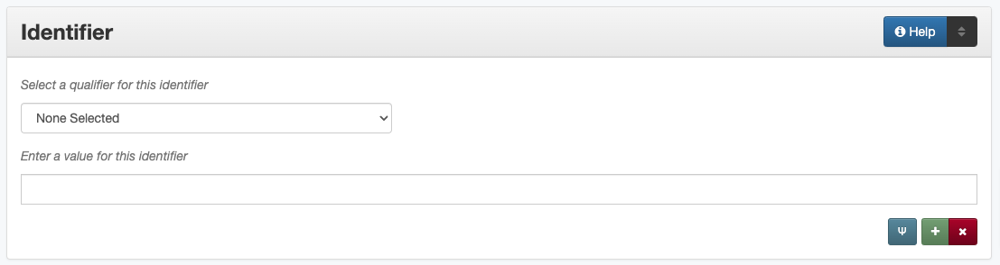

==========
Identifier
==========

**********
Definition
**********

A numeric or alphanumeric string or a URL that identifies the item in a
particular context.

**********************************************
Where Can the Identifier Information be Found?
**********************************************

Identifier information can be found in several places including:

+---------------------------------------+-------------------------------------------------------+
|**Item Types**                         |**Information Sources**                                |
+=======================================+=======================================================+
|For text                               |- a title page                                         |
|                                       |- a documentation page                                 |
|                                       |- the cover of a report or book                        |
+---------------------------------------+-------------------------------------------------------+
|For webpages or online resources       |- a website                                            |
|                                       |- a URL                                                |
+---------------------------------------+-------------------------------------------------------+
|For any item type                      |- a library catalog record                             |
|                                       |- an OCLC record                                       |
|                                       |- local accession records                              |
|                                       |- the physical item                                    |
|                                       |- accompanying or supplementary material               |
+---------------------------------------+-------------------------------------------------------+

*****************************************
How Identifier Works in the Metadata Form
*****************************************

Parts:
   1. Identifier type -- drop-down menu
   2. Identifier -- text field

Repeatable?:   
    Yes - to include multiple identifiers, click 'Add' to repeat all
    field parts

Required?
   No ([more information][])

***************************************
How Should the Identifier be Filled in?
***************************************

+-------------------------------------------------------------------------------+------------------------------------------------+
|**Guidelines**                                                                 |**Examples**                                    |
+===============================================================================+================================================+
|-   Enter the identifier exactly as it is found on the item or record          |M1500.G68 A4                                    |
+-------------------------------------------------------------------------------+------------------------------------------------+
|-  Include one or more relevant identifiers when they are available            |b2695683                                        |
|-  Include additional identifiers if they aid information-gathering            +------------------------------------------------+
|                                                                               |50684665                                        |
|                                                                               +------------------------------------------------+
|                                                                               |Z232.A56 J67 1853z                              |
+-------------------------------------------------------------------------------+------------------------------------------------+
|-  For Local Control Numbers include the (Institution)[] code followed by an   |*Original:* 76-085.071                          |
|   underscore ( _ ) before the number                                          +------------------------------------------------+
|-  Local practice (within UNT Digital Projects) is to change some punctuation  |*Local Control Number:* PBPM_76-085-071         |
|   of locally-assigned numbers when they are used as filenames during scanning |                                                |
|   (see (webpage)[])                                                           |                                                |
+-------------------------------------------------------------------------------+------------------------------------------------+
|-  Select the correct identifier type from the `controlled vocabulary          |LCCN - Library of Congress Control Number       |
|   <http://purl.org/NET/UNTL/vocabularies/identifier-qualifiers/>`_.           |                                                |
+-------------------------------------------------------------------------------+------------------------------------------------+
|-  If the appropriate identifier type is not on the list, choose "other" and   |OTHER - Other                                   |
|   notify the `metadata administrators                                         |                                                |
|   <https://library.unt.edu/digital-projects-unit/contacts/>`_.                |                                                |
+-------------------------------------------------------------------------------+------------------------------------------------+

Other Examples
==============

Book: The Forgotten Colony: San Patricio de Hibernia: The History, the People and the Legends of the Irish Colony of McMullen-McGloin
    *CALL-NO:* F392.S237 H43 1981
    *UNTCAT:* b2047410
    *ISBN:* 0890152934
    *ISBN:* 9780890152935
    *LCCN:* 88-103244
    *OCLC:* 18258092

Journal issue: Chemical Literature, Volume 27, Number 1, Spring 1975
    *ISSN:* 0364-1929
    *OCLC:* 1553979

Department of Agriculture pamphlet: Production of pumpkins and squashes.
    *SUDOC:* A 1.35:141
    *OCLC:* 68565990
    *UNTCAT:* b3064507

Architectural Drawing: Birdseye Perspective from Northwest, Restoration Legation de France, Austin, Texas, For Daughters of the Republic of Texas
    *LOCAL-CONT-NO:* FRLM_810-1169

Music score: Ballet du Temple de la paix
    *CALL-NO:* M1520.L87 B3
    *OCLC:* 23032723
    *OTHER:* LWV 69
    *RISM:* RISM A/I, L 3049
    *UNTCAT:* b1373221

Congressional report: Merit Pay for Elementary and Secondary School Teachers: Background Discussion and Analysis of Issues
    *CRS:* 83-541S
    *LOCAL-CONT-NO:* 83-541S 1983-09-14

Map: Location and Depths of the Artesian Wells of the Black and Grand Prairies of Texas
    *OCLC:* 25650057

Office of Technology Assessment report: Informing the Nation: Federal Information Dissemination in an Electronic Age
    *SUDOC:* Y 3.T 22/2:2 In 3/9/sum.
    *OCLC:* 18605251
    *REP-NO:* OTA-CIT-397

Comments
========
-   Identifiers provide information needed to retrieve a file from the
    storage system, to access a bitstream within a file, or to locate a
    physical object.
-   Library of Congress Control Numbers should be verified as current, then normalized by:

    -   adding zeros as necessary to make the right-most number 6 digits long
    -   removing all spaces and punctuation
    -   examples:
    
        -   12-35651  >>  12035651
        -   2001-214515  >>  2001214515
        -   sc 85-7042  >>  sc85007042

**Glossary of Identifier Qualifiers:**

+-------------------------------+-------------------------------+---------------------------------------------------------------+
|Code                           |Name                           |Definition                                                     |
+===============================+===============================+===============================================================+
|ARK                            |Archival Resource Key          |A persistent, unique number systematically assigned to an item |
|                               |                               |for archival purposes                                          |
+-------------------------------+-------------------------------+---------------------------------------------------------------+
|BRAC-NUM                       |BRAC Number                    |A document identification number assigned to items held by the |
|                               |                               |Base Reassignment and Closure Commission (BRAC)                |
+-------------------------------+-------------------------------+---------------------------------------------------------------+
|CALL-NO                        |Call Number                    |An alphanumeric code assigned to each item in a library to     |
|                               |                               |classify and indicate its location on the shelves              |
+-------------------------------+-------------------------------+---------------------------------------------------------------+
|CASI                           |Center for AeroSpace           |A document identification number assigned to items held by the |
|                               |Information Number             |Center for AeroSpace Information (including NASA/NACA technical|
|                               |                               |reports)                                                       |
+-------------------------------+-------------------------------+---------------------------------------------------------------+
|CRS                            |CRS Report Number              |A number assigned to Congressional Research Service reports    |
+-------------------------------+-------------------------------+---------------------------------------------------------------+
|DOI                            |Digital Object Identifier      |The string used as an identifier by the `DOI System            |
|                               |                               |<http://www.doi.org/factsheets/DOIIdentifiers.html>`_. for an  |
|                               |                               |intellectual property entity                                   |
+-------------------------------+-------------------------------+---------------------------------------------------------------+
|GOVNO                          |Government Document Number     |Designates documents published by government agencies,         |
|                               |                               |excluding more specific identifier types, e.g., SuDoc and TxDoc|
|                               |                               |numbers                                                        |
+-------------------------------+-------------------------------+---------------------------------------------------------------+
|GRANTNO                        |Grant Number                   |A number assigned to a grant by the granting agency            |
+-------------------------------+-------------------------------+---------------------------------------------------------------+
|ISBN                           |International Standard Book    |A unique, machine-readable identification number for books     |
|                               |Number                         +---------------------------------------------------------------+
|                               |                               |ISBNs are defined in ISO Standard 2108                         |
+-------------------------------+-------------------------------+---------------------------------------------------------------+
|ISSN                           |International Standard Serial  |An eight-digit number whch identifies periodical publications, |
|                               |Number                         |including electronic serials                                   |
+-------------------------------+-------------------------------+---------------------------------------------------------------+
|LCCN                           |Library of Congress Control    |Coded numbers assigned by the Library of Congress to item      |
|                               |Number                         |records                                                        |
+-------------------------------+-------------------------------+---------------------------------------------------------------+
|LOCAL-CONT-NO                  |Accession or Local Control     |Accession numbers assigned by a museum, archive, or special    |
|                               |Number                         |collection, or local numbers used by a collector to identify   |
|                               |                               |elements of a personal collection                              |
+-------------------------------+-------------------------------+---------------------------------------------------------------+
|OCLC                           |OCLC Accession Number          |The unique identification number listed in the `Online Computer|
|                               |                               |Library Center <https://www.oclc.org/>`_. (OCLC) WorldCat      |
|                               |                               |record as part of their worldwide cataloging and interlibrary  |
|                               |                               |loan database                                                  |
+-------------------------------+-------------------------------+---------------------------------------------------------------+
|OSTI                           |Office of Scientific &         |A document identification number assigned to items published or|
|                               |Technical Information Report   |held by the U.S. Office of Science & Technology Information    |
|                               |Number                         |                                                               |
+-------------------------------+-------------------------------+---------------------------------------------------------------+
|PAT-NO                         |Patent Number                  |A number assigned to a patent application by the patent office |
+-------------------------------+-------------------------------+---------------------------------------------------------------+
|REP-NO                         |Report Number                  |A publisher-supplied number identifying a report, usually      |
|                               |                               |within a series of similar reports                             |
|                               |                               +---------------------------------------------------------------+
|                               |                               |A report number may be a standard technical report number      |
|                               |                               |formulated to the ANSI/NISO Z39.23 standard, or a less         |
|                               |                               |standardized number designed to work within an organizational  |
|                               |                               |scheme of the issuing agency's publications                    |
+-------------------------------+-------------------------------+---------------------------------------------------------------+
|RISM                           |RISM Number                    |A unique identifier within Répertoire International des Sources|
|                               |                               |Musicales (RISM), the International Inventory of Musical       |
|                               |                               |Sources                                                        |
+-------------------------------+-------------------------------+---------------------------------------------------------------+
|SERIESNO                       |Series Number                  |A sequence number assigned to a publication that is part of a  |
|                               |                               |series or serial, but is not a Report Number                   |
+-------------------------------+-------------------------------+---------------------------------------------------------------+
|SUDOC                          |SuDoc Number                   |`Superintendent of Documents Classification                    |
|                               |                               |<https://www.fdlp.gov/cataloging-and-classification/           |
|                               |                               |classification-guidelines>`_. (SuDoc) numbers are assigned to  |
|                               |                               |federal documents to group government publications by authoring|
|                               |                               |agencies                                                       |
+-------------------------------+-------------------------------+---------------------------------------------------------------+
|TXDOC                          |TxDoc Number                   |`Texas Document Classification                                 |
|                               |                               |<http://www.tsl.state.tx.us/statepubs/classmanual.html>`_.     |
|                               |                               |(TxDoc) numbers are assigned to Texas state documents as unique|
|                               |                               |identifiers for publications of teh state government           |
+-------------------------------+-------------------------------+---------------------------------------------------------------+
|UNTCAT                         |UNT Catalog Number             |The bibliographic record number for a specific UNT library     |
|                               |                               |record                                                         |
+-------------------------------+-------------------------------+---------------------------------------------------------------+
|URL                            |Uniform Resource Locator       |The global address of the document or resource on the World    |
|                               |                               |Wide Web                                                       |
+-------------------------------+-------------------------------+---------------------------------------------------------------+
|URN                            |Uniform Resource Name          |A persistent resource identifier (including PURLs)             |
+-------------------------------+-------------------------------+---------------------------------------------------------------+
|UUID                           |Universally Unique Identifier  |An identifier used in software construction                    |
+-------------------------------+-------------------------------+---------------------------------------------------------------+
|OTHER                          |Other Identifier               |Used for identifiers that do not fit into another category     |
+-------------------------------+-------------------------------+---------------------------------------------------------------+

Resources
=========

-   UNT Identifier Type [Controlled Vocabulary][]
-   Library of Congress [Catalog][]
- [OCLC Worldcat][]
- [Worldcat via FirstSearch database][] (Requires UNT authentication)

**More Guidelines:**

- [Quick-Start Metadata Guide][]
- [Input Guidelines for Descriptive Metadata][]
- [Metadata Home][]

[more information]: https://library.unt.edu/digital-projects-unit/metadata/minimally-viable-records/
[DOI System]: http://www.doi.org/factsheets/DOIIdentifiers.html
[Online Computer Library Center]: https://www.oclc.org/
[Superintendent of Documents Classification]: https://www.fdlp.gov/cataloging-and-classification/classification-guidelines
[Texas Document Classification]: http://www.tsl.state.tx.us/statepubs/classmanual.html
[Controlled Vocabulary]: https://digital2.library.unt.edu/vocabularies/identifier-qualifiers/
[Catalog]: http://catalog.loc.gov/
[OCLC Worldcat]: http://www.worldcat.org/
[Worldcat via FirstSearch database]: https://iii.library.unt.edu/record=e1000044~S12
[Quick-Start Metadata Guide]: https://library.unt.edu/digital-projects-unit/metadata/quick-start-guide/
[Input Guidelines for Descriptive Metadata]: https://library.unt.edu/digital-projects-unit/metadata/input-guidelines-descriptive/
[Metadata Home]: https://library.unt.edu/digital-projects-unit/metadata/

