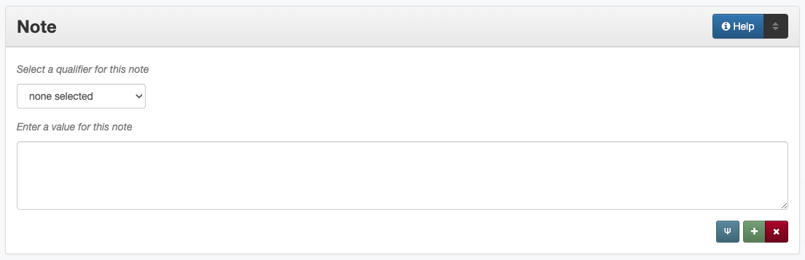

####
Note
####

.. _note-definition:

**********
Definition
**********

A "catch-all" field for additional information that cannot be entered or does not fit well in other elements.

.. _note-sources:

****************************************
Where Can the Note Information be Found?
****************************************

For any item type, information that goes into the note field can come
from any part of the item including:

-   the cover
-   the title page
-   table of contents
-   handwritten notes on pages or images
-   examining or reading the text of the item (e.g., inconsistent page
    numbers)
-   supplementary or accompanying information

.. _note-form:

***********************************
How Note Works in the Metadata Form
***********************************

Parts:
   1. Note type -- drop-down menu
   2. Note -- text field

Repeatable?
:   Yes - clicking 'Add' repeats all field parts

Required?
	 No (:doc:`more information </minimally-viable-records>`)

.. _note-fill:

*********************************
How Should the Note be Filled in?
*********************************

.. _note-display:

General (Display) Note
======================

+-------------------------------------------------------------------------------+------------------------------------------------+
|**Guidelines**                                                                 |**Examples**                                    |
+===============================================================================+================================================+
|-      Include any important information about the item that does not fit in   |The original contains a silk fiber sample.      |
|       other fields                                                            |                                                |
|-      As appropriate, include a contextual statement to clarify the           |                                                |
|       information source                                                      |                                                |
+-------------------------------------------------------------------------------+------------------------------------------------+
|-      Put information in quotations when it is copied directly from the source|"Issued May 11, 1918."                          |
|                                                                               +------------------------------------------------+
|                                                                               |Text at top of map: "A three-mile breakwater,   |
|                                                                               |seventeen feet above mean low tide, sixteen feet|
|                                                                               |at the base and five feet at top."              |
+-------------------------------------------------------------------------------+------------------------------------------------+
|-      Include Roman numerals from the title                                   |"Vol. IV."                                      |
|                                                                               +------------------------------------------------+
|(Also see [Serials and Series][] regarding normalized titles.)                 |"Vol. II, No. 3."                               |
+-------------------------------------------------------------------------------+------------------------------------------------+
|-      Include notes about non-standard or inconsistent page numbers, missing  |The original document is missing pages 15 and   |
|       pages or other oddities                                                 |16.                                             |
|                                                                               +------------------------------------------------+
|                                                                               |"Volume LXX" on title page is a misprint.  It   |
|                                                                               |should be "Volume LXXI."                        |
+-------------------------------------------------------------------------------+------------------------------------------------+
|-      When relevant, include accompanying information that may have come from |"S1-JR-41" written on sleeve.                   |
|       another source or physical container, e.g., text written on the sleeve  +------------------------------------------------+
|       of a negative                                                           |Accompanying information: "Tractor given to him |
|                                                                               |by Mrs. Dick Mitchell."                         |
+-------------------------------------------------------------------------------+------------------------------------------------+
|-      It might be useful to include background information that relates to the|Additional historical context: The Tower of     |
|       item that is not directly part of the content, e.g.:                    |Americas was constructed for the World's Fair of|
|                                                                               |1968, known as HemisFair '68, which was held    |
|       -       biographical information about the creator or person in an image|from April to October, 1968.                    |
|       -       history of a pictured building or location                      +------------------------------------------------+
|       -       collection-level or contextual information                      |Additional information about the publisher: An  |
|       -       etc.                                                            |important publisher of children's books during  |
|                                                                               |the mid-1800's in New England.  Babcock was     |
|                                                                               |particularly known for "toy books" - short,     |
|                                                                               |small pamphlets and chapbooks with simple wood  |
|                                                                               |cut illustrations.                              |
+-------------------------------------------------------------------------------+------------------------------------------------+

.. _note-nondisplay:

Metadata (Non-Displaying) Note
==============================

-   Non-display notes are not visible to the public, but are used for any
    information important to internal maintenance of records or relevant
    to the original items

+-------------------------------------------------------------------------------+------------------------------------------------+
|**Guidelines**                                                                 |**Examples**                                    |
+===============================================================================+================================================+
|This may be an appropriate place to include notes about:                       |Shortened title was chosen for official title to|
|                                                                               |facilitate discovery.                           |
|       -       decisions to include (or not include) particular information    +------------------------------------------------+
|       -       preservation information about the physical items               |Conserved in 2002 with donation funds.          |
|       -       donor or provenance information                                 +------------------------------------------------+
|       -       relevant private personal information (e.g., addresses or       |Provenance: ca. Guerrero.                       |
|               contact information) that should not be public                  +------------------------------------------------+
|       -       sources of information found by editor                          |Date of image based on movie release in 1953,   |
|       -       administrative or digitization information                      |per imdb.                                       |
+-------------------------------------------------------------------------------+------------------------------------------------+

.. _note-examples:

**************
Other Examples
**************

Display Notes
=============

-   Digitization completed by Digital Daring Inc. under contract to the
    University of North Texas Libraries.
-   Performed in Hebrew with English subtitles.
-   "Volume II."
-   Pages numbered consecutively though each volume.
-   A related image is available in the Portal at 4.0084c.
-   Earlier images of this site are available in Mr. Goin's collection
    at 4.0123a and 6.0018b.
-   Distributed to some depository libraries in microfiche.
-   At head of title: Committee print.
-   Does not show western Texas beyond 7 miles west of San Antonio.
-   Purchased with funds provided by the Friends of the UNT Libraries.
-   "HR-2555"

Non-Displaying Notes
====================

-   There was accompanying information not included in the record because it did not appear to match the item.
-   Unverified creator due to conflicting information on duplicate copies.
-   This does not appear to actually be a photo of the Livingston-Hess House, though it is similar.

.. _note-resources:

*********
Resources
*********

**More Guidelines:**
-   :doc:`Quick-Start Metadata Guide </guides/quick-start-guide>`
-   `Metadata Home <https://library.unt.edu/metadata/>`_