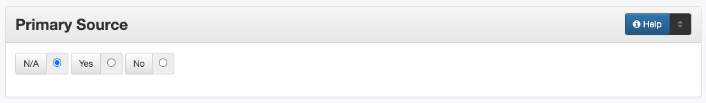

##############
Primary Source
##############

.. _psource-definition:

**********
Definition
**********

The primary source field designates firsthand accounts of historical subjects.

.. _psource-sources:

**************************************************
Where Can the Primary Source Information be Found?
**************************************************

-   Whether or not an item is a primary source is determined by
    examining the item
-   For our purposes, primary sources are firsthand accounts or archival
    copies of historical items

.. _psource-form:

*********************************************
How Primary Source Works in the Metadata Form
*********************************************

Parts:
	#. N/A -- radio button
	#. Yes -- radio button
	#. No -- radio button

Repeatable?
    No

Required?
	 No (:doc:`more information </minimally-viable-records>`)

	 
.. _psource-fill:

*******************************************
How Should the Primary Source be Filled in?
*******************************************

-   If the resource is a primary source, click the radio button marked
    "Yes" on the metadata entry form
-   If the resource is not a primary source, click the radio button
    marked "No"
-   If the item contains components that are both primary and secondary,
    choose "No" and include a :doc:`note </fields/note>`
-   If it is unclear whether the item is a primary source or if it
    cannot be determined, choose the radio button marked "N/A" (not
    applicable)

Is the item a primary source?
=============================

+---------------------------------------------------------------+-------------------------------------------------------+
| **Primary Source**                                            | **Not a Primary Source**                              |
+===============================================================+=======================================================+
|autobiographies                                                |biographies                                            |
+---------------------------------------------------------------+-------------------------------------------------------+
|a personal collection of original school photographs           |yearbooks                                              |
+---------------------------------------------------------------+-------------------------------------------------------+
|journal article written in 1943 about WWII                     |journal article written in 2008 about WWII             |
+---------------------------------------------------------------+-------------------------------------------------------+
|original census data published by the government               |written history that quotes census numbers             |
+---------------------------------------------------------------+-------------------------------------------------------+

For more clarification about a particular item:

    -   See if the item fits one of the example categories in the next section
    -   Try reading the :doc:`Scholars' Definitions </primary-sources-definition>` of Primary Sources

.. _psource-examples:

***************
Other Examples:
***************

-   Diaries, personal journals, letters, memos, postcards, manuscripts,
    memoirs, autobiographies, oral histories
-   Private papers, deeds, wills
-   Speeches, interviews, personal accounts, oral histories
-   Documentary photographs, audio recordings, movies, or videos
-   Government records, proceedings, court records, census data, patents
-   Records of organizations (e.g., minutes, reports, correspondence)
-   Public opinion polls, consumer surveys
-   Scientific experiments, field notes, artifacts, schematic drawings,
    technical reports
-   City directories
-   Maps
-   Paintings, sculptures, jewelry
-   Published materials (books and magazine/newspaper articles) written
    AT THE TIME about a particular event
-   Reprinted primary sources (often in reference books such as Speeches
    of the American Presidents or Documents of American History)

.. _psource-comments:

********
Comments
********

-   To describe the category of the resource, use the :doc:`Resource Type </fields/type>` element.

.. _psource-resources:

*********
Resources
*********

-   :doc:`Scholars' Definitions </primary-sources-definition>` of Primary Sources

More Guidelines:

-   :doc:`Quick-Start Metadata Guide </guides/quick-start-guide>`
-   `Metadata Home <https://library.unt.edu/metadata/>`_