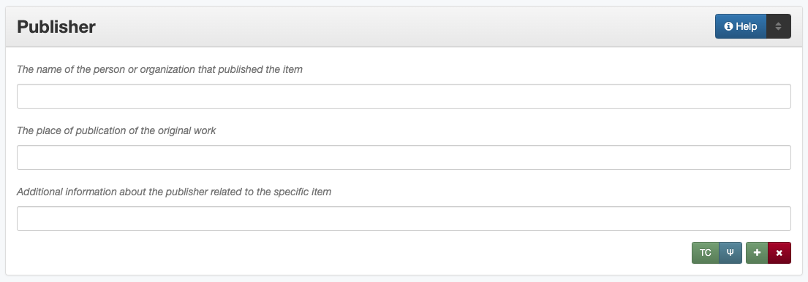

#########
Publisher
#########

.. _publisher-definition:

**********
Definition
**********

An entity responsible for making the resource available: the publisher of the original work.

.. _publisher-sources:

*********************************************
Where Can the Publisher Information be Found?
*********************************************

-   A publisher can be a publishing house, an organization, a service, a
    corporate body, a government agency, a museum, a historical society,
    a university, a project, a repository, a person, etc. and may be
    found on:

    -   a copyright page
    -   an inside cover of a book
    -   a colophon
    -   a logo stamped on a photograph, map, or cover of a book
    -   accompanying or supplementary information

.. _publisher-form:

****************************************
How Publisher Works in the Metadata Form
****************************************

Parts:
    #. Publisher name -- text field
    #. Publisher location -- text field
    #. Publisher information -- text field

Repeatable?
	Yes - to include multiple publishers, click 'Add' to repeat all field parts

Required?
	 No (:doc:`more information </minimally-viable-records>`)

.. _publisher-fill:

**************************************
How Should the Publisher be Filled in?
**************************************

General Publisher Rules
=======================

-   If no publisher statement is present on the resource or its documentation, leave the field blank
-   When relevant, multiple publishers can be included, but it may be appropriate for a second publisher
    to be listed as a :doc:`contributor </fields/contributor>` instead (for example, a "printer" or "distributor")

.. _publisher-name:

Publisher Names
---------------

+-----------------------------------------------------------+---------------------------------------+
| **Guideline**                                             | **Examples**                          |
+===========================================================+=======================================+
|-  If known, use the authorized form of the name from the  |United States. Government Printing     |
|   `Library of Congress Authorities <https://id.loc.gov/>`_|Office.                                |
+-----------------------------------------------------------+---------------------------------------+
|-  If no authorized version is available, enter the most   |                                       |
|   complete version of the name that is known using proper |                                       |
|   formatting:                                             |                                       |
+-----------------------------------------------------------+---------------------------------------+
|   -   Do not invert names of individuals (for             |Roberta Wright Rylander                |
|       self-publishing)                                    |                                       |
+-----------------------------------------------------------+---------------------------------------+
|For non-government or single-level bodies:                                                         |
+-----------------------------------------------------------+---------------------------------------+
|   -   Use the name as it appears in the item              |Lewis Publishing Company               |
+-----------------------------------------------------------+---------------------------------------+
|   -   Do not invert personal names that are parts of      |A. C. Baldwin & Sons                   |
|       organizational names                                |                                       |
+-----------------------------------------------------------+---------------------------------------+
|   -   Put [square brackets] around publisher names if it  |[Houston] Chamber of Commerce          |
|       is important to clarify components that do not come |                                       |
|       from the resource itself                            |                                       |
+-----------------------------------------------------------+---------------------------------------+
|-  Write out names rather than using acronyms              | | *Name:* University of North Texas   |
|                                                           | | *Info:* UNT                         |
+-----------------------------------------------------------+---------------------------------------+
|For hierarchical agencies or entities:                                                             |
+-----------------------------------------------------------+---------------------------------------+
|-  List agency or body parts in hierarchical order,        |Fort Wolters (Tex.). United States Army|
|   starting at the highest level and ending with the most  |Primary Helicopter School.             |
|   specific                                                |                                       |
+-----------------------------------------------------------+---------------------------------------+
|-  Separate the elements of the hierarchy with periods     |American Chemical Society. Division of |
|                                                           |Chemical Information.                  |
+-----------------------------------------------------------+---------------------------------------+
|-  Preface the name of government agencies with the name of|Texas. Legislature. Senate. Committee  |
|   the country or state                                    |on Transportation.                     |
+-----------------------------------------------------------+---------------------------------------+
|-  If a hierarchy is unclear, record the name as it appears|                                       |
|   on the item                                             |                                       |
+-----------------------------------------------------------+---------------------------------------+
|For United States agencies:                                                                        |
+-----------------------------------------------------------+---------------------------------------+
|-  Spell out "United States" unless there is an authorized |-  [United States.] Army Information   |
|   version that abbreviates it                             |   Branch.                             |
|                                                           |-  United States. Department of        |
|                                                           |   Commerce. Office of Technical       |
|                                                           |   Services.                           |
+-----------------------------------------------------------+---------------------------------------+
|-  In the case of a long (well-known) name, it may be      |United States. Central Intelligence    |
|   shortened by eliminating unnecessary parts              |Agency.                                |
|                                                           |                                       |
|   -   For example, the Library of Congress Authorities    |                                       |
|       often omit upper-level intermediary divisions, such |                                       |
|       as the secondary level in "United States. National  |                                       |
|       Security Council. Central Intelligence Agency."     |                                       |
+-----------------------------------------------------------+---------------------------------------+
|For non-U.S. agencies:                                                                             |
+-----------------------------------------------------------+---------------------------------------+
|-  When using an authorized form of the name, it may be    | | *Name:* Japan. Kankyōshō.           |
|   appropriate to add notes to the "info" section:         | | *Info:* [Japan] Ministry of the     |
|                                                           |   Environment                         |
|   -   If the name is written in a language other than     |                                       |
|       English, add the English translation (if known)     +---------------------------------------+
|   -   If the name is written in English, additional forms |China (Republic : 1949- ). Huan jing   |
|       from the item may be added                          |bao hu shu.                            |
+-----------------------------------------------------------+---------------------------------------+
|-  If there is no authorized form, follow general          |                                       |
|   formatting rules                                        |                                       |
|                                                           |                                       |
+-----------------------------------------------------------+---------------------------------------+

.. _publisher-location:

Publisher Location
------------------

+-----------------------------------------------------------+---------------------------------------+
| **Guideline**                                             | **Examples**                          |
+===========================================================+=======================================+
|-  Enter the place of publication listed on the resource   | | Sewanee, Tennessee                  |
|-  Write out city and state names                          | | Austin, Texas                       |
+-----------------------------------------------------------+---------------------------------------+
|-  If multiple places are associated with the publisher,   |London, England                        |
|   use the first place listed                              |                                       |
+-----------------------------------------------------------+---------------------------------------+
|-  If no place of publication is listed:                   | | United States                       |
|                                                           | | Idaho                               |
|   -   Leave the location blank                            |                                       |
|   -   A less specific location (e.g., country or state    |                                       |
|       only) may be used if it can be reasonably inferred  |                                       |
+-----------------------------------------------------------+---------------------------------------+
|-  Put the place of publication in [square brackets] if it |[Washington D.C.]                      |
|   is known but not listed on the item                     |                                       |
+-----------------------------------------------------------+---------------------------------------+

.. _publisher-info:

Publisher Info
--------------
-   Info is not required as part of the publisher entry
-   This field is only for information about the publisher listed in or
    directly related to the object
-   It is not necessary to do research to find information; this field
    is only used for readily-available notes

+-----------------------------------------------------------+---------------------------------------+
| **Guideline**                                             | **Examples**                          |
+===========================================================+=======================================+
|-  Include other relevant information known about the      |Raphael Tuck & Sons Co., Ltd.          |
|   publisher that relates to the object, such as:          +---------------------------------------+
|                                                           |"A Multipro Reprint"                   |
|   -   Additional forms of the publisher's name            +---------------------------------------+
|   -   Dates of existence                                  |Printed by The Bandera Bulletin for    |
|   -   Other/multiple locations listed for a company       |Frontier Times Museum                  |
|   -   A publishing statement printed in the resource      |                                       |
+-----------------------------------------------------------+---------------------------------------+

.. _publisher-examples:

***************
Other Examples:
***************

**Children's book: More Fun For Everyone**

- *Publisher:* Raphael Tuck & Sons
- *Location:* London, England
- *Information:* "London, Paris & New York. Designed at the Studios in England and printed at the Fine Art Works in Bavaria."

**Photo-journal: A Camera Trip Through Camp Wolters: a picture book of the camp and its activities**

- *Publisher:* The Ullman Company
- *Location:* Brooklyn, New York
- *Information:* "This book planned and printed in Gravure by the Ullman Company, Brooklyn, N. Y."

**Lion's Roar, Yearbook of the North Texas Laboratory School, 1958**

- *Publisher:* North Texas Laboratory School
- *Location:* Denton, Texas

|

- *Publisher:* Taylor Publishing Co.
- *Location:* Dallas, Texas
- *Information:* "Lithographed by Taylor Publishing Co."

**U.S. Geological Survey Map: Locations and Depths of the Artesian Wells of the Black and Grand Prairies of Texas**

- *Publisher:* A. Hoen & Co.
- *Location:* Baltimore, Maryland
- *Information:* "Lith. by A Hoen & Co."

**French opera score: Nouvelles Poesies Morales sur Les Plus Beaux Airs de la Musique Francoise et Italienne avec la Basse.[...]**

- *Publisher:* N. Lottin & J. H. Butard
- *Location:* Paris, France
- *Information:* "Chez Ph. N. Lottin, & J. H. Butard, Imprimeur - Libraries, rue Saint Jacques, proche de S. Yves, à la Verité"

**World War II Poster: This man is your friend: Dutch sailor: he fights for freedom**

- *Publisher:* United States. Government Printing Office.
- *Location:* Washington D.C.

**Inventory of county records, Young County courthouse, Graham, Texas**

- *Publisher:* North Texas State University. Center for Community Services.
- *Location:* Denton, Texas

|

- *Publisher:* Texas State Library. Archives Division.
- *Location:* Austin, Texas
- *Information:* Printer [and distributor]

**Pamphlet: An Appeal to the People of Massachusetts, on The Texas Question.**

- *Publisher:* Charles C. Little and James Brown (Firm)
- *Location:* Boston, Massachusetts 

.. _publisher-comments:

********
Comments
********

-   Name fields are connected to the `UNT Name App <https://digital2.library.unt.edu/name/>`_, which will try to
    match text against local authority files. Editors should always
    choose an authorized form from the list if it is available.
-   If the publisher and the creator are the same, repeat the name in
    the :doc:`Creator </fields/creator>` element.
-   In the case of outsourcing, the name of the contract agency
    performing digital services for a publisher could be recorded in the
    :doc:`Note </fields/note>` element.
-   Publishing information about a resource from which the current
    resource is derived should be placed in the :doc:`Source </fields/source>` element.
-   For place(s) associated with the intellectual content of the
    resource, use the Coverage :ref:`Place Name <coverage-place>` sub-element.

.. _publisher-resources:

*********
Resources
*********

-   `UNT Name App <https://digital2.library.unt.edu/name/>`_
-   Library of Congress

    - `Authorities <http://authorities.loc.gov>`_
    - `Linked Data Service <http://id.loc.gov/>`_

-   `OCLC Worldcat <http://www.worldcat.org/>`_
-   `Worldcat via FirstSearch <https://discover.library.unt.edu/catalog/b2247936>`_ (Accessible to UNT staff/students)

**More Guidelines:**

-   :doc:`Quick-Start Metadata Guide </guides/quick-start-guide>`
-   `Metadata Home <https://library.unt.edu/metadata/>`_