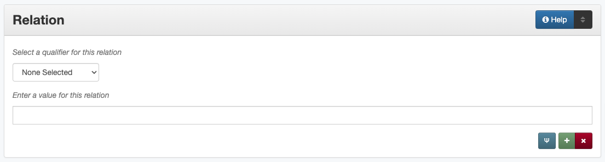

########
Relation
########

.. _relation-definition:

**********
Definition
**********

Information about another resource that is related to the current resource.

.. _relation-sources:

********************************************
Where Can the Relation Information be Found?
********************************************

-   Relation information provides a reference to a related resource
    which may be found on:
    
    -   a title page
    -   accompanying or supplementary information

.. _relation-form:

***************************************
How Relation Works in the Metadata Form
***************************************

Parts:
    Relation type -- drop-down menu
    Relation -- text field

Repeatable?
	Yes - to include multiple relationships, click 'Add' to repeat all field parts

Required?
	 No (:doc:`more information </minimally-viable-records>`)

.. _relation-fill:

*************************************
How Should the Relation be Filled in?
*************************************

-   Enter information about known relationships in the records for both items
-   It is not necessary to do research to find related resources
-   If the relationship is unclear, uncertain, or otherwise
    questionable, the information may be entered into a :doc:`note <note>` instead

+-----------------------------------------------------------+---------------------------------------+
| **Guideline**                                             | **Examples**                          |
+===========================================================+=======================================+
|-  Include the title of the related item                   |Experiment Station Record Volume 61    |
+-----------------------------------------------------------+---------------------------------------+
|-  Optionally, include a unique identifier or additional   |81-01796a-20_02 and 81-01796b-20_02    |
|   information if it is important to identify the item     |                                       |
|                                                           |                                       |
|   -   If one item has multiple identifiers, both can be   |                                       |
|       included together                                   |                                       |
+-----------------------------------------------------------+---------------------------------------+
|-   Include the permalink (ARK) from the related item      |ark:/67531/metapth38109                |
|                                                           |                                       |
|   -   Since ARKs are assigned at the time of upload, they |                                       |
|       cannot be added until after items are online        |                                       |
|   -   When an ARK is added to the relation field, the     |                                       |
|       system will automatically create a link to that item|                                       |
+-----------------------------------------------------------+---------------------------------------+

-   Choose the appropriate relation qualifier from the `controlled vocabulary <https://digital2.library.unt.edu/vocabularies/relation-qualifiers/>`_
-   Generally both halves of the reciprocal relation should be represented so that each record references the other

    -   In some cases, if there are a large number of related items on
        one side (usually has part/is part of), the child items should
        all reference the parent, but the reciprocal may be eliminated
    -   The direction of the relationship should reflect which of the
        items was created first or is a more original version
    -   If you cannot determine which is the more original/first created
        item, default to the one uploaded first (first ARK, sequentially)

-   If more than one qualifier applies (e.g., transcription and
    translation), choose one and explain as needed in a [display note][]
-   If none of the qualifiers applies to the items, the qualifier can be
    left blank, but consider whether the information might be more
    appropriate in another field such as:
    
    - :doc:`Description <description>`
    - :doc:`Display note <note>`
    - [Source][]

+---------------------------------------+-----------------------------------------------------------+---------------------------------------+---------------------------------------+
|**Relationship**                       | **Description**                                           | **Examples**                                                                  |
+=======================================+===========================================================+=======================================+=======================================+
|Is based on / Is basis for             |To show that an item has an intellectual relation to       |*Is based on*                          |*Is basis for*                         |
|                                       |another                                                    +---------------------------------------+---------------------------------------+
|                                       |                                                           |A creative adaptation or modernization |An original, creative work             |
|                                       |                                                           +---------------------------------------+---------------------------------------+
|                                       |                                                           |An executive summary                   |A separately-published report or       |
|                                       |                                                           |                                       |document                               |
|                                       |                                                           +---------------------------------------+---------------------------------------+
|                                       |                                                           |A linguistic analysis                  |An original text or transcript         |
+---------------------------------------+-----------------------------------------------------------+---------------------------------------+---------------------------------------+
|Is format of / Has format              |To show that the item has the same content in a different  |*Is format of*                         |*Has format*                           |
|                                       |format                                                     +---------------------------------------+---------------------------------------+
|                                       |                                                           |A photographic print                   |An original negative                   |
|                                       |                                                           +---------------------------------------+---------------------------------------+
|                                       |                                                           |A print manuscript                     |A born-digital text file               |
+---------------------------------------+-----------------------------------------------------------+---------------------------------------+---------------------------------------+
|Is part of  / Has part                 |-  To show that the item is part of a larger resource      |*Is part of*                           |*Has part*                             |
|                                       |-  To show that the item is a duplication of partial       +---------------------------------------+---------------------------------------+
|                                       |   content from another resource                           |A chapter from a book or report        |The complete volume                    |
|                                       |                                                           +---------------------------------------+---------------------------------------+
|                                       |                                                           |An individual map                      |A book or atlas containing the same map|
+---------------------------------------+-----------------------------------------------------------+---------------------------------------+---------------------------------------+
|Is version of / Has version            |To show that an item has multiple identical or             |*Is version of*                        |*Has version*                          |
|                                       |near-identical copies in the same format                   +---------------------------------------+---------------------------------------+
|                                       |                                                           |An annotated legal document            |A plain copy of the same document      |
|                                       |                                                           +---------------------------------------+---------------------------------------+
|                                       |                                                           |Identical copies of a postcard, perhaps with different notes                   |
|                                       |                                                           +---------------------------------------+---------------------------------------+
|                                       |                                                           |Multiple prints of the same photo image with different cropping/enlargement    |
+---------------------------------------+-----------------------------------------------------------+---------------------------------------+---------------------------------------+
|References / Is referenced by          |-  To show that an item is intellectually interrelated     |*References*                           |*Is referenced by*                     |
|                                       |-  To show that an item is cited or sourced in the content +---------------------------------------+---------------------------------------+
|                                       |   of another resource                                     |A letter                               |Separated, cited enclosures            |
|                                       |                                                           +---------------------------------------+---------------------------------------+
|                                       |                                                           |A news script                          |An accompanying video clip             |
|                                       |                                                           +---------------------------------------+---------------------------------------+
|                                       |                                                           |A report                               |Separately-published appendices,       |
|                                       |                                                           |                                       |figures, or indexes                    |
|                                       |                                                           +---------------------------------------+---------------------------------------+
|                                       |                                                           |A research publication                 |A separate dataset analyzed in the     |
|                                       |                                                           |                                       |document                               |
+---------------------------------------+-----------------------------------------------------------+---------------------------------------+---------------------------------------+
|Replaces / Is replaced by              |To show that a later version overrides an earlier one      |*Replaces*                             |*Is replaced by*                       |
|                                       |                                                           +---------------------------------------+---------------------------------------+
|                                       |                                                           |A revised policy                       |An older version of the same policy    |
|                                       |                                                           +---------------------------------------+---------------------------------------+
|                                       |                                                           |Any updated document                   |A previous version/edition             |
+---------------------------------------+-----------------------------------------------------------+---------------------------------------+---------------------------------------+
|Requires / Is required by              |To show that an item needs another component               |                                       |                                       |
+---------------------------------------+-----------------------------------------------------------+---------------------------------------+---------------------------------------+
|Has transcription / Is transcription of|To show that a handwritten item has a transcript           |*Has transcription*                    |*Is transcription of*                  |
|                                       |                                                           +---------------------------------------+---------------------------------------+
|                                       |                                                           |Any handwritten document, e.g., letter,|A typed version of the same content    |
|                                       |                                                           |ledger, organizational minutes, etc.   |                                       |
|                                       |                                                           +---------------------------------------+---------------------------------------+
|                                       |                                                           |A printed document written in          |A plain-text or simple type version    |
|                                       |                                                           |calligraphy or fancy script, such as   |                                       |
|                                       |                                                           |German Fraktur                         |                                       |
+---------------------------------------+-----------------------------------------------------------+---------------------------------------+---------------------------------------+
|Has translation / Is translation of    |To show that an item has versions in different languages   |*Has translation*                      |*Is translation of*                    |
|                                       |                                                           +---------------------------------------+---------------------------------------+
|                                       |                                                           |Any item written in any language (e.g.,|The same document or content published |
|                                       |                                                           |pamphlet, letter, book, etc.)          |or made available in another language  |
+---------------------------------------+-----------------------------------------------------------+---------------------------------------+---------------------------------------+
|Conforms to                            |To show that an item is compliant with a set of standards  |                                       |                                       |
|                                       |                                                           |                                       |                                       |
|                                       |   -   This relationship is not currently used; see the    |                                       |                                       |
|                                       |       :ref: `Comments <relation-comments>`  section below |                                       |                                       |
+---------------------------------------+-----------------------------------------------------------+---------------------------------------+---------------------------------------+

.. _relation-examples:

***************
Other Examples:
***************

**Detailed volumes with a separate summary**

+---------------------------------------+-------------------------------------------------------------------+
|The summary report:                    |*Is based on*: Texas House Legislative Budget Estimates: 2016-2017 |
|                                       |Biennium, Articles 1-3, `ark:/67531/metapth641220                  |
|                                       |<https://texashistory.unt.edu/ark:/67531/metapth641220/>`_         |
|                                       +-------------------------------------------------------------------+
|                                       |*Is based on*: Texas House Legislative Budget Estimates: 2016-2017 |
|                                       |Biennium, Articles 4-10, `ark:/67531/metapth640727                 |
|                                       |<https://texashistory.unt.edu/ark:/67531/metapth640727/>`_         |
+---------------------------------------+-------------------------------------------------------------------+
|Each complete report:                  |*Is basis for*: Summary of Texas House Legislative Budget Board    |
|                                       |Estimates: 2016-17 Biennium, `ark:/67531/metapth839391             |
|                                       |<https://texashistory.unt.edu/ark:/67531/metapth839391/>`_         |
+---------------------------------------+-------------------------------------------------------------------+

**Map with copies in multiple formats**

+---------------------------------------+-------------------------------------------------------------------+
|Map of North Park Addition to Abilene, |*Has format:* Map of North Park Addition to Abilene, Texas [#2],   |
|Texas [#1]:                            |OKHPB_0470, `ark:/67531/metapth77939                               |
|                                       |<https://texashistory.unt.edu/ark:/67531/metapth77939/>`_          |
|                                       +-------------------------------------------------------------------+
|                                       |*Has format:* Map of North Park Addition to Abilene, Texas [#3],   |
|                                       |OKHPB_0491, `ark:/67531/metapth77960                               |
|                                       |<https://texashistory.unt.edu/ark:/67531/metapth77960/>`_          |
+---------------------------------------+-------------------------------------------------------------------+
|Map of North Park Addition to Abilene, |*Is format of:* Map of North Park Addition to Abilene, Texas [#1], |
|Texas [#2]:                            |OKHPB_0468, `ark:/67531/metapth77936                               |
|                                       |<https://texashistory.unt.edu/ark:/67531/metapth77936/>`_          |
|                                       +-------------------------------------------------------------------+
|                                       |*Is format of:* Map of North Park Addition to Abilene, Texas [#3], |
|                                       |OKHPB_0491, `ark:/67531/metapth77960                               |
|                                       |<https://texashistory.unt.edu/ark:/67531/metapth77960/>`_          |
+---------------------------------------+-------------------------------------------------------------------+
|Map of North Park Addition to Abilene, |*Is format of:* Map of North Park Addition to Abilene, Texas [#1], |
|Texas [#3]:                            |OKHPB_0468, `ark:/67531/metapth77936                               |
|                                       |<https://texashistory.unt.edu/ark:/67531/metapth77936/>`_          |
|                                       +-------------------------------------------------------------------+
|                                       |*Is format of:* Map of North Park Addition to Abilene, Texas [#2]  |
|                                       |OKHPB_0470, `ark:/67531/metapth77939                               |
|                                       |<https://texashistory.unt.edu/ark:/67531/metapth77939/>`_          |
+---------------------------------------+-------------------------------------------------------------------+

**Application materials with photos duplicated as separate items**

+---------------------------------------+-------------------------------------------------------------------+
|For complete application document:     |*Has part:* [Alexander Lowe House Photograph #1],                  |
|                                       |`ark:/67531/metapth495135                                          |
|                                       |<https://texashistory.unt.edu/ark:/67531/metapth495135/>`_         |
|                                       +-------------------------------------------------------------------+
|                                       |*Has part:* [Alexander Lowe House Photograph #2],                  |
|                                       |`ark:/67531/metapth495293                                          |
|                                       |<https://texashistory.unt.edu/ark:/67531/metapth495293/>`_         |
+---------------------------------------+-------------------------------------------------------------------+
|For each individual photo:             |*Is part of:* [Historic Marker Application: Alexander Lowe House], |
|                                       |`ark:/67531/metapth477613                                          |
|                                       |<https://texashistory.unt.edu/ark:/67531/metapth477613/>`_         |
+---------------------------------------+-------------------------------------------------------------------+

**City ordinances repeated in multiple volumes**

+---------------------------------------+-------------------------------------------------------------------+
|For ordinances 1-20:                   |*Has version:* [City of Clarendon Ledger: Ordinances 1-103],       |
|                                       |`ark:/67531/metapth38109                                           |
|                                       |<https://texashistory.unt.edu/ark:/67531/metapth38109/>`_          |
+---------------------------------------+-------------------------------------------------------------------+
|For ordinances 1-103:                  |*Is version of:* [City of Clarendon Ledger: Ordinances 1-20],      |
|                                       |`ark:/67531/metapth38130                                           |
|                                       |<https://texashistory.unt.edu/ark:/67531/metapth38130/>`_          |
+---------------------------------------+-------------------------------------------------------------------+

**A series of volumes with a cumulative index**

+---------------------------------------+-------------------------------------------------------------------+
|For the general index:                 |*References:* Experiment Station Record Volume 61,                 |
|                                       |`ark:/67531/metadc5095                                             |
|                                       |<https://texashistory.unt.edu/ark:/67531/metadc5095/>`_            |
|                                       +-------------------------------------------------------------------+
|                                       |(repeated with information for each volume)                        |
+---------------------------------------+-------------------------------------------------------------------+
|For each volume:                       |*Is referenced by:* Experiment Station Record General Index to     |
|                                       |Volumes 61-70, `ark:/67531/metadc5055                              |
|                                       |<https://texashistory.unt.edu/ark:/67531/metadc5055/>`_            |
+---------------------------------------+-------------------------------------------------------------------+

**A handwritten letter with a typed transcription**

+---------------------------------------+-------------------------------------------------------------------+
|Original letter:                       |*Has transcription:* [Transcript of letter from Josephus Moore to  |
|                                       |Charles Moore, February 16, 1865], CBM_2079-019-004,               |
|                                       |`ark:/67531/metapth203126                                          |
|                                       |<https://texashistory.unt.edu/ark:/67531/metapth203126/>`_         |
+---------------------------------------+-------------------------------------------------------------------+
|Transcription:                         |*Is transcription of:* [Letter from Josephus Moore to Charles      |
|                                       |Moore, February 16, 1865], CBM_2079-019-004,                       |
|                                       |`ark:/67531/metapth203348                                          |
|                                       |<https://texashistory.unt.edu/ark:/67531/metapth203348/>`_         |
+---------------------------------------+-------------------------------------------------------------------+

**A Texas document published in both English and Spanish**

+---------------------------------------+-------------------------------------------------------------------+
|For the English version:               |*Has translation:* Boletín de Noticias, Primavera 2013,            |
|                                       |`ark:/67531/metapth640173                                          |
|                                       |<https://texashistory.unt.edu/ark:/67531/metapth640173/>`_         |
+---------------------------------------+-------------------------------------------------------------------+
|For the Spanish version:               |*Is translation of:* Texas Talking Book News, Spring 2013,         |
|                                       |`ark:/67531/metapth653584                                          |
|                                       |<https://texashistory.unt.edu/ark:/67531/metapth653584/>`_         |
+---------------------------------------+-------------------------------------------------------------------+

.. _relation-comments:

********
Comments
********

-   To make observations about related subject matter in the
    intellectual content of another resource (for example, photographs
    of the same storm-damaged building taken from different viewpoints),
    use the [Note][] element.
-   Items may also have other content-based connections that are not
    represented best by a formal "Relation." For example, materials may
    have topical, geographic, or temporal relationships represented in
    the :doc:`Date <date>`, :doc:`Coverage <coverage>`, :doc:`Subject <subject>`, or other appropriate
    fields.
-   Relationships are drawn primarily from Dublin Core Metadata
    Initiative (DCMI) standards (a full list of fields and controlled
    vocabulary terms can be accessed `here <http://dublincore.org/documents/dcmi-terms/>`_.
    
    -   The relationships for transcription and translation are locally
        added
    -   We include "Conforms To" within our controlled vocabulary as a
        DCMI relationship, but it is not currently used within the
        system.
        
-   Local practice is to use the Relation field specifically for
    reciprocal references between items in the Digital Collections,
    rather than describing relationships between an item in the Digital
    Collections and an external resource.
-   Although only the ARK is technically required to establish a relationship,
    it is highly encouraged to include a title or other identifying information
    for clarity and to increase metadata shareability (e.g., for harvesting)

.. _relation-resources:

*********
Resources
*********

-   UNT Relation Qualifier `Controlled Vocabulary <https://digital2.library.unt.edu/vocabularies/relation-qualifiers/>`_
-   Dublin Core Metadata Initiative (DCMI) `Homepage <http://dublincore.org>`_

**More Guidelines:**

-   :doc:`Quick-Start Metadata Guide </guides/quick-start-guide>`
-   `Metadata Home <https://library.unt.edu/metadata/>`_:doc
