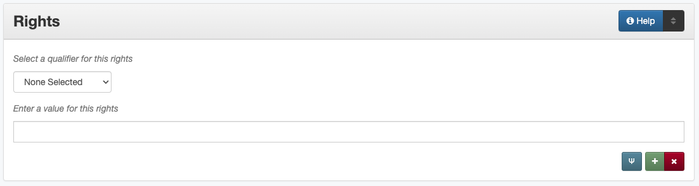

######
Rights
######

.. _rights-definition:

**********
Definition
**********

Rights information provides information about rights held in and over
the resource; describes the conditions under which the work may be used,
distributed, reproduced, etc.; how these conditions may change over
time; and whom to contact regarding the copyright of the work.

There are four aspects of rights information:

-   access (level of access that will be allowed to users)
-   license (if there is a license or rights for the resource)
-   holder (individual/organization that holds the rights to the item)
-   statement (other notes or details about the rights or licensing)

.. _rights-sources:

******************************************
Where Can the Rights Information be Found?
******************************************

For published (copyrighted or CC licensed) materials, rights statements or holders 
may be printed at the beginning or end of the text (e.g. on a copyright page, title
page, front matter, etc.)

For any item, rights information generally comes directly from the institution 
and may be included in the:

-   copyrights information form
-   agreement form
-   resource owner information
-   accompanying or supplementary information

.. _rights-form:

**************************************
How Rights Works in the Metadata Form
**************************************

Parts:
	Rights type -- drop-down menu
	Rights information -- text field
	Note: Some rights information (access and license) open in a pop-up modal

Repeatable?
    Yes - to include different kinds of rights information (up to four),
    click "Add" to repeat all field parts; each individual information
    type (access, holder, license, statement) cannot be repeated

Required?
	 No (:doc:`more information </minimally-viable-records>`)

	 
.. _rights-fill:

***********************************
How Should the Rights be Filled in?
***********************************

.. _rights-access:

Rights Access
=============

-   Select the correct access level from the `controlled vocabulary <https://digital2.library.unt.edu/vocabularies/rights-access/>`_

+--------------------+------------------------------------------------------------------------------+
|Public              |access is open or there are no restrictions to view the content of the item   |
+--------------------+------------------------------------------------------------------------------+
|UNT                 |access is restricted to users associated with the University of North Texas   |
+--------------------+------------------------------------------------------------------------------+
|UNT-Strict          |access is restricted to the UNT Community (strictly enforced)                 |
+--------------------+------------------------------------------------------------------------------+
|UNT-Libraries       |access is restricted to users physically located within the Libraries'        |
|                    |buildings                                                                     |
+--------------------+------------------------------------------------------------------------------+

.. _rights-license:

Rights License
==============

-   Select the correct access level from the `controlled vocabulary <https://digital2.library.unt.edu/vocabularies/rights-licenses/>`_

+--------------------+----------------------------------------------+
|Copyright           |                                              |
+--------------------+----------------------------------------------+
|Attribution         |Attribution Share Alike                       |
|                    +----------------------------------------------+
|                    |Attribution No derivatives                    |
|                    +----------------------------------------------+
|                    |Attribution Non-commercial                    |
|                    +----------------------------------------------+
|                    |Attribution Non-commercial Share Alike        |
|                    +----------------------------------------------+
|                    |Attribution Non-commercial No Derivatives     |
+--------------------+----------------------------------------------+
|Public-Domain       |                                              |
+--------------------+----------------------------------------------+

.. _rights-holder:

Rights Holder
=============

+-----------------------------------------------------------+---------------------------------------+
| **Guideline**                                             | **Examples**                          |
+===========================================================+=======================================+
|-  Enter the name of the rights holder                     |Daniel, John Kelly                     |
+-----------------------------------------------------------+---------------------------------------+
|-  The rights holder may or may not be the same as the     |University of North Texas Libraries    |
|   institution                                             |                                       |
+-----------------------------------------------------------+---------------------------------------+

.. _rights-statement:

Rights Statement
================

+-----------------------------------------------------------------------+---------------------------------------+
| **Guideline**                                                         | **Examples**                          |
+=======================================================================+=======================================+
|-  An explicit statement from the item may be included, particularly to|Copyright is held by the author, unless|
|   include information about:                                          |otherwise noted.  All rights reserved. |
|                                                                       +---------------------------------------+
|   -   Rights held in and over the resource                            |Material may not be reproduced without |
|   -   Conditions under which the work may be used, distributed,       |permission.                            |
|       reproduced, etc.                                                +---------------------------------------+
|   -   Information about how the rights conditions may change over time|Fiscal Notes is not copyrighted and may|
|   -   Whom to contact regarding the copyright of the work             |be reproduced.  The Texas Comptroller  |
|                                                                       |of Public Accounts would appreciate    |
|                                                                       |credit for material used and a copy of |
|                                                                       |the reprint.                           |
+-----------------------------------------------------------------------+---------------------------------------+

.. _rights-examples:

***************
Other Examples:
***************

Electronic dissertation: Comparisons of Improvement-Over-Chance Effect Sizes for Two Groups Under Variance Heterogeneity and Prior Probabilities
    -   *Access:* public - Public
    -   *License:* copyright - Copyright
    -   *Holder:* Alexander, Erika D.
    -   *Statement:* Copyright is held by the author, unless otherwise noted. All rights reserved.

World War II poster: For freedom's sake: buy war bonds.
    -   *Access:* public - Public
    -   *License:* pd - Public Domain

Ensemble concert recording: Faculty Recital: 2006-02-05 - David Sundquist, tenor
    -   *Access:* unt - Use restricted to UNT Community

Electronic thesis: Development of a Hybrid Molecular Ultraviolet Photodetector based on Guanosine Derivatives
    -   *Access:* unt_strict - Use restricted to UNT Community (strictly enforced)
    -   *License:* copyright - Copyright
    -   *Holder:* Liddar, Harsheetal
    -   *Statement:* Copyright is held by the author, unless otherwise noted. All rights reserved.

Technical report: Evaluation of Ground-Water Resources in the Lower Rio Grande Valley, Texas
    -   *License:* by - Attribution
    -   *Statement:* Authorization for use or reproduction of any original material contained in this publication, 
        i.e., not obtained from other sources, is freely granted. The Board would appreciate acknowledgement Authorization 
        for use or reproduction of any original material contained in this publication, i.e., not obtained from other sources, 
        is freely granted. The Board would appreciate acknowledgement.

Magazine: Texas Highways, Volume 46, Number 4, April 1999
    -   *License:* copyright - Copyright
    -   *Holder:* Texas Department of Transportation

.. _rights-comments:

********
Comments
********

-   It is necessary to establish who the rights holder of a resource is
    for situations where there is a question of what can or can't be
    done or whom to contact regarding the copyright of the work.
-   As a general rule, the Rights field is only used when it is important
    to assert information beyond the boilerplate rights statement in the
    user interface.

.. _rights-resources:

*********
Resources
*********

-   UNT Rights Access `Controlled Vocabulary <https://digital2.library.unt.edu/vocabularies/rights-access/>`_
-   UNT Rights License `Controlled Vocabulary <https://digital2.library.unt.edu/vocabularies/rights-licenses/>`_
-   `Creative Commons Licenses <http://creativecommons.org/about/licenses/>`_

More Guidelines:

-   :doc:`Quick-Start Metadata Guide </guides/quick-start-guide>`
-   `Metadata Home <https://library.unt.edu/metadata/>`_
