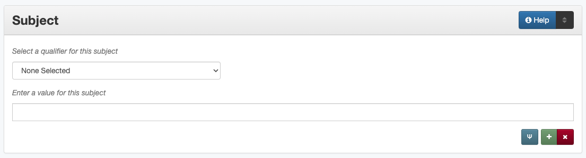

#######
Subject
#######

.. _subject-definition:

**********
Definition
**********

The subjects or topics that succinctly describe the content of the resource.

.. _subject-sources:

*******************************************
Where Can the Subject Information be Found?
*******************************************

In some cases, subjects may come from accompanying or supplementary information; generally the item must be read/examined to assign subjects and keywords, such as:

+---------------------------------------+-------------------------------------------------------+
|**Item Types**                         |**Information Sources**                                |
+=======================================+=======================================================+
|For text                               |- titles                                               |
|                                       |- abstracts                                            |
|                                       |- tables of contents                                   |
|                                       |- section/chapter headings                             |
|                                       |- introduction/scope statements/text content           |
+---------------------------------------+-------------------------------------------------------+
|For images                             |- notes on bottom or back of a photograph              |
|                                       |- visible items (people, surroundings, objects, etc.)  |
|                                       |- illustrations                                        |
+---------------------------------------+-------------------------------------------------------+
|For maps                               |- statement in a caption                               |
|                                       |- notes around the outside of the map                  |
|                                       |- geographic area and time period of the map (content) |
+---------------------------------------+-------------------------------------------------------+
|For music scores                       |- title page or header                                 |
|                                       |- table of contents                                    |
|                                       |- lyrics                                               |
+---------------------------------------+-------------------------------------------------------+
|For videos                             |- label on disc                                        |
|                                       |- container cover                                      |
|                                       |- title screens or content                             |
+---------------------------------------+-------------------------------------------------------+
|For sound files                        |- information on disc/cassette                         |
|                                       |- container information                                |
|                                       |- content of audio                                     |
+---------------------------------------+-------------------------------------------------------+
|For computer files                     |- title page/screen                                    |
|                                       |- text of document (content)                           |
+---------------------------------------+-------------------------------------------------------+

.. _subject-form:

**************************************
How Subject Works in the Metadata Form
**************************************

Parts:
	Subject qualifier -- drop-down menu
	Subject -- text field

Repeatable?
	Yes - to include multiple subjects, click 'Add' to repeat all field parts

Required?
	 Yes - two subject terms are required (:doc:`more information <minimally-viable-records>`)

.. _subject-fill:

************************************
How Should the Subject be Filled in?
************************************

.. _subject-general:

General Subject/Keyword Rules
=============================

-   Information in the subject field should describe what the content is "about" answering questions like: who, what, where, and when
-   Add as many terms as necessary to capture subject content:

    -   Two subjects (any type) are required, but an average of five subject/keyword entries is recommended (number varies depending on content)
    -   Avoid terms that are too general to describe a particular item
    -   Only include geographic subjects when the particular place is significant to the content
    -   Generally do not repeat information that is represented in other fields (e.g., material type/resource type, geographic names that are identical to coverage locations)
    -   The use of controlled vocabularies is not required (except UNTL-BS terms for items in the Portal)
    
-   Proper names can be subjects (persons, places, titles, etc.)
-   Follow the general formatting rules for consistency:

    -   Use appropriate capitalization, punctuation, etc. depending on the type of subject
    -   Terms from controlled vocabularies must use the exact formatting prescribed by the source
    -   Choose the appropriate subject type from the `controlled vocabulary <https://digital2.library.unt.edu/vocabularies/subject-qualifiers/>`_
    
.. _subject-keywords:
    
Keywords and Phrases (KWD)
--------------------------

.. _subject-kwdformat:

Formatting Keywords
^^^^^^^^^^^^^^^^^^^

+-----------------------------------------------------------+---------------------------------------+
| **Guideline**                                             | **Examples**                          |
+===========================================================+=======================================+
|-  Add informal keywords as needed to help users locate the|puppies                                |
|   resource                                                |                                       |
|                                                           |                                       |
|-  It is not necessary to repeat terms from controlled     |                                       |
|   vocabularies as keywords                                |                                       |
+-----------------------------------------------------------+---------------------------------------+
|-  Keywords should be lowercase                            |costumes                               |
|                                                           +---------------------------------------+
|-  Only capitalize proper nouns                            |Cretaceous geologic period             |
+-----------------------------------------------------------+---------------------------------------+
|-  Use punctuation when applicable                         |long-range planning                    |
|                                                           +---------------------------------------+
|-  If needed, including multiple versions with different   |man-made lakes                         |
|   spacing/punctuation                                     +---------------------------------------+
|                                                           |manmade lakes                          |
|-  Do not add quotation marks to titles                    +---------------------------------------+
|                                                           |Romeo and Juliet                       |
+-----------------------------------------------------------+---------------------------------------+
|-  Use plural forms of keywords                            |clothespins                            |
|                                                           +---------------------------------------+
|-  The singular form may be used when there is no          |quilting                               |
|   reasonable plural                                       |                                       |
+-----------------------------------------------------------+---------------------------------------+
|When referring to a company, organization, school, military|*Description:* Postcard of buildings at|
|installation, etc., the abbreviated version of the name can|Ft. McIntosh.                          |
|be used, but the full name must appear at least once in the+---------------------------------------+
|record (e.g., the content description or subject)          |*Keyword:* Fort McIntosh               |
|                                                           +---------------------------------------+
|                                                           |UNT                                    |
+-----------------------------------------------------------+---------------------------------------+
|Prefer applicable controlled terms when they are readily-  |*LCGFT:* Portraits                     |
|available (e.g., for more specific material information)   +---------------------------------------+
|                                                           |*TGM:* Cabinet photographs             |
|                                                           +---------------------------------------+
|                                                           |*Keyword:* quarterly reports           |
+-----------------------------------------------------------+---------------------------------------+

.. _subject-kwdassign:

Assigning Keywords
^^^^^^^^^^^^^^^^^^
-   When assigning keywords, keep in mind that they should help users find the item you're describing and also help the item be found with other, similar items
-   Follow all formatting guidelines (e.g., generally lowercase and plural)
-   Here are some suggestions:

+-----------------------------------------------------------+------------------------------------------+--------------------------------+
| **Guideline**                                             | **Instead of:**                          | **Consider:**                  |
+===========================================================+==========================================+================================+
|Keep keywords short -- break up long, complex phrases      |ACI service awards for Austin and Dallas  |Airport Council International   |
|                                                           |airports                                  +--------------------------------+
|                                                           |                                          |ACI                             |
|                                                           |                                          +--------------------------------+
|                                                           |                                          |service awards                  |
|                                                           |                                          +--------------------------------+
|                                                           |                                          |airports                        |
|                                                           +------------------------------------------+--------------------------------+
|                                                           |crude oil and petroleum products markets  |crude oil                       |
|                                                           |                                          +--------------------------------+
|                                                           |                                          |oil products                    |
|                                                           |                                          +--------------------------------+
|                                                           |                                          |petroleum products              |
|                                                           |                                          +--------------------------------+
|                                                           |                                          |fuel markets                    |
+-----------------------------------------------------------+------------------------------------------+--------------------------------+
|Split up proper names and abbreviations/acronyms           |National Environmental Policy Act (NEPA)  |National Environmental Policy   |
|                                                           |                                          |Act                             |
|                                                           |                                          +--------------------------------+
|                                                           |                                          |NEPA                            |
+-----------------------------------------------------------+------------------------------------------+--------------------------------+
|Remove unnecessary articles                                |the DREAM Act                             |DREAM Act                       |
+-----------------------------------------------------------+------------------------------------------+--------------------------------+
|Reorder words to create shorter phrases, when appropriate  |disposal of waste                         |waste disposal                  |
|                                                           +------------------------------------------+--------------------------------+
|                                                           |books in astronomy                        |astronomy books                 |
+-----------------------------------------------------------+------------------------------------------+--------------------------------+
|Every keyword should have a noun                           |horseback                                 |horseback riding                |
|                                                           |                                          +--------------------------------+
|                                                           |                                          |horseback riders                |
+-----------------------------------------------------------+------------------------------------------+--------------------------------+
|Add descriptors if the term is extremely vague             |processing                                |data processing                 |
|                                                           |                                          +--------------------------------+
|                                                           |                                          |grain processing                |
|                                                           |                                          +--------------------------------+
|                                                           |                                          |water processing                |
|                                                           |                                          +--------------------------------+
|                                                           |                                          |financial processing            |
|                                                           |                                          +--------------------------------+
|                                                           |                                          |agricultural processing         |
+-----------------------------------------------------------+------------------------------------------+--------------------------------+

.. _subject-animal:

Named Animals (namedAnimal)
---------------------------

-   If an identified pet or other animal is visible in a photo or a
    primary subject of a text, the name can be added as a "Named Animal"

+-----------------------------------------------------------+---------------------------------------+
| **Guideline**                                             | **Examples**                          |
+===========================================================+=======================================+
|Include the name exactly as written/punctuated             |Rolph                                  |
|                                                           +---------------------------------------+
|                                                           |Dox Happy Rx                           |
|                                                           +---------------------------------------+
|                                                           |Bit O'Man                              |
+-----------------------------------------------------------+---------------------------------------+

.. _subject-person:

Named Persons (named_person)
----------------------------

-   'Named persons' refers to people who are significant in some way to
    the content of the item (see below for clarification)
-   Only include names as 'named persons' if a surname is known
-   If only a first name, first and middle names, or nickname is known:

    -   Use the name in the content description (if relevant)
    -   Use the name in the title (if relevant)
    
-   All names should have the same format:

+-----------------------------------------------------------+---------------------------------------+
| **Guideline**                                             | **Examples**                          |
+===========================================================+=======================================+
|Invert the name (Last, First Middle)                       |Lott, Leanna Ivory                     |
+-----------------------------------------------------------+---------------------------------------+
|Use any known part of the name, including initials) if the |Thompson, J. D.                        |
|full name is unknown                                       |                                       |
+-----------------------------------------------------------+---------------------------------------+
|Include additional names as middle names                   |Williams, Mary Deline Xenia Buchanan   |
+-----------------------------------------------------------+---------------------------------------+
|Names that are hyphenated or have multiple parts are all   |Smith-Jones, John                      |
|considered "last names"                                    +---------------------------------------+
|                                                           |van Tyen, Jan                          |
+-----------------------------------------------------------+---------------------------------------+
|-  Include known titles before the first name (optional    |Steever, Col. Edgar Z.                 |
|   when not necessary to identify the specific person, as  +---------------------------------------+
|   these may change over time)                             |Petersen, Mrs. P. J.                   |
|-  Include known suffixes at the end of the name after a   +---------------------------------------+
|   second comma                                            |Stolte, Hugo C., Jr.                   |
+-----------------------------------------------------------+---------------------------------------+
|Nicknames can be included in parentheses at the end of the |Wind, Ellis (Pee Wee)                  |
|name                                                       |                                       |
+-----------------------------------------------------------+---------------------------------------+
|If a person has an alternate name or alias, include their  |*Named Person:* Cody, William Frederick|
|real name under "named person" and aliases as keywords     +---------------------------------------+
|                                                           |*Keyword:* Buffalo Bill                |
+-----------------------------------------------------------+---------------------------------------+
|-  If an authorized name (from the `Library of Congress    |*Named Person:* Austin, Stephen F.     |
|   <https://id.loc.gov/>`_ ) is known, it may be used in   |(Stephen Fuller), 1793-1836            |
|   the named person entry                                  +---------------------------------------+
|-  Alternately, if the authorized version does not include |*LCSH:* Johnson, Lady Bird, 1912-2007  |
|   information (such as "Jr.") that could be helpful, it   +---------------------------------------+
|   may be included as an LCSH term, with fuller version    |*Named Person:* Johnson, Claudia Alta  |
|   in named person                                         |Taylor (Lady Bird)                     |
+-----------------------------------------------------------+---------------------------------------+
|If a person is identified with both a married name and a   |Buchanan, Menvil Mae                   |
|prior name, include a separate named person entry for each +---------------------------------------+
|surname                                                    |Seastrunk, Menvil Mae                  |
+-----------------------------------------------------------+---------------------------------------+

Should someone be a 'named person'?
^^^^^^^^^^^^^^^^^^^^^^^^^^^^^^^^^^^

-   For images, the person must physically be part of the content
-   For text, part of the content must be "about" the person
-   Here are some general guidelines:

+-----------------------------------------------------------+-----------------------------------------------------------+---------------------------------------+
| **Named Person**                                          | **Not a Named Person**                                    | **Instead:**                          |
+===========================================================+===========================================================+=======================================+
|Person definitely identified in a photograph               |Person hesitantly identified (S. M. Garvin?)               |Add name as a keyword                  |
|                                                           +-----------------------------------------------------------+                                       |
|                                                           |Person is not physically visible in a photograph           |                                       |
|                                                           +-----------------------------------------------------------+                                       |
|                                                           |Statue or likeness of a person                             |                                       |
+-----------------------------------------------------------+-----------------------------------------------------------+---------------------------------------+
|Plaintiff or defendant in a court case                     |Person mentioned once in court transcript                  |(Not included)                         |
+-----------------------------------------------------------+-----------------------------------------------------------+---------------------------------------+
|Person who is the subject of an entire or significant      |Person mentioned in a paragraph or two of a book           |(Not included)                         |
|portion of a book                                          |                                                           |                                       |
+-----------------------------------------------------------+-----------------------------------------------------------+---------------------------------------+
|Author of an autobiography                                 |Author of texts not about themselves                       |Add author as creator (or contributor) |
+-----------------------------------------------------------+-----------------------------------------------------------+---------------------------------------+
|Personal author and addressee of a letter                  |Person mentioned in passing in a letter                    |(Not included)                         |
+-----------------------------------------------------------+-----------------------------------------------------------+---------------------------------------+

.. _subject-untlbs:

UNT Libraries Browse Subjects (UNTL-BS)
---------------------------------------

-   UNTL-BS terms are used for records in The Portal to Texas History
-   For records about Portal objects, include at least one subject
    (preferably more) from the UNT Libraries Browse Structure
-   Choose as many appropriate terms as necessary from the `UNTL-BS
    list <https://digital2.library.unt.edu/subjects/>`_

+-----------------------------------------------------------+---------------------------------------+
| **Guideline**                                             | **Examples**                          |
+===========================================================+=======================================+
|Terms in the UNTL browse subjects are separated by a single|Sports and Recreation - Riding - Bulls |
|dash and spaces (Term - Term)                              |                                       |
+-----------------------------------------------------------+---------------------------------------+
|-  For subject strings that have several levels, do not    |Social Life and Customs - Customs -    |
|   include each part separately -- only use the most       |Weddings                               |
|   specific or relevant string(s)                          |                                       |
|                                                           |                                       |
|-  For example, not:                                       |                                       |
|                                                           |                                       |
|   -   Social Life and Customs *and*                       |                                       |
|   -   Social Life and Customs - Customs *and*             |                                       |
|   -   Social Life and Customs - Customs - Weddings        |                                       |
+-----------------------------------------------------------+---------------------------------------+
|-  Only use UNTL-BS terms starting with "Places" when:     |Places - United States - Midwestern    |
|                                                           |Region                                 |
|   -   The place itself is important to the content of the +---------------------------------------+
|       item -- i.e., it is "about" the place" -- such as a |Places - Republic of Texas             |
|       map or travel book                                  |                                       |
|   -   The place is not duplicated in the coverage place   |                                       |
|       field -- such as U.S. regions or historic locations |                                       |
|       that are in the UNTL-BS but cannot be coverage      |                                       |
|       places                                              |                                       |
|   -   And/or there are not other, more relevant terms     |                                       |
+-----------------------------------------------------------+---------------------------------------+

Note: Additional subjects are added to the UNTL-BS when there are
enough items to warrant it, so the number of subjects is consistently
growing. If you would like to suggest a new subject, please notify
Hannah Tarver (hannah.tarver@unt.edu).

.. _subject-other:

Subjects from Other Established Thesauri or Controlled Vocabularies
-------------------------------------------------------------------

-   The UNT Libraries schema supports a number of controlled
    vocabularies and encourages the use of any readily-available
    subjects (e.g., from established thesauri or discipline-related word
    lists) that would be helpful for users
-   Editors are never required to include terms from external controlled
    vocabularies
-   When included, the vocabulary used should be identified for each
    term
-   Do not use terms that duplicate resource types, e.g., "Photographs"
-   If the name of the controlled vocabulary is not in the list, choose
    "other" and notify the `metadata administrators <https://library.unt.edu/digital-projects-unit/contacts/>`_

.. _subject-lcsh:

Library of Congress Subject Headings (LCSH)
^^^^^^^^^^^^^^^^^^^^^^^^^^^^^^^^^^^^^^^^^^^

+-----------------------------------------------------------+---------------------------------------+
| **Guideline**                                             | **Examples**                          |
+===========================================================+=======================================+
|-  Subject strings must be formulated according to Library |Bee culture - Equipment and supplies   |
|   of Congress rules                                       +---------------------------------------+
|-  Terms are separated by a double dash (Term -- Term)     |Fort Wolters (Tex.)                    |
|                                                           +---------------------------------------+
|                                                           |Capote, Truman, 1924-                  |
+-----------------------------------------------------------+---------------------------------------+
|-  If the item has been previously described in a library  |Costume -- China -- History --         |
|   catalog record, that may be a good source of relevant   |Ming-Qing dynasties, 1368-1912         |
|   subjects                                                |                                       |
|-  You may need to tweak the formatting depending on how   |                                       |
|   the subjects are displayed                              |                                       |
+-----------------------------------------------------------+---------------------------------------+
|-  Generally prefer terms that don't duplicate other       |*LCSH:* Texas. Department of           |
|   information, e.g.:                                      |Transportation -- Evaluation           |
|                                                           +---------------------------------------+
|   -   Consider leaving out geographic subdivisions that   |*LCGFT:* Periodicals                   |
|       overlap with coverage place(s)                      +---------------------------------------+
|   -   Use separate LCGFT terms rather than form           |*LCGFT:* Annual reports                |
|       subdivisions                                        |                                       |
+-----------------------------------------------------------+---------------------------------------+

.. _subject-lcgft:

Library of Congress Genre/Form Terms (LCGFT)
^^^^^^^^^^^^^^^^^^^^^^^^^^^^^^^^^^^^^^^^^^^^

-   If there are relevant genre/form terms (e.g., taken from an LCSH subject string), they may be added as subjects
-   Note that unlike other subjects, these terms describe the *physical* item or *type* of content rather than what
    the item is about

+-----------------------------------------------------------+---------------------------------------+
| **Guideline**                                             | **Examples**                          |
+===========================================================+=======================================+
|-  Subject terms must come from the LCGFT thesaurus        |Blank forms                            |
|-  Add one (or more) terms if they add more information    +---------------------------------------+
|-  Do not add LCGFT terms that only duplicate the resource |Greeting cards                         |
|   type (e.g., Photographs or Postcards)                   +---------------------------------------+
|-  Terms that provide *more specific* information may be   |Cadastral maps                         |
|   included (e.g., *type* of map, book, photo)             +---------------------------------------+
|                                                           |Handbooks and manuals                  |
|                                                           +---------------------------------------+
|                                                           |Statistics                             |
+-----------------------------------------------------------+---------------------------------------+

.. _subject-examples:

***************
Other Examples:
***************

Navy pamphlet: The Texas Navy.
    *UNTL-BS:* Military and Wars - Wars - Texas Revolution
    *UNTL-BS:* Military and War - Transportation - Ships
    *LCSH:* Texas -- History, Naval
    *LCSH:* Texas -- History -- Republic, 1836-1846
    *KWD:* independence
    *KWD:* battleships
    *KWD:* schooners
    *KWD:* naval vessels
    *KWD:* Nimitz

Photograph: [Look-out Tower at Fort Davis]
    *LCSH:* New Deal, 1933-1939
    *LCSH:* Davis Mountain State Park (Tex.)
    *UNTL-BS:* Architecture - Civil Works
    *UNTL-BS:* Landscape and Nature - State and National Parks
    *KWD:* Civilian Conservation Corps
    *KWD:* overlooks
    *KWD:* scenery
    *KWD:* mountains
    *KWD:* deserts

Photograph: Jim Goin and Mr. [Fred] Cummings. Ice delivery in Aubrey
    *UNTL-BS:* People - Individuals
    *UNTL-BS:* Business, Economics and Finance - Transportation - Automobiles
    *KWD:* cars
    *KWD:* wagons
    *named_person:* Goin, Jim
    *named_person:* Cummings, Mr. Fred

Letter to Cromwell Anson Jones, 19 May 1869
    *UNTL-BS:* People - Individuals - Mary Jones
    *UNTL-BS:* Social Life and Customs - Correspondence
    *LCGFT:* Personal correspondence
    *LCSH:* Jones, Mary Smith McCrory, 1819-1907
    *named_person:* Jones, Cromwell Anson

Map of the Missouri, Kansas and Texas Railway
    *UNTL-BS:* Landscape and Nature - Geography and Maps
    *UNTL-BS:* Business, Economics and Finance - Transportation - Railroads
    *LCSH:* Missouri, Kansas and Texas Railway

Texian Campaigne plate
    *UNTL-BS:* Military and War - Wars - Mexican War
    *UNTL-BS:* Social Life and Customs - Furnishings - Dishes
    *NMC (Chenhall's):* Food T&E
    *NMC (Chenhall's):* Tools & Equipment for Materials
    *KWD:* ceramics
    *KWD:* plates
    *KWD:* Texian Campaigne

Surgical Scalpel, 19th Century
    *UNTL-BS:* Science and Technology
    *OTH:* Devices, Medical
    *KWD:* surgical knife
    *KWD:* surgical knives

Thesis: An 8-step program: Shaping and fixed-time food delivery effects on several approximations and undesired responses in goats
    *LCSH:* Clicker training (Animal training)
    *LCSH:* Goats -- Training
    *LCSH:* Operant conditioning
    *KWD:* shaping

Music score: Daisy: Opera in Two Acts
    *LCSH:* Low, Juliette Gordon, 1860-1927 -- Drama
    *LCSH:* Girl Scouts
    *LCSH:* Operas
    *LCGFT:* Scores
    *KWD:* Girl Scouts of America
    *KWD:* music
    *KWD:* conductors
    *KWD:* voices
    *KWD:* instruments

Photograph: [Portrait of Jessie Bogle Hubbard]
    *LCSH:* Bogle family
    *UNTL-BS:* People - Individuals
    *UNTL-BS:* Social Life and Customs - Customs - Weddings
    *KWD:* wedding dresses
    *LCGFT:* Portraits
    *named_person:* Bogle, Jessie
    *named_person:* Hubbard, Jessie Bogle

Architectural Drawing: Elementary School Building, Fort Stockton, Texas: Ceiling Plans
    *LCSH:* Public schools -- Designs and plans
    *UNTL-BS:* Architecture - Buildings
    *UNTL-BS:* Education - Schools - Buildings
    *AAT:* elementary schools (buildings)
    *KWD:* Fort Stockton Independent School District

.. _subject-comments:

********
Comments
********

-   Since the "subject and keywords" element may describe both what the
    object is about and the format in some cases, subject-related
    information may be repeated in other elements:

    -   An image with a [Resource Type][] "Photograph" could have a more
        specific subject term such as "cabinet cards," "ambrotypes," or
        "panoramic photos"
    -   To describe a resource, such as an autobiography, that is about
        its creator, place the creator's name in both the
        subject/keyword element and the :doc: `Creator <creator>` element.
    -   Although geographic terms are normally handled by the
        :doc: `Coverage <coverage>` (Place Name) element, subject fields could include
        geographic terms as well if the location is significant to the
        content.

-   When using an established controlled vocabulary, follow all rules
    related to scope and formatting
    
    -   E.g., the scope for the LCGFT includes the following
        disciplines: moving images (films, television programs, and
        video recordings), spoken-word recorded sounds, legal materials,
        and cartographic materials

.. _subject-resources:

*********
Resources
*********

-   UNT Subject Qualifier `Controlled Vocabulary <https://digital2.library.unt.edu/vocabularies/subject-qualifiers/>`_

Resources for Selected Vocabularies:

+-----------------------------------+---------------+---------------------------------------------------------------------------------------+
|Controlled Vocabulary              |UNTL Code      |Links to Resources                                                                     |
+===================================+===============+=======================================================================================+
|University of North Texas Libraries|UNTL-BS        |`University of North Texas Libraries Browse Subjects                                   |
|Browse Subjects                    |               |<https://digital2.library.unt.edu/subjects/>`_                                         |
+-----------------------------------+---------------+---------------------------------------------------------------------------------------+
|Art and Architecture Thesaurus     |AAT            |`Art and Architecture Thesaurus                                                        |
|(Getty)                            |               |<https://www.getty.edu/research/tools/vocabularies/aat/>`_                             |
+-----------------------------------+---------------+---------------------------------------------------------------------------------------+
|Library of Congress (LC)           |               |`Thesauri and Controlled Vocabularies <https://id.loc.gov/>`_                          |
|                                   |               +---------------------------------------------------------------------------------------+
|                                   |               |`Classification Web                                                                    |
|                                   |               |<https://discover.library.unt.edu/catalog/b2659614>`_                                  |
|                                   |               |(Accessible to UNT staff/students)                                                     |
+-----------------------------------+---------------+---------------------------------------------------------------------------------------+
|-  Legislative Subject Terms       |LST            |`Legislative Subject Terms                                                             |
|                                   |               |<https://www.congress.gov/help/field-values/legislative-subject-terms>`_               |
+-----------------------------------+---------------+---------------------------------------------------------------------------------------+
|-  Library of Congress Subject     |LCSH           |`Library of Congress Authorities <https://authorities.loc.gov>`_                       |
|   Headings                        |               +---------------------------------------------------------------------------------------+
|                                   |               |`Library of Congress Subject Headings                                                  |
|                                   |               |<https://id.loc.gov/authorities/subjects.html>`_                                       |
+-----------------------------------+---------------+---------------------------------------------------------------------------------------+
|-  LC Genre/Form Terms             |LCGFT          |`Library of Congress Genre/Form Terms                                                  |
|                                   |               |<https://id.loc.gov/authorities/genreForms.html>`_                                     |
+-----------------------------------+---------------+---------------------------------------------------------------------------------------+
|-  LC Medium of Performance        |LCMPT          |`Library of Congress Medium of Performance Thesaurus                                   |
|   Thesaurus                       |               |<https://id.loc.gov/authorities/performanceMediums.html>`_                             |
+-----------------------------------+---------------+---------------------------------------------------------------------------------------+
|-  LC Thesaurus for Graphic        |TGM            |`Thesaurus for Graphic Materials I: Subject Terms                                      |
|   Materials                       |               |<https://www.loc.gov/rr/print/tgm1/>`_                                                 |
|                                   |               +---------------------------------------------------------------------------------------+
|                                   |               |`Thesaurus for Graphic Materials                                                       |
|                                   |               |<https://id.loc.gov/vocabulary/graphicMaterials.html>`_                                |
+-----------------------------------+---------------+---------------------------------------------------------------------------------------+

More Guidelines:

-   :doc:`Quick-Start Metadata Guide <quick-start-guide>`
-   `Metadata Home <https://library.unt.edu/metadata/>`_:doc
