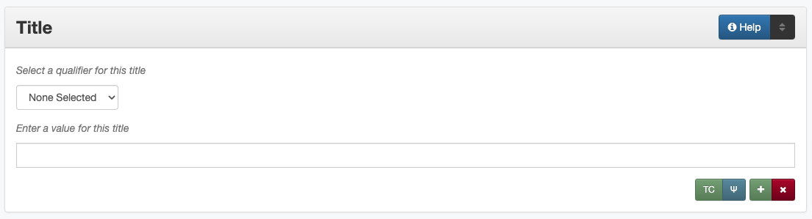

#####
Title
#####

.. _title-definition:

**********
Definition
**********

A name given to the resource.

.. _title-sources:

*******************************************
Where Can the Title Information be Found?
*******************************************

In some cases, titles may come from accompanying or supplementary information; generally titles may be found on the item, such as:

+---------------------------------------+-------------------------------------------------------+
|**Item Types**                         |**Information Sources**                                |
+=======================================+=======================================================+
|For text                               |- title page (use the title page unless there isn't    |
|                                       |  one)                                                 |
|                                       |- front cover                                          |
|                                       |- copyright page                                       |
|                                       |- spine of cover                                       |
+---------------------------------------+-------------------------------------------------------+
|For images                             |- title written on the back of a photograph            |
|                                       |- captions                                             |
|                                       |- an envelope, slip cover, or case                     |
+---------------------------------------+-------------------------------------------------------+
|For maps                               |- title caption on map                                 |
|                                       |- notes around the outside of the map                  |
+---------------------------------------+-------------------------------------------------------+
|For music scores                       |- title page or header                                 |
|                                       |- top of first page                                    |
|                                       |- front cover                                          |
+---------------------------------------+-------------------------------------------------------+
|For videos                             |- title screen(s)                                      |
|                                       |- container cover                                      |
|                                       |- label on disc                                        |
+---------------------------------------+-------------------------------------------------------+
|For sound files                        |- title on disc/cassette                               |
|                                       |- container information                                |
+---------------------------------------+-------------------------------------------------------+
|For computer files                     |- title page/screen                                    |
|                                       |- title at top of document                             |
|                                       |- title in HTML header                                 |
+---------------------------------------+-------------------------------------------------------+

.. _title-form:

************************************
How Title Works in the Metadata Form
************************************

Parts:
	#. Title qualifier -- drop-down menu
	#. Title -- text field

Repeatable?
	Yes - to include multiple titles, click 'Add' to repeat all field parts

Required?
	 Yes - a Main Title is required (:doc:`more information </minimally-viable-records>`)

.. _title-fill:

**********************************
How Should the Title be Filled in?
**********************************

General Title Rules
===================

-   Every record must have one Main Title, also called an "official title"
-   Some records may have multiple titles (see below under :ref:`Special Titles <title-special>` for more clarification about when to use other titles)
-   For each title, be sure to choose the appropriate qualifier from the `controlled vocabulary <https://digital2.library.unt.edu/vocabularies/title-qualifiers/>`_
    
    
+-----------------------------------------------------------+---------------------------------------+
| **Guideline**                                             | **Examples**                          |
+===========================================================+=======================================+
|-  Write out the title the way it appears                  |Reminiscences of the Terry Rangers     |
|-  Do not put the call number, file name, or other         |                                       |
|   identifiers in the title                                |                                       |
+-----------------------------------------------------------+---------------------------------------+
|-  Capitalize the first word and proper nouns              |Difficulties of a Mexican revenue      |
|-  Keep other capitalization the same as it is on the item |officer in Texas                       |
|-  If a title is written in all caps, change it to title   |                                       |
|   case                                                    |                                       |
|-  Use the same capitalization for all titles in a record  |                                       |
|   unless there is a reason not to do so (e.g., authorized |                                       |
|   series titles)                                          |                                       |
+-----------------------------------------------------------+---------------------------------------+
|-  Change Roman numerals to Arabic numbers (when a change  | | *Title:* Laws of the Republic of    |
|   is made to the printed title, the original version      |	Texas in two volumes. Volume 1      |
|   be added as a                                           | | *Note:* "Vol. I."                   |
|   :ref:`display note <note-display>`                      |                                       |
|-  Write out numbers through 100                           |                                       |
|-  (Note that an alternate title may be appropriate if     |                                       |
|   the numbers are important to the title)                 |                                       |
|                                                           | | Two Ladies in Beauty Shop           |
+-----------------------------------------------------------+---------------------------------------+
|-  Write out abbreviations or acronyms                     | | *Main:* Documents pertaining to the |
|-  (Abbreviations may be included in an alternate title or |   case of Eliza Miller vs. Texas & New|
|   display note)                                           |   Orleans Railroad Company, cause no. |
|                                                           |   547, 1902                           |
|                                                           | | *Alternate:* Documents pertaining to|
|                                                           |   case of Eliza Miller vs. T & NORR   |
|                                                           |   Co.                                 |
+-----------------------------------------------------------+---------------------------------------+
|-  Separate title and subtitles with a colon               |Deaf Smith County Schools: 1893-2003   |
+-----------------------------------------------------------+---------------------------------------+
|-  In some cases, it may make sense to separate long titles|An Assessment of the Social and Special|
|   with commas (e.g., normalized periodical titles) or     |Effects of Siting a Low-Level          |
|   periods                                                 |Radioactive Waste Disposal Facility in |
|                                                           |Texas: Phase 1. Historical and         |
|                                                           |Sociodemographic Dimensions            |
+-----------------------------------------------------------+---------------------------------------+
|-  If there is no title on the item:                       | | [Calf-Roping in Groups at Cowtown   |
|                                                           |   Coliseum]                           |
|   -   Use a title from a library catalog or similar       |                                       |
|       resource (including OCLC Worldcat)                  | | [Certificate of Appointment of K.K. |
|   -   Create a title in [square brackets] that is both    |   Legett as Delegate]                 |
|       succinct (roughly ~10 words or less) and descriptive|                                       |
|                                                           | | [Bus Transfer Ticket #020137]       |
+-----------------------------------------------------------+---------------------------------------+
|-  It is preferred that titles include more than a personal| | [Stan Kenton Reading a Score]       |
|   name only (for items that do not have titles)           |                                       |
|                                                           | | [Obituary for I. M. Cummings]       |
|                                                           |                                       |
|                                                           | | [Portrait of Susan R. Theodore]     |
+-----------------------------------------------------------+---------------------------------------+
|-  Any time a printed title does not accurately reflect the| | [Correspondence between Meyer       |
|   item (e.g., multiple, titled maps printed on one page), |   Bodansky and A. O. Gettler - 1940]  |
|   create an appropriate title in [square brackets]        |                                       |
|-  Original title(s) may be included as added titles       | | [Maps of the United States, New     |
|                                                           |   England, and Principal U.S. Cities] |
+-----------------------------------------------------------+---------------------------------------+
|-  Clarifying information can be added to a title using    | | Texas Board of Law Examiners Annual |
|   [square brackets] in order to identify differing        |   Financial Report: 2016 [Audited]    |
|   versions or provide context for users                   |                                       |
|                                                           | | Standard Varieties of Chickens:     |
|                                                           |   [Part] 1. The American Class        |
+-----------------------------------------------------------+---------------------------------------+
|-  In some cases, it may be appropriate to add a number in | | Conrad & Menefee's Subdivision of   |
|   [square brackets] when there are near-identical copies  |   Lot Number 2, Block Number 146,     |
|-  This may also apply to situations where titles are being|   Abilene, Taylor County, Texas [#2]  |
|   created (e.g., near-identical portraits taken during a  |                                       |
|   photo shoot), but should generally not take the place   | | [Aerial View of Workers Digging a   |
|   of creating unique, descriptive titles when content is  |   Channel #1]                         |
|   different                                               |                                       |
+-----------------------------------------------------------+---------------------------------------+

.. _title-standardized:

Standarized Titles
------------------
-   For some materials, we often use a standardized format for convenience and consistency

    -   When dates are included in titles, they should be written out in "human readable" form

+-------------------------------------------------------------------+---------------------------------------+
| **Guideline**                                                     | **Examples**                          |
+===================================================================+=======================================+
|-  For letters: [Letter from {name} to {name} - {date}]            |[Letter from John C. Brewer to Emma    |
|                                                                   |Davis - April 21, 1879]                |
|   -   Separate correspondence information from the date           |                                       |
|       with  a dash or comma                                       |                                       |
|   -   Also see                                                    |                                       |
|       :doc:`Correspondence Guidelines </guides/correspondence>`   |                                       |
+-------------------------------------------------------------------+---------------------------------------+
|-  For clippings: [Clipping: {article title}]                      |[Clipping: Forced Sale!]               |
+-------------------------------------------------------------------+---------------------------------------+
|-  For funeral programs: [Funeral Program for {full name},         |[Funeral Program for Cottrell Brackett,|
|   {date of funeral}]                                              |Jr., October 10, 2012]                 |
+-------------------------------------------------------------------+---------------------------------------+
|-  For an invoice/receipt: [{Invoice/Receipt for {item/            | | [Invoice for Cooking Materials,     |
|   summary}, {date}]                                               |   May 18, 1894]                       |
|                                                                   |                                       |
|                                                                   | | [Receipt for Kinsel Motor Payment,  |
|                                                                   |   October 1936]                       |
+-------------------------------------------------------------------+---------------------------------------+
|-  For items related to court cases: Documents pertaining          |Documents pertaining to the case of    |
|   to the case of {name/case name}, Cause No. {#}                  |Garner Williams & Co. vs. J. E. Ennis, |
|                                                                   |Cause No. 507, 1867                    |
+-------------------------------------------------------------------+---------------------------------------+
|-  For serials: {title}, Volume #, Number, {date}                  |AACOG Region, Volume 5, Number 9,      |
|-  Other normalized values may be appropriate for specific         |November 1978                          |
|   serials, see                                                    |                                       |
|   :doc:`Serials Guidelines </guides/serials>`                     |                                       |
+-------------------------------------------------------------------+---------------------------------------+
|-  Note that these standardized formats may not apply to           | | [Letter from Betty Scrivner to her  |
|   all items                                                       |   Mother]                             |
|-  When appropriate, adjust titles to accurately reflect           |                                       |
|   the content and type of materials, e.g.:                        | | [Correspondence Concerning a        |
|                                                                   |   Marriage License]                   |
|   -   When information is unknown (generally omit)                |                                       |
|   -   Business or organizational correspondence (e.g.,            | | [Front Page of 'The Washington      |
|       form letters) that may not have correspondents              |   Blade,' August 4, 2000]             |
|   -   If there are multiple items (e.g., a reply added to         |                                       |
|       the bottom of a letter or multiple clippings on a           | | [Newspaper Clippings About Dr. May  |
|       sheet of paper)                                             |   Owen and a TMA Meeting]             |
+-------------------------------------------------------------------+---------------------------------------+

.. _title-special:

Special Titles
==============

Does the item need multiple titles?

+-----------------------------------------------------------+---------------------------------------+
| **If...**                                                 | **Add:**                              |
+===========================================================+=======================================+
|-  The title has alternate spellings, omissions,           |an alternate title                     |
|   abbreviations, or acronyms                              |                                       |
+-----------------------------------------------------------+---------------------------------------+
|-  The item is in a non-English language                   |a parallel title                       |
|-  The item is a translation from another language         |                                       |
+-----------------------------------------------------------+---------------------------------------+
|-  The item has multiple versions of a title listed in     |an added title                         |
|   different places (e.g., title page, cover, and/or spine)|                                       |
+-----------------------------------------------------------+---------------------------------------+
|-  The item is a serial publication (e.g., yearbooks,      |a serial title                         |
|   newsletters, journals, magazines, etc.)                 |                                       |
|-  Also see :doc:`Serial Guidelines </guides/serials>`     |                                       |
|-  if the serial also has:                                 |                                       |
+-----------------------------------------------------------+---------------------------------------+
|a.   a different title on the cover or title page          |an added title                         |
+-----------------------------------------------------------+---------------------------------------+
|b.   no sequence number (e.g., an index) that should       |a sort title                           |
|     sort with other issues non-alphabetically             |                                       |
+-----------------------------------------------------------+---------------------------------------+
|-  The item is part of a series (also see                  |a series title                         |
|   :ref:`Series Guidelines <serials-series>`)              |                                       |
+-----------------------------------------------------------+---------------------------------------+
|-  The item has been published under other titles (e.g.,   |a uniform title                        |
|   music pieces, Shakespeare's works, some serials)        |                                       |
+-----------------------------------------------------------+---------------------------------------+

Formatting special titles:

+-----------------------------------------------------------+---------------------------------------+
| **Guideline**                                             | **Examples**                          |
+===========================================================+=======================================+
|If the item is part of a serial (see the :doc:`serial guidelines </guides/serials>` for more       |
|information)                                                                                       |
+-----------------------------------------------------------+---------------------------------------+
|-   Formulate a standardized main title format, which will | | *Main:* Prickly Pear, Yearbook of   |
|    be the same for each issue                             |   Abilene Christian College, 1945     |
|-   Include the title, volume/issue numbers, and date(s) in|                                       |
|    main title (as relevant)                               | | *Serial:* Prickly Pear              |
|-   Add a serial title that represents the entire          |                                       |
|    publication (i.e., no issue-level information)         | | *Added:* The 1945 Prickly Pear      |
|-   Include the title from the title page as an "added     |                                       |
|    title" when relevant                                   |                                       |
+-----------------------------------------------------------+---------------------------------------+
|-  If a serial has has multiple titles over time           |                                       |
|                                                           |                                       |
|   -   Use the serial title that matches the individual    |                                       |
|       issue                                               |                                       |
|   -   A note may be added regarding former or later titles|                                       |
|       but this may be handled by title records when there |                                       |
|       are at least 10 issues of any serial                |                                       |
+-----------------------------------------------------------+---------------------------------------+
|-  If alphabetical sorting of titles is not logical        | | *Main:* The Debates and Proceedings |
|                                                           |   in the Congress of the United       |
|   -   A sort title may be added to order items            |   States, Fourth Congress, Second     |
|   -   This is particularly useful for indexes or special  |   Session                             |
|       editions that may not sort with numbered issues     | | *Serial:* The Debates and           |
|   -   It may be used when serials have no volume or issue |   Proceedings in the Congress of the  |
|       number/s, but is not necessary if the same order may|   United States                       |
|       be achieved by sorting chronologically              | | *Sort:* Annals of Congress, Congress|
|                                                           |   4, Session 2                        |
+-----------------------------------------------------------+---------------------------------------+
|If the item is part of a series or part of a sub-collection                                        |
+-----------------------------------------------------------+---------------------------------------+
|-  Use the title on the item (or an appropriately-created  | | *Main:* [Glass with picture of an   |
|   unique title)                                           |   oil well]                           |
|-  Add a series title that represents the entire series    | | *Series:* Commemorative glasses     |
|                                                           +---------------------------------------+
|                                                           | | *Main:* [War Tax Receipt, June 1862]|
|                                                           | | *Series:* Judge Harris Masterson I  |
|                                                           |   Papers (MS 468)                     |
+-----------------------------------------------------------+---------------------------------------+
|If the item is in a non-English language, or is a translation                                      |
+-----------------------------------------------------------+---------------------------------------+
|-  For a non-English-language item, add a parallel title   | | *Main:* Estado libre de Coahuila y  |
|   with the English translation (if known)                 |   Tejas                               |
|-  If the translation is not included on the item, enclose | | *Parallel:* [Free State of Coahuila |
|   the parallel title in [square brackets]                 |   and Texas                           |
+-----------------------------------------------------------+---------------------------------------+
|-  If the item is a translation into English (or a second  | | *Main:* The Mexican Soldier,        |
|   language, add a parallel title in the original language |   1837-1847                           |
|                                                           | | *Parallel:* El Soldado Mexicano,    |
|                                                           |   1837-1847                           |
+-----------------------------------------------------------+---------------------------------------+
|If the item title has abbreviations, acronyms, or alternate spellings                              |
+-----------------------------------------------------------+---------------------------------------+
|-  Write out full words in the main title                  |*Main:* Barnhart Southwest Quadrangle  |
|-  Add an alternate title with the abbreviations           +---------------------------------------+
|                                                           |*Alternate:* Barnhart SW Quadrangle    |
+-----------------------------------------------------------+---------------------------------------+
|-  If the acronym is well-known or significant to the      | | *Main:* FCC Record, Volume 12, No.  |
|   context, it can be used in the main title with the      |   20, Pages 11370 to 11956,           |
|   fuller version added as an alternate title              |   July 28-August 8, 1997              |
|                                                           | | *Alternate:* Federal Communications |
|                                                           |   Commission Record, Volume 12, No.   |
|                                                           |   20, Pages 11370 to 11956,           |
|                                                           |   July 28-August 8, 1997              |
+-----------------------------------------------------------+---------------------------------------+
|If a published item has multiple titles                                                            |
+-----------------------------------------------------------+---------------------------------------+
|-  Use the title on the primary title page                 | | *Main:* A Memorial and Biographical |
|-  Include other titles as added titles, if relevant (e.g.,|   History of Navarro, Henderson,      |
|   from the front cover, spine, secondary title page, or   |   Anderson, Limestone, Freestone and  |
|   sub-section)                                            |   Leon Counties, Texas                |
|                                                           | | *Added:* The Lone Star State        |
+-----------------------------------------------------------+---------------------------------------+
|If an item has multiple parts or sections                                                          |
+-----------------------------------------------------------+---------------------------------------+
|-  Create an inclusive title that describes the entire item| | *Main:* [Maps of Canada]            |
|-  Include piece titles as added titles                    | | *Added:* Quebec                     |
|                                                           | | *Added:* Ontario                    |
+-----------------------------------------------------------+---------------------------------------+
|If the same item has been published under multiple titles                                          |
+-----------------------------------------------------------+---------------------------------------+
|-  Use the title on the item as the main title             | | *Main:* Six suites for violincello  |
|-  Add a generic uniform title that represents all versions|   solo                                |
|-  Uniform titles generally come from catalog records      | | *Uniform:* Suites, violoncello, BMV |
|                                                           |   1007-1012                           |
|                                                           +---------------------------------------+
|                                                           | | *Main:* 1980 census of population   |
|                                                           |   and housing. Census tracts. Abilene,|
|                                                           |   Tex., standard metropolitan         |
|                                                           |   statistical area.                   |
|                                                           | | *Uniform:* Census of population and |
|                                                           |   housing (1980). Census tracts.      |
+-----------------------------------------------------------+---------------------------------------+
|If the item is a serial with a complex title pattern                                               |
+-----------------------------------------------------------+---------------------------------------+
|-  Use the main title and serial title according to serial | | *Main:* Texas Eleventh Court of     |
|   guidelines                                              |   Appeals Annual Financial Report:    |
|-  Add a generic uniform title that represents all versions|   2011                                |
|-  Uniform titles generally come from catalog records      | | *Uniform:* Financial report for ... |
|                                                           |   fiscal year                         |
+-----------------------------------------------------------+---------------------------------------+

*Note:* In the Digital Collections, serial and series titles show up as a facet used for narrowing search results,
so adding a series is one way to create a subset or grouping of items within an established collection.  Also
see :doc:`Serials and Series </guides/serials>` for more information.

.. _title-examples:

**************
Other Examples
**************

Hand-carved cross
   *Main:* [Wooden Cross]

US Geological Survey map
   *Main:* Map of the Woodbine Artesian Reservoirs of the Black and
   Grand Prairies of Texas including the Eastern and Western Cross Timbers

Letter
   *Main:* [Letter from Jose Maria Viesca to Lorenzo de Zavala, April 14, 1828]

Yearbook
   -    *Main:* The Swarm, Yearbook of Howard Payne University, 2005
   -    *Serial:* The Swarm
   -    *Added:* Building the Future, Howard Payne University 2005 Swarm, Volume 94, Brownwood, Texas

Legislative Journal
   -    *Main:* Journal of the House of Representatives of the Regular Session, Volume 2, and First Called Session of the Fifty-Ninth Legislature
   -    *Serial:* Journal of the House of Representatives, Texas Legislature
   -    *Uniform:* Journal of the House of Representatives of the...session of the...Legislature of Texas.
   -    *Series:* 59th Legislature of Texas
   -    *Sort:* Journal of the House of Representatives of the State of Texas, Legislature 59, Regular Session, Volume 2
   -    *Added:* Journal of the House of Representatives of the Regular Session of the Fifty-Ninth Legislature of the State of Texas, Volume 2
   -    *Added:* Journal of the House of Representatives of the First Called Session of the Fifty-Ninth Legislature of the State of Texas

Plat Map
   -    *Main:* K. K. Legett's Subdivision of Lot Number 4 & a Part of Lot Number 5 of the Benjamin Austin Survey Number 92, Taylor County, Texas
   -    *Alternate:* K. K. Legett's Subdivision of Lot No. 4 & a Part of Lot No. 5 of the Benj. Austin Sur. No. 92, Taylor Co., Texas

Technical Report
   -    *Main:* Fuel Cycle Program Progress Report: Eleventh Quarter, January-March 1963
   -    *Added:* Fuel Cycle Program. A Boiling Water Reactor Research and Development Program: Eleventh Quarterly Progress Report, January-March, 1963
   -    *Serial:* Fuel Cycle Program Progress Report
   -    *Sort:* Fuel Cycle Program Progress Report, Quarter 11, 1963
   -    *Series:* AEC research and development report
   -    *Series:* Atomic Energy Commission Reports
   -    *Series:* General Electric Company Atomic Power Reports
   -    *Added:* General Electric Atomic Power Equipment Department Report GEAP-4215

.. _title-comments:

********
Comments
********

**Glossary of Title Types:**

+-----------------------+---------------------------+-----------------------------------------------+
| **Code**              | **Examples**              | **Definition**                                |
+=======================+===========================+===============================================+
|officialtitle          |Main Title                 |The most appropriate title to represent the    |
|                       |                           |individual item                                |
+-----------------------+---------------------------+-----------------------------------------------+
|alternatetitle         |Alternate Title            |Reflects alternate spellings, terms, or        |
|                       |                           |omissions (including abbreviations, acronyms,  |
|                       |                           |and enumerations)                              |
+-----------------------+---------------------------+-----------------------------------------------+
|paralleltitle          |Parallel Title             |Used for items written in non-English languages|
|                       |                           |or translations from a second language         |
+-----------------------+---------------------------+-----------------------------------------------+
|serialtitle            |Serial Title               |Representative of an entire serial publication |
+-----------------------+---------------------------+-----------------------------------------------+
|seriestitle            |Series Title               |Representative of an entire series of separate |
|                       |                           |but related items                              |
+-----------------------+---------------------------+-----------------------------------------------+
|uniformtitle           |Uniform Title              |A generalized title when an item has been      |
|                       |                           |published under different titles               |
+-----------------------+---------------------------+-----------------------------------------------+
|addedtitle             |Added Title                |Reflects additional titles or significant      |
|                       |                           |subsections                                    |
+-----------------------+---------------------------+-----------------------------------------------+

.. _title-resources:

*********
Resources
*********

-  UNT Title Qualifier `Controlled Vocabulary`_
- `OCLC Worldcat <http://www.worldcat.org/>`_
- `Worldcat via FirstSearch <https://discover.library.unt.edu/catalog/b2247936>`_ (UNT staff/students can get to OCLC records through electronic resources)

More Guidelines:

-   :doc:`Quick-Start Metadata Guide </guides/quick-start-guide>`
-   `Metadata Home <https://library.unt.edu/metadata/>`_