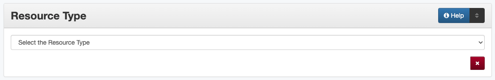

#############
Resource Type
#############

.. _type-definition:

**********
Definition
**********

The type or category of the primary content of the resource

.. _type-sources:

*************************************************
Where Can the Resource Type Information be Found?
*************************************************

Resource tpe is determined by examining the physical item

.. _type-form:

********************************************
How Resource Type Works in the Metadata Form
********************************************

Parts:
	Resource Type -- drop-down menu

Repeatable?
    No

Required?
	 Yes - also see (:doc:`more information </minimally-viable-records>`) about required field

	 
.. _type-fill:

******************************************
How Should the Resource Type be Filled in?
******************************************

+-----------------------------------------------------------------------+---------------------------------------+
| **Guideline**                                                         | **Examples**                          |
+=======================================================================+=======================================+
|Select the correct resource type from the `controlled vocabulary       |image_score - Musical Score/Notation   |
|<https://digital2.library.unt.edu/vocabularies/resource-types/>`_      |                                       |
+-----------------------------------------------------------------------+---------------------------------------+
|Use the most specific resource type that is relevant                   |image_photo - Photograph (not "image") |
|                                                                       +---------------------------------------+
|                                                                       |text_letter - Letter (not "text")      |
+-----------------------------------------------------------------------+---------------------------------------+
|If the particular kind of resource is not on the list, use a generic   |image - Image                          |
|type                                                                   +---------------------------------------+
|                                                                       |text - Text                            |
+-----------------------------------------------------------------------+---------------------------------------+

**If it is difficult to determine the resource type:**

1.  Check the glossary (in the `Comments <type-comments>` section) for clarification.
2.  Consider whether it fits one of these scenarios:

    -   Page images of textual items should be entered as "Text" not "Image"
    -   A series of negatives/photographs should be entered as "Photograph"
3.  A page with both text and images should be entered based on which
    portion is most dominant or important, i.e.,
    
    -   Does it seem like 'text' with accompanying images(s) -- e.g.,
        photos or illustrations in a letter or printed page?
    -   Does it seem like 'photograph(s)' or illustrations with
        inscriptions and accompanying text?
        
4.  Consider whether someone would expect to find the item if they limit
    their search to one particular type
    
    

.. _type-examples:

**************
Other Examples
**************

**Proceedings of a convention (booklet)**
   *Resource Type:* text_book - Book

**Handwritten tally of voters from 1836**
   *Resource Type:* text - Text

**Advertisement (with illustrations)**
   *Resource Type:* image_artwork - Artwork

**U.S. Geological Survey Map**
   *Resource Type:* image_map - Map

**Tintype**
   *Resource Type:* image_photo - Photograph

**Opera score**
   *Resource Type:* image_score - Musical Score/Notation

**Organizational chart**
   *Resource Type:* image - Image

**Event flyer**
   *Resource Type:* text_pamphlet - Pamphlet

.. _type-comments:

********
Comments
********

Glossary of Resource Types
==========================

Primarily Text-Based Materials
------------------------------

+---------------------------+-----------------------+-----------------------------------------------------------------------+
|Resource Type              |Code                   |Use for:                                                               |
+===========================+=======================+=======================================================================+
|Article                    |text_article           |A full article from a periodical, such as a journal, magazine, or      |
|                           |                       |newsletter                                                             |
+---------------------------+-----------------------+-----------------------------------------------------------------------+
|Book                       |text_book              |A book, atlas, photojournal, ledger, etc.                              |
+---------------------------+-----------------------+-----------------------------------------------------------------------+
|Book Chapter               |text_chapter           |A full chapter that is part of an anthology or larger, multi-chapter   |
|                           |                       |text                                                                   |
+---------------------------+-----------------------+-----------------------------------------------------------------------+
|Clipping                   |text_clipping          |Newspaper clippings and partial excerpts from other published materials|
+---------------------------+-----------------------+-----------------------------------------------------------------------+
|Thesis or Dissertation     |text_etd               |Thesis or dissertation                                                 |
+---------------------------+-----------------------+-----------------------------------------------------------------------+
|Journal / Magazine /       |text_journal           |An issue of a periodical such as a journal, magazine, newsletter,      |
|Newsletter                 |                       |bulletin, etc.                                                         |
+---------------------------+-----------------------+-----------------------------------------------------------------------+
|Legal Document             |text_legal             |Court or government legal documents, e.g., affidavits, deeds, wills,   |
|                           |                       |land grants, warrants, etc.                                            |
+---------------------------+-----------------------+-----------------------------------------------------------------------+
|Legislative Document       |text_leg               |Materials generated by state and federal legislatures, such as text of |
|                           |                       |bills and resolutions, or session proceedings                          |
+---------------------------+-----------------------+-----------------------------------------------------------------------+
|Letter                     |text_letter            |Correspondence                                                         |
+---------------------------+-----------------------+-----------------------------------------------------------------------+
|Newspaper                  |text_newspaper         |Full issue of a newspaper                                              |
+---------------------------+-----------------------+-----------------------------------------------------------------------+
|Pamphlet                   |text_pamphlet          |A non-serial publication under 50 pages including booklets, brochures, |
|                           |                       |flyers, etc.                                                           |
+---------------------------+-----------------------+-----------------------------------------------------------------------+
|Paper                      |text_paper             |Written composition such as an essay, working/discussion paper, white  |
|                           |                       |paper, etc.                                                            |
+---------------------------+-----------------------+-----------------------------------------------------------------------+
|Patent                     |text_patent            |A government-issued patent including a description and often diagram(s)|
+---------------------------+-----------------------+-----------------------------------------------------------------------+
|Poem                       |text_poem              |A poem or text written in verse                                        |
+---------------------------+-----------------------+-----------------------------------------------------------------------+
|Prose Fiction              |text_prose             |A literary composition not classified as poetry, such as a novel,      |
|                           |                       |novella, or short story                                                |
+---------------------------+-----------------------+-----------------------------------------------------------------------+
|Report                     |text_report            |A research, statistical, technical, or summary report written by an    |
|                           |                       |individual, organization, or other agency                              |
+---------------------------+-----------------------+-----------------------------------------------------------------------+
|Review                     |text_review            |A written commentary on an item (books, artwork, journals, etc.) or an |
|                           |                       |event (performances, conferences, exhibitions, etc.)                   |
+---------------------------+-----------------------+-----------------------------------------------------------------------+
|Script                     |text_script            |Text of plays, speeches, etc., meant to be read or performed           |
+---------------------------+-----------------------+-----------------------------------------------------------------------+
|Yearbook                   |text_yearbook          |Serial yearbook or annual documenting members of a class or            |
|                           |                       |organization                                                           |
+---------------------------+-----------------------+-----------------------------------------------------------------------+
|Text                       |text                   |A certificate, handwritten note, or other text item not specified above|
|                           |                       |(e.g., printed forms, business cards, invoices, tickets, receipts,     |
|                           |                       |ballots, unbound meeting minutes/agendas, etc.)                        |
+---------------------------+-----------------------+-----------------------------------------------------------------------+

Primarily Image-Based Materials
-------------------------------

+---------------------------+-----------------------+-----------------------------------------------------------------------+
|Resource Type              |Code                   |Use for:                                                               |
+===========================+=======================+=======================================================================+
|Artwork                    |image_artwork          |Two-dimensional images such as a painting, drawing, engraving, graphic |
|                           |                       |design, plan, etc.                                                     |
+---------------------------+-----------------------+-----------------------------------------------------------------------+
|Map                        |image_map              |An individual map or unbound map sheet                                 |
+---------------------------+-----------------------+-----------------------------------------------------------------------+
|Musical Score/Notation     |image_score            |Sheet music or score                                                   |
+---------------------------+-----------------------+-----------------------------------------------------------------------+
|Photograph                 |image_photo            |Photographic print, negative, or slide                                 |
+---------------------------+-----------------------+-----------------------------------------------------------------------+
|Postcard                   |image_postcard         |Postcard (with or without written notes)                               |
+---------------------------+-----------------------+-----------------------------------------------------------------------+
|Poster                     |image_poster           |Broadside or poster                                                    |
+---------------------------+-----------------------+-----------------------------------------------------------------------+
|Presentation               |image_presentation     |Images or text used as visual aids for a speech, lecture,              |
|                           |                       |seminar/webinar, or other presentation                                 |
+---------------------------+-----------------------+-----------------------------------------------------------------------+
|Technical Drawing          |image_drawing          |Architectural or engineering illustrations                             |
+---------------------------+-----------------------+-----------------------------------------------------------------------+
|Image                      |image                  |Other type of still image not specified above (e.g., logos, charts     |
|                           |                       |graphs, etc.)                                                          |
+---------------------------+-----------------------+-----------------------------------------------------------------------+

Other Materials
---------------

+---------------------------+-----------------------+------------------------------------------------------------------------+
|Resource Type              |Code                   |Use for:                                                                |
+===========================+=======================+========================================================================+
|Collection                 |collection             |Group or compilation of items                                           |
+---------------------------+-----------------------+------------------------------------------------------------------------+
|Dataset                    |dataset                |Statistical data files, CD-ROMs of data, databases, etc.                |
+---------------------------+-----------------------+------------------------------------------------------------------------+
|Interactive Resource       |interactive-resource   |Video game, interactive virtual exhibits, etc.                          |
+---------------------------+-----------------------+------------------------------------------------------------------------+
|Physical Object            |physical-object        |Museum piece (such as furniture, dishes, tools), architectural          |
|                           |                       |structure, monument, three-dimensional object (including sculptures,    |
|                           |                       |etc.                                                                    |
+---------------------------+-----------------------+------------------------------------------------------------------------+
|Sound                      |sound                  |Audio recording                                                         |
+---------------------------+-----------------------+------------------------------------------------------------------------+
|Software                   |software               |Application software such as presentation viewers, word processors, etc.|
+---------------------------+-----------------------+------------------------------------------------------------------------+
|Specimen                   |specimen               |Scientific sample                                                       |
+---------------------------+-----------------------+------------------------------------------------------------------------+
|Video                      |video                  |Analog or digital animation, moving image, television program, etc.     |
+---------------------------+-----------------------+------------------------------------------------------------------------+
|Website                    |website                |Webpages                                                                |
+---------------------------+-----------------------+------------------------------------------------------------------------+

.. _type-resources:

*********
Resources
*********

-   UNT Resource Type `Controlled Vocabulary <https://digital2.library.unt.edu/vocabularies/resource-types/>`_

More Guidelines:

-   :doc:`Quick-Start Metadata Guide </guides/quick-start-guide>`
-   `Metadata Home <https://library.unt.edu/metadata/>`_
