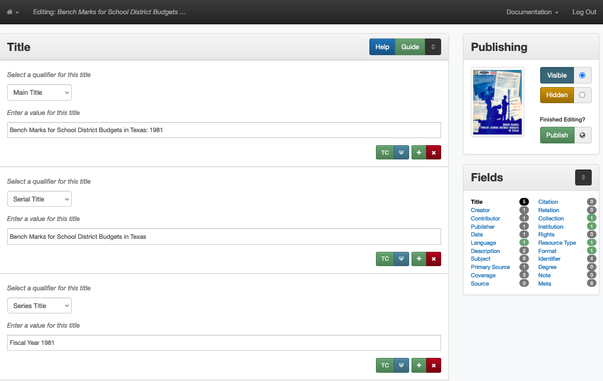
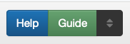

#############################
UNTL System Quick Start Guide
#############################

************
Introduction
************

If you’re new to the UNT Libraries (UNTL) system, this document gives a brief overview of how to interact with the edit system.  
For more information about entering/formatting metadata values, you should review the :doc:`Metadata Quick-Start Guide </guides/quick-start-guide>`. 
Additionally, links within this overview connect to more specific portions of the documentation for both technical information and metadata guidelines.

The overall process outlined here is:

-   Get a new account (or log in to the edit system with an existing account)
-   View the list of records that you have access to edit and 
    choose which one to work on
-   Edit the metadata for a specific item (update or add any information to 
    the record)
-   Publish the record to save your changes
-   Repeat for each item, review documentation for more information as needed

.. _sys-account:

Getting an Account
==================

We provide access to the UNTL system for a number of internal/external editors:

-   UNT staff or student employees creating metadata for departmental materials
-   Staff or volunteers from partner institutions creating metadata for 
    their collections
-   MLIS students completing metadata as practical assignments
-   Other volunteers or project editors

Generally, if you want to have access to edit metadata, you should go through
your contact point for the UNTL system, e.g., a supervisor or a department head at
UNT, a professor (for class assignments), your partner liaison, etc.  
Each account requires a first/last name and a valid e-mail address.  
(If you are the contact person requesting the account, you will also need to specify
what access each editor should have, i.e., which collection/s they should have permission to edit.)

When account access is requested, you'll receive an invitation in your e-mail, with the subject line, "You have been invited to join the Metadata Editing System."  
The text will contain a link to register your account by choosing a password.  Note:

-   You should verify all information in the form (like the spelling of your name)
-   This account is separate from any other UNT-affiliated accounts, i.e., the 
    username/password is not connected to your euid or any other account
-   After registering, the link in the e-mail will no longer work

The form will automatically redirect you to the main Dashboard view for the edit system.  After your account is registered, you can also access the Dashboard directly by adding "edit." in front of the URL for the particular system where you are editing:

-   https://edit.texashistory.unt.edu/  (Portal)
-   https://edit.digital.library.unt.edu/  (Digital Library)
-   https://edit.gateway.okhistory.org/  (Gateway)

If you ever forget your username or password, you can retrieve it from the the login page (at those edit links) by having an e-mail sent to the address on file for your account.

.. note::

    If you have *ever* had an editing account in the UNTL system, your username
    and password still exist.  In some cases, we may deactivate accounts for
    users who have not edited for a long period of time, but the same account
    can be re-activated (i.e., you would not receive a new invitation).

.. _sys-nav:

**********
Navigating
**********

Dashboard
=========

The default when you log into the edit system is the Dashboard, or "Search" view, which displays a list of the records that you have permission to edit.  

.. image:: ../_static/images/dashboard.png
   :alt: Screenshot of the edit Dashboard

The left side of the screen will list "Available Filters" to let you limit the display list by specific criteria, like "only records that are hidden" or "only records for photographs."  
The filters and criteria only display when there are multiple options, so your view will vary.  
For example, if you only have access to records that are hidden, you won't see the "Visibility" filter until some records are publicly visible.

Above the list, there is a search box, if you are looking for a specific title, identifier, etc. in a collection.  
You can also sort the list of items by creation date or upload date or use the radio buttons to change how many records display on each page.

For an outline of the various features and options that display on the Dashboard, see :doc:`Using the UNTL Editing System </technical/navigation>`.

Once you find a record that you want to look at or edit in the list, you can click on the thumbnail or title to open the summary page or click the "Edit" button to jump directly to the edit screen.

Record Summary
==============

The record summary is an intermediary view that lets you review a record/item without editing the metadata.  

.. image:: ../_static/images/record-summary.png
   :alt: Screenshot of a record summary

You can skip directly to editing (by clicking the "Edit" button on the Dashboard), 
but if you are still learning the system or working with a new collection, it may be helpful to look at the summary first.
    
There is a full explanation of the :fef:`summary page features <nav-summ>`.

One thing that may be helpful is to scroll down and look at the summary record.  What information is already there?  What placeholder values are in the record?  
Is there any information that looks incorrect/misspelled, etc.?  Has the system flagged anything that needs to be reviewed in the record?

There is an explanation about placeholder values in the :doc:`Completing Metadata </technical/completing-records>` page.

The record summary is also useful when you complete a record, since the brief record view is sometimes easier to skim, if you want to double-check what you've entered.

.. _sys-edit:

*******
Editing
*******

When you're ready to edit a record, you can click "Edit this Record" on the summary page, or click the "Edit" button from the Dashboard to open the edit form for that item.

Opening the edit form "locks" the record so that others cannot edit it at the same time.  (A lock icon displays on the Dashboard.)  
This lock will clear if you publish the record, but it will also automatically expire after about an hour -- whether the record is still open or not.

We have more information about editing records in several places:

-   For an overview of the features and options in the edit view, see :ref:`Record Edit Form <nav-edit>`
-   If you want some general information about metadata work in our system, see :doc:`Completing Metadata </technical/completing-records>`
-   To get an introduction to *entering* metadata (i.e., field usage and formatting), see the :doc:`UNTL Metadata Quick Start Guide </guides/quick-start-guide>`

Also note that we may have collection- or material-specific guidelines that are a good place to start, when applicable, including:

-   :doc:`Serials </guides/serials>` (newsletters, yearbooks, annual reports, etc.)
-   :doc:`Correspondence </guides/correspondence>`
-   :doc:`Oral histories </guides/interviews>` (and interviews)
-   :doc:`Photographs </guides/photos>`

All of the documentation is listed on the left side menu if you scroll down to the section that you're looking for, like "Project-Specific Guidelines" or "Technical Guidelines."

Completing a Record
===================

In the editing form, enter values for all required fields and any relevant information that is available to you according to the UNTL guidelines.  
Make sure you have reviewed the Metadata Quick-Start Guide and/or more specific guides that are appropriate to your project before starting your first record.

Consult our guidelines at any time (using the Help/Guide links) if you need more information about a specific field -- like how to format an unusual name.

The Help/Guide links will open the guidelines for that specific field, but all of the documentation is listed on the left side menu if you scroll down.  

When you finish editing, you can click "Publish" to save your changes.  Publishing the record *will not* change whether the record is publicly visible:

-   If the record is hidden and you have completed the record, you can click the "Visible" radio button before publishing to make it public
-   If you need to come back to the record later to add more information, you can publish the record and it will remain hidden if you do not click the radio buttons
-   If you are editing a record that is already visible (e.g., to correct typos), you can publish the record and the visibility won't change
-   When records are already visible, we rarely change them to "hidden" (see next section)

.. warning::
    
    Publishing a record will save a new version of the record, even if no changes were made.  
    If you open a record and do not make any changes, close the window or tab without publishing the record to avoid saving duplicate copies.

Potential Problems
==================

Occasionally, you may look at an item and discover that there's a problem (e.g., duplicated items, item parts that have split up or multiple items grouped together, upside-down images, etc.)

If there is a problem with an item, it should remain hidden (or be re-hidden depending on the issue).  
Always add an explanatory note to the main title so that other editors or administrators can see the message from the Dashboard view and easily find these items.

For examples of title notes, see :ref:`Issues with Items or Records <cm-issues>`

There are a couple of general categories of problems.  In each case, you should include information in the title to explain what the issue is/why the record is hidden.

-   **There are two copies** of the same item and we only want to have one.  
    In this situation, the duplicated item (usually the one of lesser quality or
    added later) is marked as a duplicate and left hidden.  
-   **The record and item/s are mismatched**, e.g., pages from two items were 
    grouped together or two pages of a single text were separated by mistake.  
-   **There is an issue with image quality**, for example, a photo is rotated
    and displays sideways or upside-down.  
-   **There are permissions issues** with a specific item that contains 
    personal information, copyrighted material, etc.  

*****************
Other Information
*****************

This guide provides a very brief overview of the process to edit (getting an account, finding a record, editing the metadata, publishing to save changes), 
but it will likely be helpful to review other documentation as you become familiar with the system.

Once you have been editing for a while, it may also be helpful to review the documentation about :doc:`Quality Control in Metadata </tools/metadata-tools>` 
to learn how the system's edit tools may help you check your work or review records across a collection.

Also note that we add new documentation and update existing pages periodically, so make sure to check back, especially if you have a new project.
