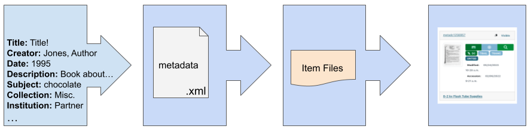
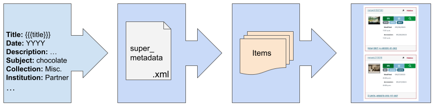

==================
Metadata Workflows
==================

************
Introduction
************

All items in the Digital Collections must have a metadata record in order to go online.  
This page describes the workflow for creating metadata before upload, which is primarily a manual process, 
by entering information in the `New Record Creator <https://edit.texashistory.unt.edu/nrc/>`_ (this does require an editing account). 
Metadata creation generally happens near the end of the process, roughly outlined here:

+-------+---------------------------------------+-------------------------------------------------------------------------------+
|Step   |Description                            |More Information/Related Resources                                             |
+=======+=======================================+===============================================================================+
|1.     |Partner acquires materials, organizes  |`About Unique Identifiers                                                      |
|       |them, and assigns unique identifiers   |<https://library.unt.edu/digital-projects-unit/partners/unique-identifiers/>`_ |
+-------+---------------------------------------+-------------------------------------------------------------------------------+
|2.     |Physical materials are digitized       |`About Scanning Materials                                                      |
|       |                                       |<https://library.unt.edu/digital-projects-unit/partners/scanning/>`_           |
|       +---------------------------------------+-------------------------------------------------------------------------------+
|       |Born-digital files are sorted into     |`Organizing Files                                                              |
|       |item-level folders                     |<https://library.unt.edu/digital-projects-unit/partners/organizing-files>`_    |
+-------+---------------------------------------+-------------------------------------------------------------------------------+
|3.     |Printed text materials are OCRd        |                                                                               |
|       |(this may also happen after metadata)  |                                                                               |
+-------+---------------------------------------+-------------------------------------------------------------------------------+
|4.     |:ref:`Metadata <workflow-metadata>`    |`Creating Metadata                                                             |
|       |records or :ref:`templates             |<https://library.unt.edu/digital-projects-unit/partners/creating-metadata/>`_  |
|       |<workflow-templates>` are created      |                                                                               |
|       |(described on this page)               |                                                                               |
+-------+---------------------------------------+-------------------------------------------------------------------------------+
|5.     |Items are uploaded into the Digital    |`UNT Libraries Ingest Workflow Diagram                                         |
|       |Collections                            |<https://digital.library.unt.edu/ark:/67531/metadc1040520/>`_                  |
+-------+---------------------------------------+-------------------------------------------------------------------------------+
|6.     |Individual metadata records are        |                                                                               |
|       |completed (if necessary) and made      |                                                                               |
|       |public                                 |                                                                               |
+-------+---------------------------------------+-------------------------------------------------------------------------------+

.. _workflow-metadata:

****************
Metadata Records
****************

In some cases, it makes sense to create a single record per item before each one is uploaded.  Some reasons why we might use this process:

-   a collection has very few items and it is easier to make unique records
-   item(s) need to be available very quickly
-   it is easier for a particular project for someone to work on metadata at 
    an earlier stage (e.g., because they will not be available at other times)

+-----------------------+-----------------------+-----------------------+-----------------------------------+
|Step 1.                |Step 2.                |Step 3.                |Step 4.                            |
+=======================+=======================+=======================+===================================+
|Information about the  |Information is entered |The individual record  |The item is online in the Digital  |
|item is identified or  |into the metadata form |is uploaded with the   |Collections & the record can be    |
|collected              |using the NRC and      |item & all associated  |edited.  Most of the time, all     |
|                       |exported as a          |image files            |information has been entered and   |
|                       |metadata.xml file to   |                       |the item is publicly visible, but  |
|                       |the item folder        |                       |may also be incomplete or hidden   |
|                       |                       |                       |for various reasons                |
+-----------------------+-----------------------+-----------------------+-----------------------------------+

.. _workflow-templates:

****************
Template Records
****************

For most of the collections that we move online, general "templates" are created and applied to multiple individual items when they are uploaded.  These items are hidden with the intention that each metadata record is edited with specific information and then made public after completion.  Some reasons why we might use this process:

-   large collections can go online more quickly, since metadata creation can 
    take time
-   multiple people can all work on a collection at once
-   items can become public as editors have time, or based on collection
    priorities
-   information can be added to a whole collection or sub-set of a collection at
    once

+-----------------------+-----------------------+-----------------------+-----------------------------------+
|Step 1.                |Step 2.                |Step 3.                |Step 4.                            |
+=======================+=======================+=======================+===================================+
|Information about the  |Information is entered |-  Template information|All items are online in the Digital|
|items is identified or |into the metadata form |   is applied to each  |Collections & the records can be   |
|collected; items are   |using the NRC and      |   item in the set     |edited.  These records are hidden  |
|sorted by type or topic|exported as a          |-  Each item identifier|until an editor can complete       |
|(as needed)            |super_metadata.xml file|   is appended to the  |individual records and make them   |
|                       |to the directory of    |   main title and added|publicly visible                   |
|                       |items it describes     |   as a "local control |                                   |
|                       |                       |   number" (identifier)|                                   |
+-----------------------+-----------------------+-----------------------+-----------------------------------+

The amount of information in a template can vary, depending on how similar the items are and how much work is done up front (e.g., to group like items in a large collection).  
For some collections or item types, a large amount of information can be pre-set if it will stay the same most or all of the time (e.g., a collection with a single creator who
made all of the items or a serial that has the same kind of content for all issues).  In some cases, templates may have "placeholder" values that will be replaced or removed by
editors; however, these values may "hold" entries for fields that have multiple pieces of information or provide reminders to editors.  Examples of placeholder values:

-   YYYY-MM-DD
-   # p.
-   {{{add keywords}}}

At minimum, a template record needs to have:

#. a title (this can be just the identifier, but often includes a placeholder)
#. partner institution
#. collection(s)

The partner and/or collection information are used to provide editor access to the items; if these are not included, editors may not be able to complete the records.

*************
Mixed Records
*************
For newspapers and very specific circumstances, we use a process that adds item-level information to a template record during upload, so that a large number of
items can go online publicly with (relatively) less work than completing individual records.  Aside from newspapers, these records are generally considered temporary,
with an expectation that records will be updated at a later time to have more specific, item-level information.

*************
Related Links
*************

-   `New Record Creator`_

    -   "Generic" templates for material types (not collection specifc)
    
        -   `Photos <https://edit.texashistory.unt.edu/nrc/new/?t=3691>`_
        -   `Letters <https://edit.texashistory.unt.edu/nrc/new/?t=3689>`_
        -   `Clippings <https://edit.texashistory.unt.edu/nrc/new/?t=4119>`_
        -   `Oral Histories (text) <https://edit.texashistory.unt.edu/nrc/new/?t=3699>`_
        -   `Oral Histories (audio) <https://edit.texashistory.unt.edu/nrc/new/?t=3690>`_
        -   `Other Text <https://edit.texashistory.unt.edu/nrc/new/?t=3692>`_

-   UNT `Trusted Digital Repository <https://library.unt.edu/digital-libraries/trusted-digital-repository/>`_ documentation

    -   `Preferred File Formats <https://library.unt.edu/digital-projects-unit/standards/digital-file-formats/>`_
    -   `UNT Libraries Ingest Workflow Diagram <https://digital.library.unt.edu/ark:/67531/metadc1040520/>`_
    
-   `For Our Partners <https://library.unt.edu/digital-projects-unit/partners/>`_

    -   `About Unique Identifiers`_
    -   `About Scanning Materials`_
    -   `Organizing Files`_
    -   `Creating Metadata`_