#############################
Using the UNTL Editing System
#############################

*****************************
Navigating the Editing System
*****************************
This provides an overview of some of the features in the editing system; to see context about
using edit system features for quality control, see the page on :doc:`the Edit Dashboard </tools/dashboard>`.

.. _nav-dash:

Dashboard
=========
The Dashboard (also called the "search" interface) is the main interface view when an editor logs in.  
It will display any records that a user has permission to edit.  The displayed records can be adjusted by using
the filters on the left side of the screen (e.g., by resource type, public visibility, etc.), by searching for a 
particular term in the search box at the top of the screen, or by sorting in various ways.

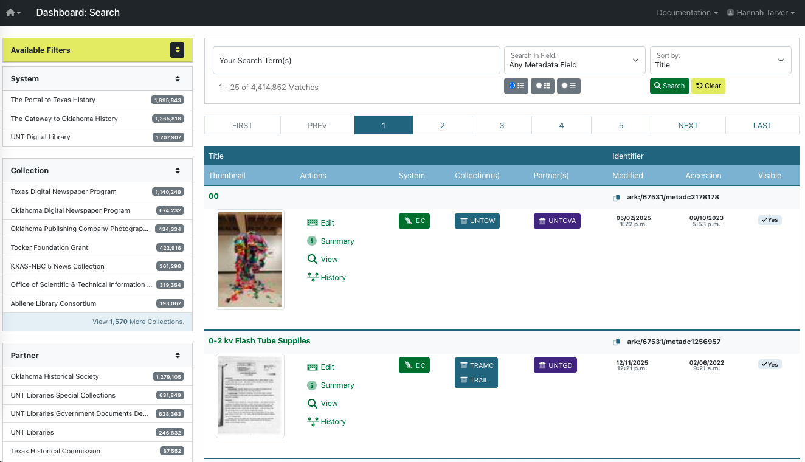

Changing Views
--------------
**Filters.**  A filter will only display if at least two options are available, depending
on permissions and other criteria.  For example, if an editor only has access to photograph collections,
they will not see the "resource type" filter; if the search term (or other set filters) only apply to public
records, the "visibility" filter will not display.  Here is a full list of possible filters:

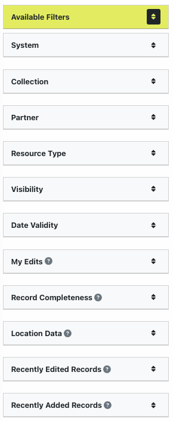

Each filter shows up to 7 options, clicking one will change the Dashboard results to show records matching 
that option and it will display above the filter list 

+-----------------------------------------------------------------------+---------------------------------------------------------------+
|Example of filter options                                              |Example of display message                                     |
+-----------------------------------------------------------------------+---------------------------------------------------------------+
| .. image:: ../_static/images/rt-filter.png                            | .. image:: ../_static/images/filter-note.png                  |
|   :alt: Screenshot of the resource type filter                        |    :alt: Screenshot of the display message for a chosen filter|
+-----------------------------------------------------------------------+---------------------------------------------------------------+

For filters that have more than 7 options, a link at the bottom of the filter box lets you search all available values:

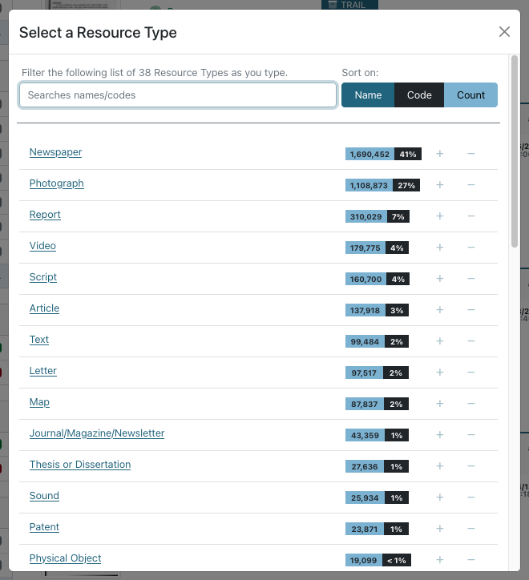

**Searching.**  Entering terms in the search box will look for matching text in any records displaying in the Dashboard 
(i.e., based on filters and editor permissions).  The search can be general,
limited to a specific field, or in the item text (using the OCR for printed text items).

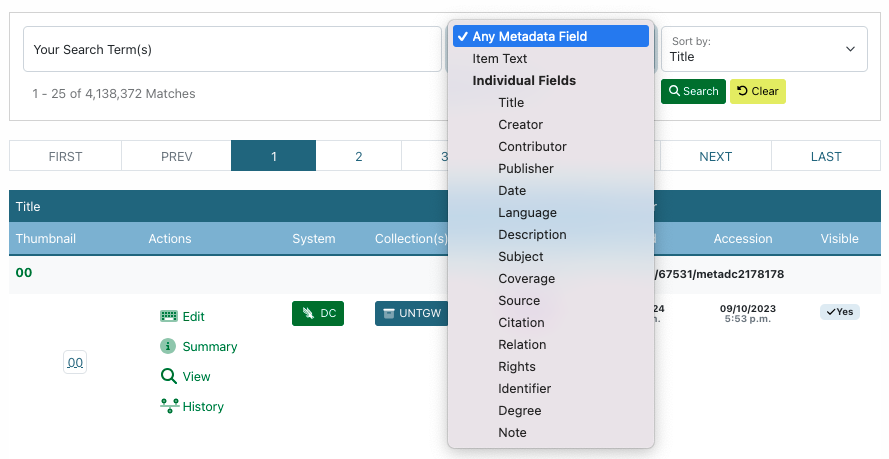

**Sorting.**  The result list of records sorts alphabetically by title as a default but can also be sorted by 
date created, added, or modified; ARK identifier; or completeness.

.. image:: ../_static/images/sort-list.png
   :alt: Screenshot of the menu options to sort Dashboard results

Record Listings
----------------
Below the search box, there are radio buttons to change the results to a list (default), grid, or brief view

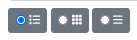
   

In the default view, each record listing includes a thumbnail and summary information; clicking the title or thumbnail will open the record summary:

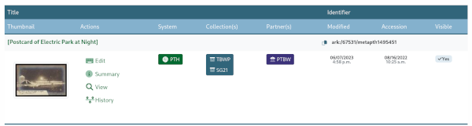

Several parts of the record listing are links to various functionality:

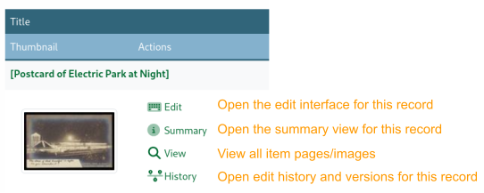

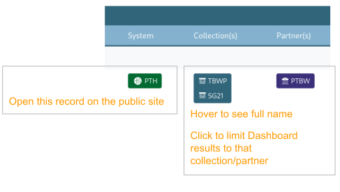

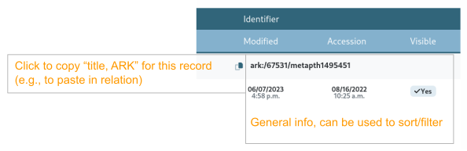

The grid view displays much of the same information in a condensed format, with 30 records per page:

+-----------------------------------------------------------------------+----------------------------------------------------------------+
|Example of a single record entry in grid view                          |Single record entry with features listed                        |
+-----------------------------------------------------------------------+----------------------------------------------------------------+
| .. image:: ../_static/images/record-grid.png                          | .. image:: ../_static/images/record-b.png                      |
|   :alt: Screenshot of a single record entry in grid view              |    :alt: Screenshot of a grid view entry with labeled features |
+-----------------------------------------------------------------------+----------------------------------------------------------------+

The brief view shows 99 records per page and only lists the meta id, edit button (linking directly to the editing interface), and title (linking to the summary view) for each record:

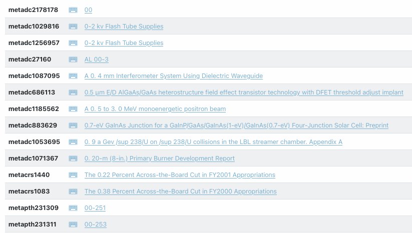

.. _nav-summ:

Record Summary
==============
The record summary displays a large view of the item thumbnail along with a summary of information about the record: 

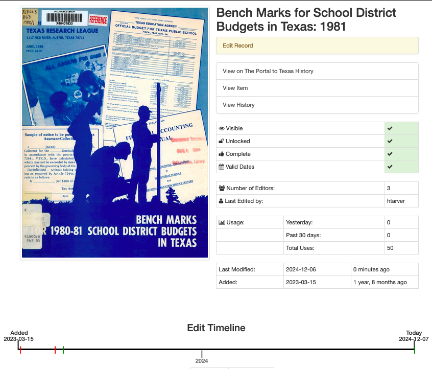

Several parts of the record summary are links to various functionality or highlight information:

.. image:: ../_static/images/summary-1.png
   :alt: Screenshot of the information at the top of the summary page links labeled

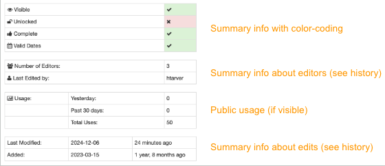

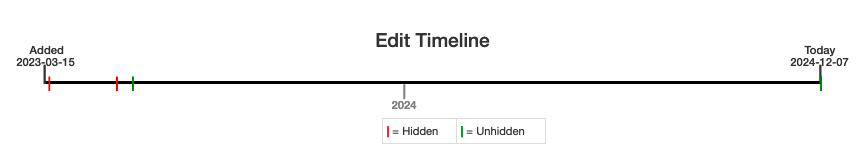

Below the edit timeline there is a full, condensed view of the metadata record; this can be useful for proofreading (including checking if values and qualifiers match).

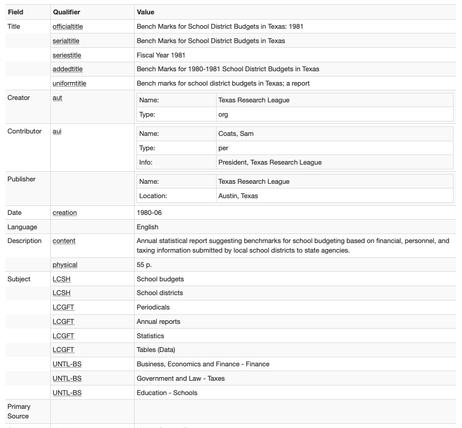

At the far left part of each field in the condensed view there is a button to open the record to that field.  
On the far right there are two buttons to either search for the first instance of the value in the edit view or copy the value to your clipboard:

+----------------------------------------------------------------+--------------------------------------------------------------+---------------------------------------------------------------+
|.. image:: ../_static/images/summary-edit.png                   |.. image:: ../_static/images/summary-find.png                 |.. image:: ../_static/images/summary-copy.png                  |
|   :alt: Screenshot of the field-edit button with hover text    |   :alt: Screenshot of the value-find button with hover text  |   :alt: Screenshot of the copy-text button with hover text    |
+----------------------------------------------------------------+--------------------------------------------------------------+---------------------------------------------------------------+
                                                                                                                                                                                                
On the right side of the screen (at the top), we've added an overview with a summary of the number of entries for 
each field and highlighting when the system has flagged something as a possible issue for futher review. 

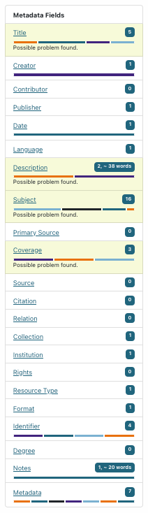

Flagged fields are also highlighted in the summary view.  Here are some examples of things that the system 
might identify as possible problems.

+--------------------------------------------------------------------+--------------------------------------------------------------------+
|Values in the summary view are highlighted in red when the system finds a problem with validation                                        |
+--------------------------------------------------------------------+--------------------------------------------------------------------+
|.. image:: ../_static/images/flag-1.png                             |This is an example of a validation error because there is a         |
|   :alt: Screenshot of the contributor field flagged in the overview|contributor role with a missing role or type -- all                 |
|                                                                    |creator/contributor entries must include both a role and a type     |
|.. image:: ../_static/images/highlight-1.png                        |                                                                    |
|   :alt: Screenshot of the contributor field with highlighting      |                                                                    |
+--------------------------------------------------------------------+--------------------------------------------------------------------+
|.. image:: ../_static/images/flag-2.png                             |Here, a date value in a date field (either date or coverage date)   |
|   :alt: Screenshot of the coverage field flagged in the overview   |does not meet EDTF standards, so the date is invalid; this example  |
|                                                                    |is a placeholder (intended to be replaced with a "real" value) but  |
|.. image:: ../_static/images/highlight-2.png                        |any date entry that is not formatted correctly will be flagged      |
|   :alt: Screenshot of the coverage field with highlighting         |                                                                    |
+--------------------------------------------------------------------+--------------------------------------------------------------------+
|Values in the summary view are highlighted in yellow if the system suspects that it *may* be incomplete or incorrect, but needs review   |
+--------------------------------------------------------------------+--------------------------------------------------------------------+
|.. image:: ../_static/images/flag-3.png                             |In this case, the record has a number of placeholder values that the|
|   :alt: Screenshot of the description field flagged in the overview|system has tried to flag based on values like "{{{" in the title and|
|                                                                    |"#" in the description.  Placeholders should be fixed or removed.   |
|.. image:: ../_static/images/highlight-3.png                        |                                                                    |
|   :alt: Screenshot of a record with placeholders highlighted       |                                                                    |
+--------------------------------------------------------------------+--------------------------------------------------------------------+
|.. image:: ../_static/images/flag-4.png                             |Some items are uploaded with very few values or placeholders.  The  |
|   :alt: Screenshot of multiple fields flagged in the overview      |system also flags missing required fields, like content descriptions|
|                                                                    |and subjects (explained in the warning text).                       |
+--------------------------------------------------------------------+--------------------------------------------------------------------+
|Summaries may have a mix of red and yellow highlighting depending on the conditions                                                      |
+--------------------------------------------------------------------+--------------------------------------------------------------------+
|.. image:: ../_static/images/highlight-4.png                        |The contributor placeholder is flagged because of the curly brackets|
|   :alt: Screenshot of the creator and contributor fields with      |but the type is red because there is a value in the name portion but|
|         highlighting                                               |not the type (invalid) -- the whole entry would need to be removed  |
|                                                                    |or updated with a correct name, role, and type                      |
+--------------------------------------------------------------------+--------------------------------------------------------------------+
|Some values get flagged but are not incorrect -- when in doubt, consult the relevant field guide for usage/formatting                    |
+--------------------------------------------------------------------+--------------------------------------------------------------------+
|.. image:: ../_static/images/flag-5.png                             |The title field is flag due to characters that *may* be placeholders|
|   :alt: Screenshot of the title field flagged in the overview      |but in this case, the "uniform" title is used to represent the      |
|                                                                    |general pattern for a serial title and may have gaps for information|
|.. image:: ../_static/images/highlight-5.png                        |that is different in individual issues/years                        |
|   :alt: Screenshot of the title field with highlighting            |                                                                    |
+--------------------------------------------------------------------+--------------------------------------------------------------------+
|.. image:: ../_static/images/highlight-6.png                        |These subject values were flagged because of the word order, but    |
|   :alt: Screenshot of the subject field with highlighting          |happen to be valid Library of Congress Subject Headings in this case|
|                                                                    |                                                                    |
+--------------------------------------------------------------------+--------------------------------------------------------------------+

.. _nav-edit:

Record Edit Form
================

The edit view shows all of the metadata fields available in the record with any values that have been entered:

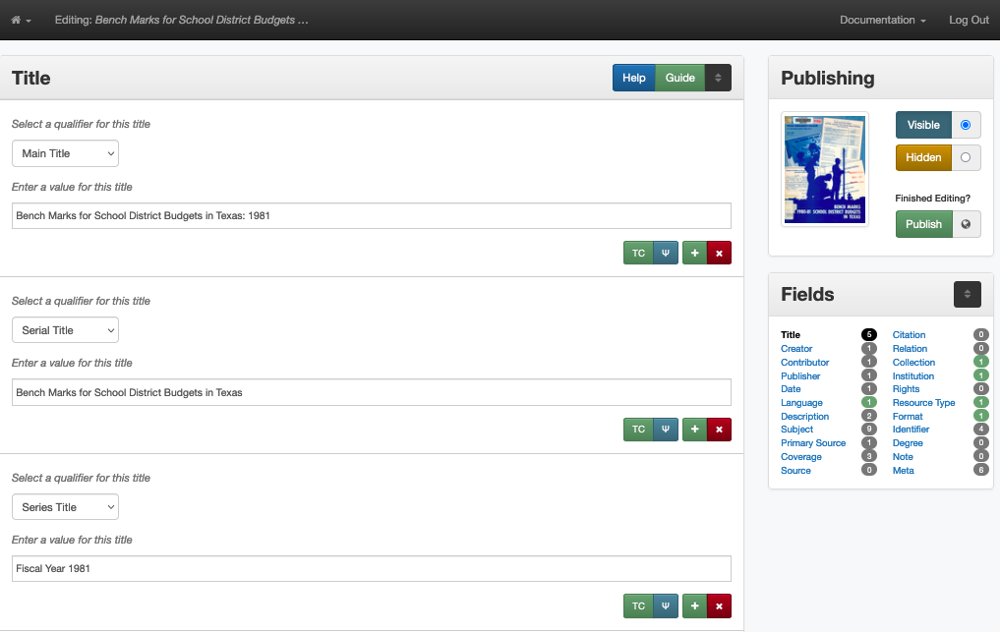

There are several features in the "side-car" at the right side of the screen:

.. image:: ../_static/images/edit-1.png
   :alt: Screenshot of the thumnail and links at the top of the "side-car"

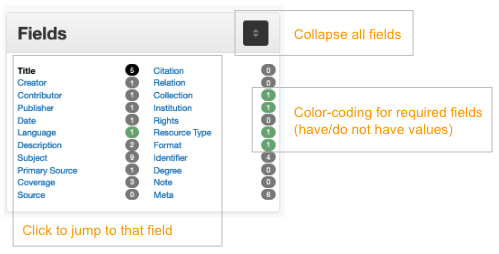

Each field is in a separate box:

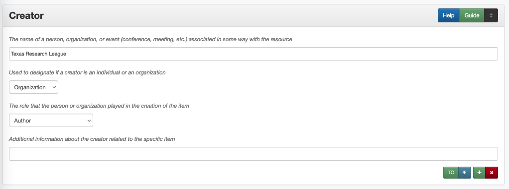

There are several links in the title bar and in the bottom-right corner of each field box:

.. image:: ../_static/images/edit-4.png
   :alt: Screenshot of the creator field in edit, with labels

Validation and Helper-Tools
---------------------------
There are a number of tools built into the system to make suggestions or highlight values that do not match expectations.

**Warning Messages**
For validation, if a field value seems wrong, the field will be highlighted in the sidecar along with a message explaining what needs to be checked:

+-----------------------------------------------------------------------+
| .. image:: ../_static/images/warning-1.png                            |
|   :alt: Screenshot of a title-case warning                            |
|                                                                       |
| | This warning appears if a title, creator, contributor, or           |
|   publisher value is more than 50% capitalized.                       |
|                                                                       |
| | In rare instances, these values may be correct                      |
+-----------------------------------------------------------------------+
| .. image:: ../_static/images/warning-2.png                            |
|   :alt: Screenshot of a date warning                                  |
|                                                                       |
| | This warning appears if a value in the date or coverage date        |
|   field does not conform to EDTF specifications (check guidelines     |
|   for more info)                                                      |
+-----------------------------------------------------------------------+
| .. image:: ../_static/images/warning-3.png                            |
|   :alt: Screenshot of a subject warning                               |
|                                                                       |
| | This warning appears if a subject value does not match the          |
|   vocabulary qualifier -- this only works for vocabularies that       |
|   have search modals                                                  |
+-----------------------------------------------------------------------+

********************************
Related Explanations & Tutorials
********************************

-   This presentation provides an overview of metadata and various features in the edit system as of November 2024: `UNT Libraries Metadata Environment <https://digital.library.unt.edu/ark:/67531/metadc2405132/>`_
