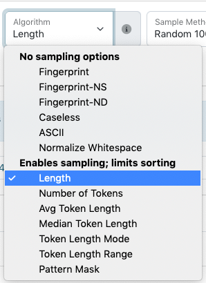

============
Cluster Tool
============

The "Cluster" tool in the edit interface takes all of the values that match the criteria and recorganizes them according to two general functions:

1.	Values are run through an algorithm to create a normalized key (e.g., Smith, John A. > a john smith); only keys with multiple unique values are displayed as clusters.
2.	Values are sorted using a length or pattern as the key; clusters include all values but only display 100 per cluster.

*************
General Notes
*************

-	Data values are compared across the system, but can be limited to specific critera 
	(e.g., a resource type or collection) using the filters on the left side of the screen
-	All tools provide information based on a field or field-qualifier combination, e.g.:

	-	A field only (any qualifiers, or non-qualified)
	-	Field values with missing qualifiers (i.e., "No Qualifier Selected")
	-	A field with a specific qualifier 
		(e.g., creators labeled "author" or subjects labeled "UNTL-BS")
	-	Note that creator and contributor have two options: the role 		
		(main qualifier) and the type, listed at the bottom of the list as per-type (personal 
		name) and org-type (organizational name)
		
-	Clicking on a value will open a search for all records matching the criteria and unique value

*********
Tool Uses
*********
Cluster is most useful for finding:

-	Using algorithms

	-	Differences in order and punctuation in similar terms 
		(e.g., a personal name entered inverted and not inverted)	
	
-	Using sorting
	
	-	Extreme outliers in length, particularly in text fields
	-	Incorrect formatting for fields that have specific patterns 
		(e.g., dates and physical descriptions)

Quality Control Example
=======================
Here are some examples of what to check specifically in a collection or set of items using the cluster tool:

-	Use normalizing algorithms to do a general check fields that are likely to have repeated values that should be the same, e.g.:

	 -	serial/series titles
	 -	names (creator, contributor, publisher)
	 -	subjects -- is there a mix of controlled and uncontrolled values that are the same?
	 -	identifiers (e.g., for serials)
	 -	notes (if standardized information is added)

-	Use pattern mask to check relevant fields that tend to follow strict formatting, e.g.:

	-	date
	-	physical description (when there isn't a wide range of material types e.g., photo collections)
	-	coverage date
	-	coverage geocodes (place box, place point)
	-	identifier
	
-	Look for obvious outliers in text fields using the "length" option to see if any values are extremely short/long, e.g.:

	-	title
	-	content description
	-	subject
	-	identifier
	-	note
	
-	For large collections, using different kinds of length options (e.g., tokens vs. characters) can be helpful, e.g.:

	-	check names for extra components (e.g., educational suffixes like PhD)
	-	group together long values that need to be reviewd or changed (subjects, titles, etc.)
	-	any field where you expect to have the same number of components but not necessarily the same character length (e.g., names, controlled subject terms, etc.)

Any combination can be checked, based on what you know about the set of records or want to verify.  Some values cluster together even if they are all correct (e.g., Smith, J. A. and Smith, A. J.).

Although the cluster tool can be used at any time, if you are planning a general or comprehensive check of a collection, cluster is often a good first sweep of values (after using count to enter anything missing).  Cluster can show values that might need normalization before looking at a whole list if you expect it to be very long (e.g., names in a large collection with many creators).

		
****************
Special Features
****************

-	Experimenting with different algorithms can show different clusters

-	On the right side of the screen, a "diff" option allows you to choose two values and see an explanation highlighting the differences between them

+-----------------------------------------------------------+-------------------------------------------------------+
|.. image:: ../_static/images/cluster-icon1.png             |.. image:: ../_static/images/cluster-icon2.png         |
|   :alt: Screenshot of hover text for cluster diff.        |   :alt: Screenshot of hover text for line diff.       |
+-----------------------------------------------------------+-------------------------------------------------------+

****************
Tool Limitations
****************

-	When values are sorted according to lengths and patterns, clusters include all values.  
	Due to the size of individual clusters, only 100 values per cluster are listed in the display. 
	Although this can be changed (i.e., random, most/least frequent, first/last alphabetically), 
	for some extremely large clusters, there is no way to see all of the relevant values.

