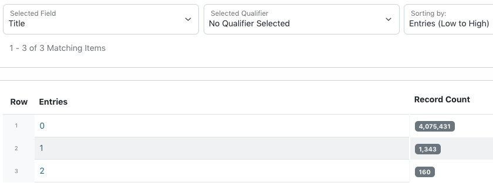
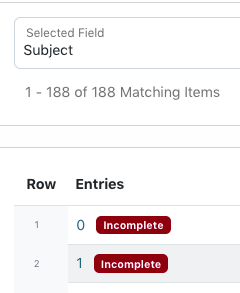
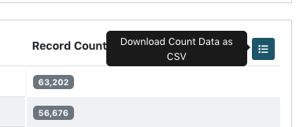

==========
Count Tool
==========

The "Count" tool in the edit interface provides a listing of the number of entries in a field, i.e., how many records have 0, 1, 2, etc. entries in that field.

*************
General Notes
*************

-	Data values are compared across the system, but can be limited to specific criteria 
	(e.g., a resource type or collection) using the filters on the left side of the screen
-	All tools provide information based on a field or field-qualifier combination, e.g.:

	-	A field only (any qualifiers, or non-qualified)
	-	Field values with missing qualifiers (i.e., "No Qualifier Selected")
	-	A field with a specific qualifier 
		(e.g., creators labeled "author" or subjects labeled "UNTL-BS")
	-	Note that creator and contributor have two options: the role 		
		(main qualifier) and the type, listed at the bottom of the list as per-type (personal 
		name) and org-type (organizational name)

-	Clicking on a count value will open a search for all records matching the criteria and count

*********
Tool Uses
*********
Count is most useful for finding:

-	Unexpected entries in fields, e.g.:

	-	text accidentally pasted in field not used for a particular collection
	-	an usually high number of entries for a field
	
-	Missing values for fields that are expected, e.g.:

	-	only 1 title entry for serial items, or in a collection using series titles
	-	0 UNTL-BS subject entries in Portal records
	-	0 creator entries for published text

-	Missing qualifiers (i.e., a value in a qualified field with "No Qualifier Selected"); in this situation, a "0" count is correct

   

Quality Control Example
=======================
Here are some examples of what to check specifically in a collection or set of items using the count tool:

-	Check the count for every individual field

	-	Do the numbers roughly match what you expect (e.g., 1 title for photos, 2 titles for collections requiring a series, the same number of titles in a serial, etc.)?
	-	Are there any outliers -- numbers that are much larger or smaller than expected?
	-	Did any "unused" fields have counts (e.g., values in the Degree field for materials not created at UNT)?
	
-	For all fields that have qualifiers, choose the "No Qualifier Selected" option

	-	If there are any counts other than 0, those are values missing qualifiers
	
-	Check specific field/qualifier combinations for qualifiers that are required or non-repeatable, e.g.:

	-	Every record has 1 main title
	-	Date qualifiers do not repeat
	-	Description qualifiers do not repeat: 1 content description & 1 physical description
	-	All records that will be visible in the Portal have at least 1 UNTL-BS subject term
	-	Coverage dates do not repeat

-	Verify counts for any field or field/qualifier combinations that would make sense for the specific records, e.g.:

	-	For a newsletter or yearbook, every record has a serial title
	-	Published text items (e.g., books, reports, ETDs, most serials) have a creator/author
	-	All photos have a place name (assuming the locations were known)
	-	Records from Special Collections have a "Preferred Citation" entry in the Citation field
	-	Music recordings have at least one LCGFT and LCMPT subject 
	-	Creator role will generally be "photographer" for photographs, but "author" for text
	
	
Any combination can be checked, based on what you know about the set of records or want to verify.  If you expect that every record should have one contributor value (e.g., a donor connected to the collection), you could check total contributor counts and also contributor/donor values to see if they match, or if there are discrepancies.

Remember, sometimes counts are odd for specific reasons (e.g., one report in the collection really did have 50 named authors) but it can still be helpful to make sure it's correct.

Although the count tool can be used at any time, if you are planning a general or comprehensive check of a collection, count can be a good place to start so that you can see if things are obviously missing or if there are outliers to verify before looking at consistency in specific values.

****************
Special Features
****************

-	For required fields, counts are highlighted when they don't meet minimum requirements

   
-	After choosing criteria and getting counts, you can download the results as a csv file with the icon on the right above the record count

****************
Tool Limitations
****************

-	Since counts are are based on the indexing of unique values, identical values will only be 
	counted once.  This is most often an issue for hidden/incomplete records when a placeholder 
	value is in multiple entries but the non-unique value is only counted as a single entry.  It
	can also happen in rare cases when expected (e.g., a volume and issue number in the citation
	field that happen to be the same).

