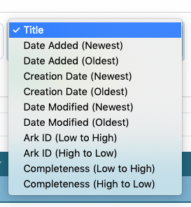
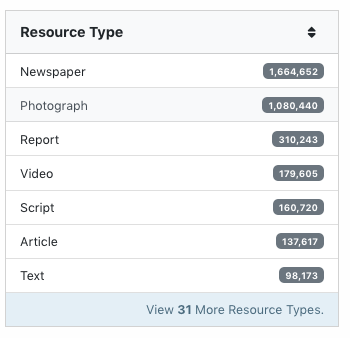
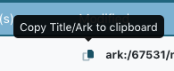

==============
Edit Dashboard
==============

The default Dashboard interface (also labeled "Search" in the tools) has a number of features to identify specific sub-sets of records.  In particular, there are a number of filters on the left side of the screen.

*************
General Notes
*************

-	Records that display are based on an individual editor's permissions 
-	Filters only show up when there are at least two options (e.g., "collection" won't display if an editor only has access to edit one collection)

*********
Tool Uses
*********

-	Some filters are useful for quality control, e.g.:

	-	hidden records (in a collection that should be visible)
	-	incomplete records
	-	invalid dates
	-	records without place names / place boxes / place points (that should have them) or vice versa
	
-	Sorting can also be relevant, especially sorting by creation date, e.g.:

	-	sort serials to see if the dates in main titles match the order
	-	for publications that have a name change (e.g., NTSU vs. UNT), verify whether items at the beginning/end of the list fall in the range

Quality Control Example
=======================
Here are some examples of what to check specifically from the Dashboard:

-	Are all records visible (or the number expected)?
-	Visible records are complete
-	The numbers for collection/institution seem correct
-	Collection usage is correct (especially if some/all items should be in multiple collections)
-	Dates for visible records are valid
-	Resource types match expectations

****************
Special Features
****************

-	The menu to the right of the search bar lets editors sort by title, dates, ARKs, or completeness

   
-	Below the search box, there are buttons to change the way records are displayed; each display shows a different number of records per page and 
	can make it easier to see different kinds of information

+-----------------------------------------------------------+-------------------------------------------------------+----------------------------------------------------+
|.. image:: ../_static/images/dash-icon1.png                |.. image:: ../_static/images/dash-icon2.png            |.. image:: ../_static/images/dash-icon3.png         |
|   :alt: Screenshot of hover text default list display.    |   :alt: Screenshot of hover text grid display.        |   :alt: Screenshot of hover text for brief display.|
+-----------------------------------------------------------+-------------------------------------------------------+----------------------------------------------------+
   
-	Any filters that have more than 7 options include a "view more" link at the bottom of the filter box that opens a search interface to see all possible list items

   
-	An icon next to each item ARK on the Dashboard lets editors copy the "title, ARK" value, which can be pasted directly into the relation field of a related item

-	When viewing reocrds in the "brief" view, there are icons below the page links (upper-right above the record titles) to download a .csv file of information for the 99 
	items on that page; either the ARKS or the information that is displayed in the list view (title, metaid, type, system, collection, institution, modification date, and 
	accession date)

+-----------------------------------------------------------+-------------------------------------------------------+
|.. image:: ../_static/images/dash-icon4.png                |.. image:: ../_static/images/dash-icon5.png            |
|   :alt: Screenshot of hover text for ARK download.        |   :alt: Screenshot of hover text for data download.   |
+-----------------------------------------------------------+-------------------------------------------------------+

****************
Tool Limitations
****************

-	Filters show records that have invalid/missing values but do not provide information about what is wrong without looking at individual records

