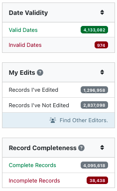
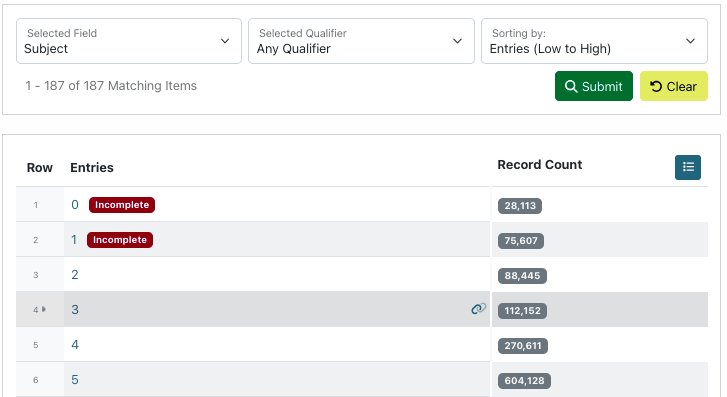
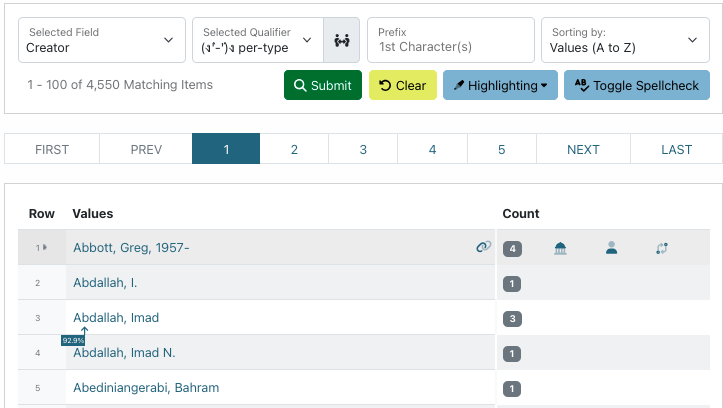
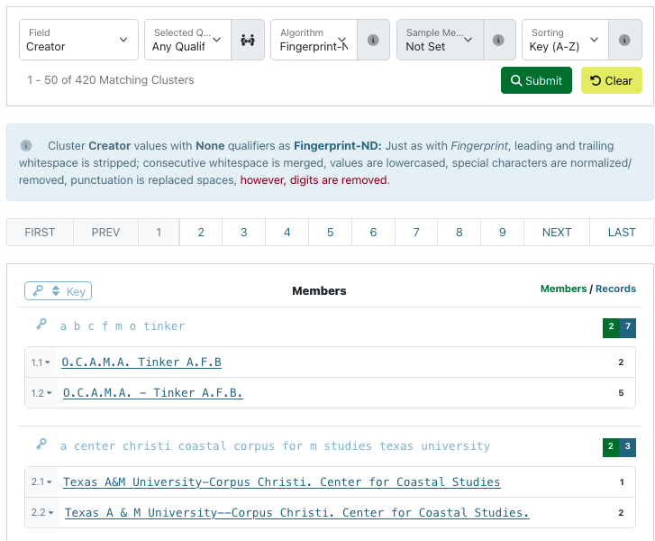
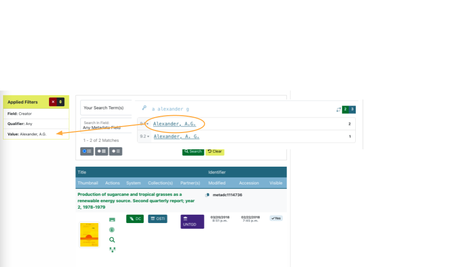
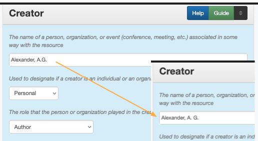
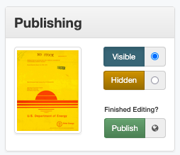

===========================================================
Guided Instructions: Correct Records During Quality Control
===========================================================
**How to use these instructions:**

-   This page lists the specific steps for finding and correcting errors in
    metadata records
-   Note that each editor only has access to specific parts of the Digital 
    Collections, so not all examples may apply
-   Although this page will include some examples of common errors, editors
    may need to identify specific types of problems based on knowledge of a
    particular collection and on relevant documentation:

    -   :doc:`UNTL Metadata Input Guidelines <input-guidelines-descriptive>`
    -   :doc:`Quality Control in Metadata </tools/metadata-tools>`

    
***********************
Step 1: Identify Issues
***********************
-   Use the system tools to find problems in metadata, such as mis-formatted
    or missing values
-   Note that tools will generally not say that something specific is 
    wrong, they just organize information in ways that may help editors identify
    an issue
-   For each of the tool sections on this page, there is one specific example;
    use the documentation about the individual tools for more suggestions 

Dashboard
=========
-   Some Dashboard filters can identify problems such as "incomplete" records
    or records containing invalid dates
-   :doc:`More about Dashboard options</tools/dashboard>`
    

Count
=====
-   The count tool helps to find missing or extra entries, such as:

    -   Too few subjects (or no UNTL-BS terms in Portal records)
    -   Multiple photographers for a single photographer (i.e., possible 
        placeholder values left in a record)
    -   No creation date for items in a collection that have known dates

-   :doc:`More about the count tool </tools/count-tool>`

Facet
=====
-   The facet tool helps with finding typos or similar values that may be normalized:
-   :doc:`More about the facet tool </tools/facet-tool>`

Cluster
=======
-   The cluster tool helps to find values with different formatting or that do 
    not fit a particular expected pattern, e.g.:

    -   Near-identical names with different spacing or punctuation
    -   Extremely long (or short) subject or title values
    -   Identifiers that do not fit a standard pattern used in a collection

-   :doc:`More about the cluster tool </tools/cluster-tool>`

********************
Step 2: Find Records
********************
-   If you're using the Dashboard filters, click on the appropriate filter 
    (e.g., "Invalid Dates")
-   From the tools, click a value (in cluster or facet) or a numeric value (in 
    count) to open a Dashboard search meeting those criteria

********************
Step 3: Edit Records
********************
-   For **each record** on the Dashboard list for an identified issue, click "Edit" to open the editing form and 
    change, add, or remove the value (depending on what is appropriate)

-   After fixing the issue, click the "publish" button at right to save the record (do not change
    the visibility of the record unless instructed to do so)

**************
Step 4: Repeat
**************
-   After a particular value has been changed, the lists in the Dashboard and tools will update 
    (note that values in cluster cache and will take longer to reflect changes)
-   Find a new issue or value that needs to be changed and follow the same steps
