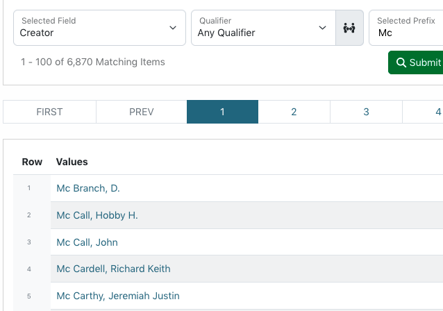
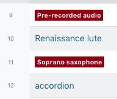
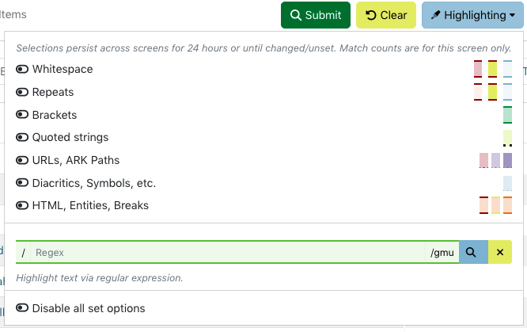

==========
Facet Tool
==========

The "Facet" tool in the edit interface provides a listing of the unique values in a field and how often each one occurs (i.e., number of records containing the value).

*************
General Notes
*************

-	Data values are compared across the system, but can be limited to specific critera 
	(e.g., a resource type or collection) using the filters on the left side of the screen
-	All tools provide information based on a field or field-qualifier combination, e.g.:

	-	A field only (any qualifiers, or non-qualified)
	-	Field values with missing qualifiers (i.e., "No Qualifier Selected")
	-	A field with a specific qualifier 
		(e.g., creators labeled "author" or subjects labeled "UNTL-BS")
	-	Note that creator and contributor have two options: the role 		
		(main qualifier) and the type, listed at the bottom of the list as per-type (personal 
		name) and org-type (organizational name)
		
-	Clicking on a facet value will open a search for all records matching the criteria and unique value

*********
Tool Uses
*********
Facet is most useful for finding:

-	Typos, misspellings, or odd/unexpected values
-	Values mis-matched with qualifiers, e.g.:

	-	personal names labeled as organizations
	-	subjects labeled with the incorrect vocabulary type

-	Incorrect or inconsistent formatting, e.g.:

	-	controlled subject terms not formatted according to vocabulary rules
	-	series or serial titles that are not all the same

****************
Special Features
****************

-	To limit values alphabetically, entering letters up to a full word (before a space) will show only values that start with that prefix 
	(e.g., "United" to see government names starting with United States)
	

	
-	For certain controlled fields, values are highlighted when they don't match formatting (dates) or vocabularies (certain subjects)

-	There are options to highlight certain kinds of symbols and spacing

   
   
- 	A spellchecking button lets you use the browser spell-checker to double-check displayed terms
-	On the right side of the screen, a "diff" option allows you to choose two facet values and see an explanation highlighting the differences between them
- 	Sorting values according to "Records High to Low" could help to identify most-frequently-used values, especially controlled names or terms
