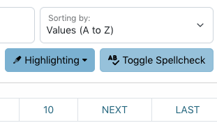

==========
Facet Tool
==========

The "Facet" tool in the edit interface provides a listing of the unique values in a field and how often each one occurs (i.e., number of records containing the value).

*************
General Notes
*************

-	Data values are compared across the system, but can be limited to specific critera 
	(e.g., a resource type or collection) using the filters on the left side of the screen
-	All tools provide information based on a field or field-qualifier combination, e.g.:

	-	A field only (any qualifiers, or non-qualified)
	-	Field values with missing qualifiers (i.e., "No Qualifier Selected")
	-	A field with a specific qualifier 
		(e.g., creators labeled "author" or subjects labeled "UNTL-BS")
	-	Note that creator and contributor have two options: the role 		
		(main qualifier) and the type, listed at the bottom of the list as per-type (personal 
		name) and org-type (organizational name)
		
-	Clicking on a facet value will open a search for all records matching the criteria and unique value

*********
Tool Uses
*********
Facet is most useful for finding:

-	Typos, misspellings, or odd/unexpected values
-	Values mis-matched with qualifiers, e.g.:

	-	personal names labeled as organizations
	-	subjects labeled with the incorrect vocabulary type

-	Incorrect or inconsistent formatting, e.g.:

	-	controlled subject terms not formatted according to vocabulary rules
	-	series or serial titles that are not all the same
	

Quality Control Example
=======================
Here are some examples of what to check specifically in a collection or set of items using the facet tool:

-	Look at general values for any field in use

	-	Do you see typos?
	-	Are there extremely similar values (e.g., a name with or without an initial)?
	-	Do counts seem reasonable (e.g., a specific topical subject value should rarely be in every record)?
	
-	See if values match qualifiers, e.g.:

	-	Look at (creator/contributor) personal names -- are there any organizations in the list? -- and vice versa
	-	Check subjects by qualifier -- does the formatting match each type?  Are any values marked invalid?
	
-	Check for duplication in values, e.g.:

	-	Main titles for serials should generally not repeat
	-	Local identifiers that are unique

-	Make sure that corresponding fields match, e.g.:

	-	Format values match resource types
	-	Serials have an LCGFT for Periodicals

Any combination can be checked, based on what you know about the set of records or want to verify. 

Although the facet tool can be used at any time, if you are planning a general or comprehensive check of a collection, it may be best to use facet last, after missing values (from count) are entered and you have done a first normalization of values (using cluster).

****************
Special Features
****************

-	To limit values alphabetically, entering letters up to a full word (before a space) will show only values that start with that prefix 
	(e.g., "United" to see government names starting with United States)
	
.. image:: ../_static/images/facet-prefix.png
   :alt: Screenshot of a facet example for names starting with "Mc".
	
-	For certain controlled fields, values are highlighted when they don't match formatting (dates) or vocabularies (certain subjects)

.. image:: ../_static/images/facet-invalid.png
   :alt: Screenshot of a facet example with invalid terms highlighted.

-	There are options to highlight certain kinds of symbols and spacing

.. image:: ../_static/images/facet-highlight.png
   :alt: Screenshot of the menu options for highlighting values.
   
   
- 	A spellchecking button lets you use the browser spell-checker to double-check displayed terms

-	On the right side of the screen, a "diff" option allows you to choose two facet values and see an explanation highlighting the differences between them; 
	for name values, there are also search options for authorities

+-----------------------------------------------------------+-------------------------------------------------------+-----------------------------------------------+
|.. image:: ../_static/images/facet-icon1.png               |.. image:: ../_static/images/facet-icon2.png           |.. image:: ../_static/images/facet-icon3.png   |
|   :alt: Screenshot of hover text for external authorities.|   :alt: Screenshot of hover text for UNT Name App.    |   :alt: Screenshot of hover text for diff.    |
+-----------------------------------------------------------+-------------------------------------------------------+-----------------------------------------------+

- 	Sorting values according to number of record ("Records High to Low") could help to identify duplicated values and also most-frequently-used values (especially controlled names or terms)
