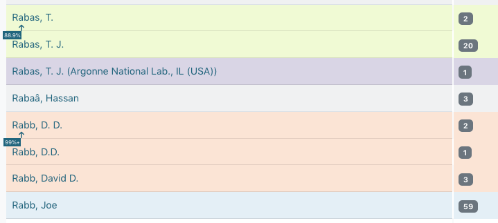

===========================
Quality Control in Metadata
===========================

************
Introduction
************

Metadata in the UNT Libraries' Digital Collections is always being updated, corrected, and enhanced as needed or when new information ecomes available.  To aid in identifying areas where records may need review or adjustments (e.g., typos, missing information, etc.), a number of tools and features have been built into the interface.

Editing tools are accessible to anyone with an account to edit in the Digital Collections using the menu in the upper-left corner.

***************
About the Tools
***************

-	As a general rule, the tools cannot tell editors when something is "wrong," but they 
	reorganize information to help editors see outliers or values that do not match what is 
	expected for the selected criteria
	
-	Data values are compared across the system, but can be limited to specific critera 
	(e.g., a resource type or collection) using the filters on the left side of the screen
-	All tools provide information based on a field or field-qualifier combination

-   The qualifier drop-down menu is only active if a qualified field is chosen and can be left blank or used in various ways:

	-	A field only (no qualifier option chosen) to include entries with any qualifiers, or non-qualified
	-	Field values with missing qualifiers (i.e., "No Qualifier Selected")
	-	A field with a specific qualifier 
		(e.g., creators labeled "author" or subjects labeled "UNTL-BS")
	-	Note that creator and contributor have two options: the role 		
		(main qualifier) and the type, listed at the bottom of the list as per-type (personal 
		name) and org-type (organizational name)

+---------------------------+-----------------------------------------------------------------------------------+
|-  Type: missing qualifier |.. image:: ../_static/images/dash-name.png                                         |
|-  Role: missing qualifier |   :alt: Screenshot of non-normative qualifier options for creator/contributor.    |
|-  Type: Organization      |                                                                                   |
|-  Type: Personal          |                                                                                   |
+---------------------------+-----------------------------------------------------------------------------------+
   
*************
Tool Features
*************
Some options and features apply to all of the tools

-	After selecting a field, there are options to copy or link to the records that contain a value/count by clicking the arrow next to the value

.. image:: ../_static/images/tools-copy.png
   :alt: Screenshot of menu to copy information from a tool value.
   

-	Clicking at the end of the line temporarily highlights the line (clicking multiple times will cycle through 4 color options); 
	the highlighting does not "stick" if the link is shared or if the page is reloaded
   

	
********************************
Related Explanations & Tutorials
********************************
These are presentations that we have done in the past about the edit tools; although some features have changed they can provide some information about how the tools work:

-	`UNT Libraries Metadata Quality Interfaces <https://digital.library.unt.edu/ark:/67531/metadc1393760/>`_ [video] (2018)
-	`Experiments with Metadata Quality Interfaces <https://digital.library.unt.edu/ark:/67531/metadc1164518/>`_ [presentation] (2018)
-	`Experiments in Operationalizing Metadata Quality Interfaces: A Case Study at the University of North Texas Libraries <https://digital.library.unt.edu/ark:/67531/metadc1281824/>`_ [presentation] (2018)
-	`New Interfaces for Metadata Quality Improvement in the UNT Libraries' Digital Collections <https://digital.library.unt.edu/ark:/67531/metadc1281808/>`_ [presentation] (2017)
-	`Tools and Workflows for Managing Metadata at the UNT Libraries <https://digital.library.unt.edu/ark:/67531/metadc1281814/>`_ [presentation] (2017)